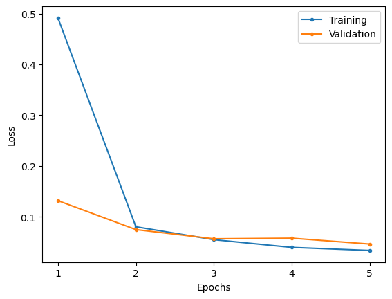
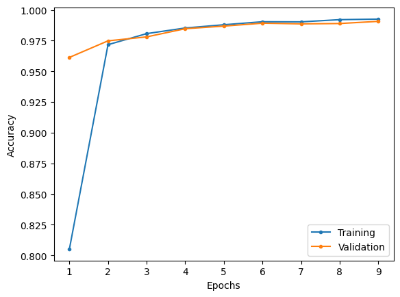

# AlexNet

This is an implementation of AlexNet model described in the research paper.

## MNIST

### Model summary

|    Layer (type)     |   Output Shape    |  Param #   |
| :-----------------: | :---------------: | :--------: |
|   2D Convolution    | [-1, 96, 55, 55]  |   34,944   |
|        ReLU         | [-1, 96, 55, 55]  |     0      |
| Local response norm | [-1, 96, 55, 55]  |     0      |
|   2D max pooling    | [-1, 96, 27, 27]  |     0      |
|   2D Convolution    | [-1, 256, 27, 27] |  614,656   |
|        ReLU         | [-1, 256, 27, 27] |     0      |
| Local response norm | [-1, 256, 27, 27] |     0      |
|   2D max pooling    | [-1, 256, 13, 13] |     0      |
|   2D Convolution    | [-1, 384, 13, 13] |  885,120   |
|        ReLU         | [-1, 384, 13, 13] |     0      |
|   2D Convolution    | [-1, 384, 13, 13] | 1,327,488  |
|        ReLU         | [-1, 384, 13, 13] |     0      |
|   2D Convolution    | [-1, 256, 13, 13] |  884,992   |
|        ReLU         | [-1, 256, 13, 13] |     0      |
|   2D max pooling    |  [-1, 256, 6, 6]  |     0      |
|       Flatten       |    [-1, 9216]     |     0      |
|       Linear        |    [-1, 4096]     | 37,752,832 |
|        ReLU         |    [-1, 4096]     |     0      |
|       Dropout       |    [-1, 4096]     |     0      |
|       Linear        |    [-1, 4096]     | 16,781,312 |
|        ReLU         |    [-1, 4096]     |     0      |
|       Dropout       |    [-1, 4096]     |     0      |
|       Linear        |     [-1, 10]      |   40,970   |

|                      |            |
| -------------------- | ---------- |
| Total params         | 58,322,314 |
| Trainable params     | 58,322,314 |
| Non-trainable params | 0          |

### Results

Training over 5 epochs at a learning rate of 1e-4.

|                     Loss                      |                       Accuracy                        |
| :-------------------------------------------: | :---------------------------------------------------: |
|  |  |

|              | Training | Validation | Testing |
| :----------: | :------: | :--------: | :-----: |
|     Loss     |   0.03   |    0.05    |  0.04   |
| Accuracy (%) |  98.92   |   98.67    |  98.87  |

| Class | Training Precision | Validation Precision | Testing Precision | Training Recall | Validation Recall | Testing Recall | Training F1 Score | Validation F1 Score | Testing F1 Score |
| :---: | :----------------: | :------------------: | :---------------: | :-------------: | :---------------: | :------------: | :---------------: | :-----------------: | :--------------: |
|   0   |       0.9940       |        0.9892        |      0.9809       |     0.9938      |      0.9931       |     0.9949     |      0.9939       |       0.9912        |      0.9878      |
|   1   |       0.9926       |        0.9951        |      0.9921       |     0.9947      |      0.9912       |     0.9947     |      0.9936       |       0.9931        |      0.9934      |
|   2   |       0.9905       |        0.9896        |      0.9912       |     0.9907      |      0.9738       |     0.9787     |      0.9906       |       0.9817        |      0.9849      |
|   3   |       0.9911       |        0.9886        |      0.9901       |     0.9888      |      0.9854       |     0.9921     |      0.9899       |       0.9870        |      0.9911      |
|   4   |       0.9909       |        0.9805        |      0.9859       |     0.9899      |      0.9927       |     0.9949     |      0.9904       |       0.9866        |      0.9904      |
|   5   |       0.9863       |        0.9940        |      0.9966       |     0.9858      |      0.9840       |     0.9843     |      0.9861       |       0.9890        |      0.9904      |
|   6   |       0.9917       |        0.9840        |      0.9926       |     0.9926      |      0.9965       |     0.9854     |      0.9921       |       0.9902        |      0.9890      |
|   7   |       0.9860       |        0.9845        |      0.9826       |     0.9889      |      0.9908       |     0.9903     |      0.9874       |       0.9876        |      0.9864      |
|   8   |       0.9841       |        0.9829        |      0.9857       |     0.9827      |      0.9823       |     0.9897     |      0.9834       |       0.9826        |      0.9877      |
|   9   |       0.9840       |        0.9779        |      0.9900       |     0.9828      |      0.9763       |     0.9812     |      0.9834       |       0.9771        |      0.9856      |

## References

Research paper: https://papers.nips.cc/paper_files/paper/2012/file/c399862d3b9d6b76c8436e924a68c45b-Paper.pdf
