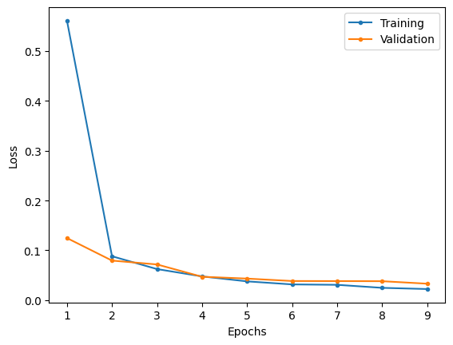

# AlexNet

This is an implementation of AlexNet model described in the research paper.

## MNIST

### Model summary

|    Layer (type)     |   Output Shape    |  Param #   |
| :-----------------: | :---------------: | :--------: |
|   2D Convolution    | [-1, 96, 55, 55]  |   34,944   |
|        ReLU         | [-1, 96, 55, 55]  |     0      |
| Local response norm | [-1, 96, 55, 55]  |     0      |
|   2D max pooling    | [-1, 96, 27, 27]  |     0      |
|   2D Convolution    | [-1, 256, 27, 27] |  614,656   |
|        ReLU         | [-1, 256, 27, 27] |     0      |
| Local response norm | [-1, 256, 27, 27] |     0      |
|   2D max pooling    | [-1, 256, 13, 13] |     0      |
|   2D Convolution    | [-1, 384, 13, 13] |  885,120   |
|        ReLU         | [-1, 384, 13, 13] |     0      |
|   2D Convolution    | [-1, 384, 13, 13] | 1,327,488  |
|        ReLU         | [-1, 384, 13, 13] |     0      |
|   2D Convolution    | [-1, 256, 13, 13] |  884,992   |
|        ReLU         | [-1, 256, 13, 13] |     0      |
|   2D max pooling    |  [-1, 256, 6, 6]  |     0      |
|       Flatten       |    [-1, 9216]     |     0      |
|       Dropout       |    [-1, 9216]     |     0      |
|       Linear        |    [-1, 4096]     | 37,752,832 |
|        ReLU         |    [-1, 4096]     |     0      |
|       Dropout       |    [-1, 4096]     |     0      |
|       Linear        |    [-1, 4096]     | 16,781,312 |
|        ReLU         |    [-1, 4096]     |     0      |
|       Dropout       |    [-1, 4096]     |     0      |
|       Linear        |     [-1, 10]      |   40,970   |

|                      |            |
| -------------------- | ---------- |
| Total params         | 58,322,314 |
| Trainable params     | 58,322,314 |
| Non-trainable params | 0          |

### Results

Training over 9 epochs at a learning rate of 1e-4.

|                     Loss                      |                       Accuracy                        |
| :-------------------------------------------: | :---------------------------------------------------: |
|  |  |

|              | Training | Validation | Testing |
| :----------: | :------: | :--------: | :-----: |
|     Loss     |  0.0223  |   0.0331   | 0.0277  |
| Accuracy (%) |  99.25   |   99.07    |  99.1   |

| Class | Training Precision | Validation Precision | Testing Precision | Training Recall | Validation Recall | Testing Recall | Training F1 Score | Validation F1 Score | Testing F1 Score |
| :---: | :----------------: | :------------------: | :---------------: | :-------------: | :---------------: | :------------: | :---------------: | :-----------------: | :--------------: |
|   0   |       0.9964       |        0.9966        |      0.9909       |     0.9969      |      0.9972       |     0.9959     |      0.9966       |       0.9969        |      0.9934      |
|   1   |       0.9960       |        0.9922        |      0.9965       |     0.9949      |      0.9946       |     0.9965     |      0.9954       |       0.9934        |      0.9965      |
|   2   |       0.9928       |        0.9906        |      0.9903       |     0.9930      |      0.9917       |     0.9932     |      0.9929       |       0.9912        |      0.9918      |
|   3   |       0.9950       |        0.9942        |      0.9853       |     0.9936      |      0.9901       |     0.9980     |      0.9943       |       0.9922        |      0.9916      |
|   4   |       0.9929       |        0.9896        |      0.9878       |     0.9905      |      0.9902       |     0.9929     |      0.9917       |       0.9899        |      0.9904      |
|   5   |       0.9921       |        0.9925        |      0.9955       |     0.9924      |      0.9827       |     0.9821     |      0.9922       |       0.9876        |      0.9887      |
|   6   |       0.9932       |        0.9917        |      0.9979       |     0.9939      |      0.9923       |     0.9791     |      0.9935       |       0.9920        |      0.9884      |
|   7   |       0.9892       |        0.9841        |      0.9893       |     0.9915      |      0.9928       |     0.9932     |      0.9904       |       0.9884        |      0.9913      |
|   8   |       0.9900       |        0.9931        |      0.9938       |     0.9895      |      0.9853       |     0.9836     |      0.9897       |       0.9892        |      0.9886      |
|   9   |       0.9877       |        0.9822        |      0.9833       |     0.9891      |      0.9890       |     0.9931     |      0.9884       |       0.9856        |      0.9882      |

The model appears to fit well and does not appear to have a minimal generalisation gap. Overall, the model performs well with accuracy being greater than 99% across all datasets and the precision, recall and f1 score not being lower than 0.98 at the worst.

## CIFAR 100

### Model Summary

|    Layer (type)     |   Output Shape    |  Param #   |
| :-----------------: | :---------------: | :--------: |
|   2D Convolution    | [-1, 96, 55, 55]  |   34,944   |
|        ReLU         | [-1, 96, 55, 55]  |     0      |
| Local response norm | [-1, 96, 55, 55]  |     0      |
|   2D max pooling    | [-1, 96, 27, 27]  |     0      |
|   2D Convolution    | [-1, 256, 27, 27] |  614,656   |
|        ReLU         | [-1, 256, 27, 27] |     0      |
| Local response norm | [-1, 256, 27, 27] |     0      |
|   2D max pooling    | [-1, 256, 13, 13] |     0      |
|   2D Convolution    | [-1, 384, 13, 13] |  885,120   |
|        ReLU         | [-1, 384, 13, 13] |     0      |
|   2D Convolution    | [-1, 384, 13, 13] | 1,327,488  |
|        ReLU         | [-1, 384, 13, 13] |     0      |
|   2D Convolution    | [-1, 256, 13, 13] |  884,992   |
|        ReLU         | [-1, 256, 13, 13] |     0      |
|   2D max pooling    |  [-1, 256, 6, 6]  |     0      |
|       Flatten       |    [-1, 9216]     |     0      |
|       Dropout       |    [-1, 9216]     |     0      |
|       Linear        |    [-1, 4096]     | 37,752,832 |
|        ReLU         |    [-1, 4096]     |     0      |
|       Dropout       |    [-1, 4096]     |     0      |
|       Linear        |    [-1, 4096]     | 16,781,312 |
|        ReLU         |    [-1, 4096]     |     0      |
|       Dropout       |    [-1, 4096]     |     0      |
|       Linear        |     [-1, 100]     |  409,700   |

|                      |            |
| -------------------- | ---------- |
| Total params         | 58,691,044 |
| Trainable params     | 58,691,044 |
| Non-trainable params | 0          |

### Results

|              | Training | Validation | Testing |
| :----------: | :------: | :--------: | :-----: |
|     Loss     |  2.0776  |   2.497    | 2.0507  |
| Accuracy (%) |    45    |   36.84    |  47.34  |

|     Class     | Training Precision | Validation Precision | Testing Precision | Training Recall | Validation Recall | Testing Recall | Training F1 Score | Validation F1 Score | Testing F1 Score |
| :-----------: | :----------------: | :------------------: | :---------------: | :-------------: | :---------------: | :------------: | :---------------: | :-----------------: | :--------------: |
|     apple     |       0.6021       |        0.6103        |      0.7901       |     0.6833      |      0.5220       |     0.6400     |      0.6401       |       0.5627        |      0.7072      |
| aquarium_fish |       0.4713       |        0.3415        |      0.4426       |     0.5616      |      0.4148       |     0.5400     |      0.5125       |       0.3746        |      0.4865      |
|     baby      |       0.4053       |        0.2529        |      0.4301       |     0.3971      |      0.2774       |     0.4000     |      0.4012       |       0.2646        |      0.4145      |
|     bear      |       0.3008       |        0.2033        |      0.3714       |     0.3073      |      0.1938       |     0.2600     |      0.3040       |       0.1984        |      0.3059      |
|    beaver     |       0.2838       |        0.1608        |      0.2628       |     0.2901      |      0.2319       |     0.3600     |      0.2869       |       0.1899        |      0.3038      |
|      bed      |       0.4384       |        0.3122        |      0.4340       |     0.4692      |      0.3711       |     0.4600     |      0.4533       |       0.3391        |      0.4466      |
|      bee      |       0.4598       |        0.4653        |      0.5490       |     0.4986      |      0.3534       |     0.5600     |      0.4784       |       0.4017        |      0.5545      |
|    beetle     |       0.5147       |        0.4425        |      0.5000       |     0.4451      |      0.3448       |     0.4400     |      0.4773       |       0.3876        |      0.4681      |
|    bicycle    |       0.5148       |        0.4208        |      0.4268       |     0.5118      |      0.4812       |     0.6700     |      0.5133       |       0.4490        |      0.5214      |
|    bottle     |       0.5237       |        0.5229        |      0.5268       |     0.4911      |      0.4938       |     0.5900     |      0.5069       |       0.5079        |      0.5566      |
|     bowl      |       0.3171       |        0.2315        |      0.3099       |     0.2197      |      0.1724       |     0.2200     |      0.2596       |       0.1976        |      0.2573      |
|      boy      |       0.3661       |        0.2336        |      0.4706       |     0.2665      |      0.2119       |     0.3200     |      0.3085       |       0.2222        |      0.3810      |
|    bridge     |       0.4587       |        0.5857        |      0.7324       |     0.4041      |      0.2628       |     0.5200     |      0.4297       |       0.3628        |      0.6082      |
|      bus      |       0.4534       |        0.3636        |      0.4133       |     0.4148      |      0.2432       |     0.3100     |      0.4332       |       0.2915        |      0.3543      |
|   butterfly   |       0.4119       |        0.2819        |      0.3284       |     0.3786      |      0.2727       |     0.4400     |      0.3946       |       0.2772        |      0.3761      |
|     camel     |       0.3782       |        0.3143        |      0.4375       |     0.3697      |      0.2308       |     0.2800     |      0.3739       |       0.2661        |      0.3415      |
|      can      |       0.4849       |        0.3933        |      0.4480       |     0.4155      |      0.3907       |     0.5600     |      0.4475       |       0.3920        |      0.4978      |
|    castle     |       0.5824       |        0.5281        |      0.5573       |     0.5824      |      0.5875       |     0.7300     |      0.5824       |       0.5562        |      0.6320      |
|  caterpillar  |       0.3791       |        0.3043        |      0.4381       |     0.4318      |      0.3311       |     0.4600     |      0.4037       |       0.3172        |      0.4488      |
|    cattle     |       0.3985       |        0.3497        |      0.4021       |     0.3109      |      0.3145       |     0.3900     |      0.3493       |       0.3311        |      0.3959      |
|     chair     |       0.6397       |        0.6522        |      0.7320       |     0.6206      |      0.4580       |     0.7100     |      0.6300       |       0.5381        |      0.7208      |
|  chimpanzee   |       0.4071       |        0.3699        |      0.7375       |     0.5478      |      0.4444       |     0.5900     |      0.4671       |       0.4038        |      0.6556      |
|     clock     |       0.4692       |        0.3784        |      0.4615       |     0.3838      |      0.1958       |     0.3600     |      0.4222       |       0.2581        |      0.4045      |
|     cloud     |       0.4758       |        0.3859        |      0.6421       |     0.6207      |      0.6118       |     0.6100     |      0.5387       |       0.4733        |      0.6256      |
|   cockroach   |       0.5290       |        0.4194        |      0.4777       |     0.6726      |      0.6460       |     0.7500     |      0.5922       |       0.5086        |      0.5837      |
|     couch     |       0.3434       |        0.3766        |      0.3929       |     0.2787      |      0.2164       |     0.2200     |      0.3077       |       0.2749        |      0.2821      |
|     crab      |       0.4062       |        0.2340        |      0.3197       |     0.3086      |      0.2025       |     0.3900     |      0.3508       |       0.2171        |      0.3514      |
|   crocodile   |       0.2974       |        0.1728        |      0.2368       |     0.3460      |      0.3534       |     0.4500     |      0.3199       |       0.2321        |      0.3103      |
|      cup      |       0.4550       |        0.4250        |      0.6235       |     0.4799      |      0.3355       |     0.5300     |      0.4671       |       0.3750        |      0.5730      |
|   dinosaur    |       0.4983       |        0.3237        |      0.4074       |     0.4034      |      0.3147       |     0.4400     |      0.4458       |       0.3191        |      0.4231      |
|    dolphin    |       0.4264       |        0.4071        |      0.5439       |     0.4858      |      0.3108       |     0.3100     |      0.4542       |       0.3525        |      0.3949      |
|   elephant    |       0.4099       |        0.3000        |      0.5542       |     0.4756      |      0.4967       |     0.4600     |      0.4403       |       0.3741        |      0.5027      |
|   flatfish    |       0.4007       |        0.3129        |      0.4211       |     0.3324      |      0.2987       |     0.4800     |      0.3633       |       0.3056        |      0.4486      |
|    forest     |       0.4223       |        0.4636        |      0.6061       |     0.4847      |      0.3617       |     0.4000     |      0.4514       |       0.4064        |      0.4819      |
|      fox      |       0.4371       |        0.3879        |      0.5467       |     0.3882      |      0.2812       |     0.4100     |      0.4112       |       0.3261        |      0.4686      |
|     girl      |       0.3267       |        0.2604        |      0.2314       |     0.2988      |      0.2907       |     0.2800     |      0.3121       |       0.2747        |      0.2534      |
|    hamster    |       0.4843       |        0.4903        |      0.6471       |     0.6006      |      0.4551       |     0.4400     |      0.5362       |       0.4720        |      0.5238      |
|     house     |       0.4522       |        0.4400        |      0.4862       |     0.4588      |      0.2750       |     0.5300     |      0.4555       |       0.3385        |      0.5072      |
|   kangaroo    |       0.3343       |        0.1775        |      0.2366       |     0.3162      |      0.2013       |     0.2200     |      0.3250       |       0.1887        |      0.2280      |
|   keyboard    |       0.5447       |        0.5294        |      0.6044       |     0.5877      |      0.5127       |     0.5500     |      0.5654       |       0.5209        |      0.5759      |
|     lamp      |       0.4176       |        0.4032        |      0.5167       |     0.3159      |      0.1613       |     0.3100     |      0.3597       |       0.2304        |      0.3875      |
|  lawn_mower   |       0.5967       |        0.4451        |      0.5669       |     0.6154      |      0.5168       |     0.7200     |      0.6059       |       0.4783        |      0.6344      |
|    leopard    |       0.4784       |        0.5176        |      0.4946       |     0.4403      |      0.2973       |     0.4600     |      0.4586       |       0.3777        |      0.4767      |
|     lion      |       0.4042       |        0.4452        |      0.6000       |     0.5102      |      0.4140       |     0.4200     |      0.4510       |       0.4290        |      0.4941      |
|    lizard     |       0.2948       |        0.2299        |      0.2740       |     0.2164      |      0.1266       |     0.2000     |      0.2496       |       0.1633        |      0.2312      |
|    lobster    |       0.4169       |        0.2941        |      0.3034       |     0.4157      |      0.2244       |     0.2700     |      0.4163       |       0.2545        |      0.2857      |
|      man      |       0.3407       |        0.2667        |      0.3021       |     0.2592      |      0.2207       |     0.2900     |      0.2944       |       0.2415        |      0.2959      |
|  maple_tree   |       0.5578       |        0.5981        |      0.6618       |     0.4955      |      0.3787       |     0.4500     |      0.5248       |       0.4638        |      0.5357      |
|  motorcycle   |       0.5613       |        0.5442        |      0.5847       |     0.5760      |      0.5063       |     0.6900     |      0.5685       |       0.5246        |      0.6330      |
|   mountain    |       0.6185       |        0.3291        |      0.4335       |     0.5974      |      0.6417       |     0.7500     |      0.6078       |       0.4350        |      0.5495      |
|     mouse     |       0.2626       |        0.2135        |      0.3182       |     0.2229      |      0.1267       |     0.2100     |      0.2411       |       0.1590        |      0.2530      |
|   mushroom    |       0.4000       |        0.4160        |      0.5169       |     0.4307      |      0.3230       |     0.4600     |      0.4148       |       0.3636        |      0.4868      |
|   oak_tree    |       0.5272       |        0.4776        |      0.4754       |     0.6335      |      0.4324       |     0.5800     |      0.5755       |       0.4539        |      0.5225      |
|    orange     |       0.5965       |        0.5628        |      0.7634       |     0.7642      |      0.6959       |     0.7100     |      0.6700       |       0.6224        |      0.7358      |
|    orchid     |       0.5550       |        0.4776        |      0.6082       |     0.6096      |      0.4444       |     0.5900     |      0.5810       |       0.4604        |      0.5990      |
|     otter     |       0.2105       |        0.1618        |      0.1458       |     0.1436      |      0.0797       |     0.0700     |      0.1708       |       0.1068        |      0.0946      |
|   palm_tree   |       0.5115       |        0.4884        |      0.6408       |     0.5882      |      0.5250       |     0.6600     |      0.5472       |       0.5060        |      0.6502      |
|     pear      |       0.4624       |        0.3134        |      0.4783       |     0.4886      |      0.4257       |     0.5500     |      0.4751       |       0.3610        |      0.5116      |
| pickup_truck  |       0.5444       |        0.3487        |      0.4953       |     0.5460      |      0.4823       |     0.5300     |      0.5452       |       0.4048        |      0.5121      |
|   pine_tree   |       0.4944       |        0.4231        |      0.5000       |     0.3964      |      0.2635       |     0.4100     |      0.4400       |       0.3247        |      0.4505      |
|     plain     |       0.5860       |        0.6133        |      0.8039       |     0.6932      |      0.6894       |     0.8200     |      0.6351       |       0.6491        |      0.8119      |
|     plate     |       0.4388       |        0.2965        |      0.4870       |     0.4859      |      0.4041       |     0.5600     |      0.4611       |       0.3420        |      0.5209      |
|     poppy     |       0.5651       |        0.5410        |      0.5366       |     0.5930      |      0.4231       |     0.4400     |      0.5787       |       0.4748        |      0.4835      |
|   porcupine   |       0.4432       |        0.3315        |      0.3762       |     0.4558      |      0.4027       |     0.3800     |      0.4494       |       0.3636        |      0.3781      |
|    possum     |       0.3650       |        0.3534        |      0.3474       |     0.2890      |      0.3052       |     0.3300     |      0.3226       |       0.3275        |      0.3385      |
|    rabbit     |       0.3252       |        0.2689        |      0.3529       |     0.2711      |      0.2038       |     0.3000     |      0.2957       |       0.2319        |      0.3243      |
|    raccoon    |       0.4101       |        0.2819        |      0.4143       |     0.4136      |      0.3605       |     0.5800     |      0.4118       |       0.3164        |      0.4833      |
|      ray      |       0.3855       |        0.3597        |      0.4337       |     0.3765      |      0.3125       |     0.3600     |      0.3810       |       0.3344        |      0.3934      |
|     road      |       0.5955       |        0.4862        |      0.6929       |     0.6870      |      0.6839       |     0.8800     |      0.6380       |       0.5684        |      0.7753      |
|    rocket     |       0.5199       |        0.4462        |      0.5000       |     0.5648      |      0.5425       |     0.6000     |      0.5414       |       0.4897        |      0.5455      |
|     rose      |       0.5350       |        0.4593        |      0.6176       |     0.5365      |      0.4306       |     0.6300     |      0.5358       |       0.4444        |      0.6238      |
|      sea      |       0.5023       |        0.4140        |      0.6559       |     0.6257      |      0.5933       |     0.6100     |      0.5573       |       0.4877        |      0.6321      |
|     seal      |       0.2509       |        0.2168        |      0.2647       |     0.1922      |      0.2199       |     0.2700     |      0.2177       |       0.2183        |      0.2673      |
|     shark     |       0.3957       |        0.3197        |      0.4203       |     0.4613      |      0.2826       |     0.2900     |      0.4260       |       0.3000        |      0.3432      |
|     shrew     |       0.2750       |        0.2535        |      0.2667       |     0.2675      |      0.2105       |     0.3200     |      0.2712       |       0.2300        |      0.2909      |
|     skunk     |       0.5433       |        0.4754        |      0.6142       |     0.5881      |      0.5878       |     0.7800     |      0.5648       |       0.5257        |      0.6872      |
|  skyscraper   |       0.5659       |        0.5760        |      0.7917       |     0.6517      |      0.5000       |     0.5700     |      0.6057       |       0.5353        |      0.6628      |
|     snail     |       0.3699       |        0.2321        |      0.3333       |     0.3699      |      0.2889       |     0.3400     |      0.3699       |       0.2574        |      0.3366      |
|     snake     |       0.3650       |        0.2333        |      0.3375       |     0.3280      |      0.1680       |     0.2700     |      0.3455       |       0.1953        |      0.3000      |
|    spider     |       0.3674       |        0.2357        |      0.3056       |     0.2787      |      0.4079       |     0.5500     |      0.3170       |       0.2988        |      0.3929      |
|   squirrel    |       0.2722       |        0.2611        |      0.2656       |     0.2522      |      0.2956       |     0.1700     |      0.2618       |       0.2773        |      0.2073      |
|   streetcar   |       0.4124       |        0.2789        |      0.4000       |     0.4227      |      0.3841       |     0.6200     |      0.4175       |       0.3232        |      0.4863      |
|   sunflower   |       0.6990       |        0.5876        |      0.7579       |     0.8006      |      0.6980       |     0.7200     |      0.7463       |       0.6380        |      0.7385      |
| sweet_pepper  |       0.4595       |        0.3242        |      0.3945       |     0.4517      |      0.3986       |     0.4300     |      0.4556       |       0.3576        |      0.4115      |
|     table     |       0.4119       |        0.3140        |      0.5571       |     0.4155      |      0.1788       |     0.3900     |      0.4137       |       0.2278        |      0.4588      |
|     tank      |       0.4934       |        0.3724        |      0.5421       |     0.5371      |      0.3600       |     0.5800     |      0.5144       |       0.3661        |      0.5604      |
|   telephone   |       0.4061       |        0.3491        |      0.4375       |     0.4176      |      0.3986       |     0.4900     |      0.4118       |       0.3722        |      0.4623      |
|  television   |       0.4209       |        0.4766        |      0.5938       |     0.4043      |      0.2982       |     0.5700     |      0.4124       |       0.3669        |      0.5816      |
|     tiger     |       0.4904       |        0.4675        |      0.4746       |     0.5115      |      0.5197       |     0.5600     |      0.5007       |       0.4922        |      0.5138      |
|    tractor    |       0.5016       |        0.3392        |      0.4211       |     0.4622      |      0.3718       |     0.5600     |      0.4811       |       0.3547        |      0.4807      |
|     train     |       0.4578       |        0.2423        |      0.3902       |     0.3950      |      0.3846       |     0.6400     |      0.4241       |       0.2973        |      0.4848      |
|     trout     |       0.4895       |        0.4795        |      0.5929       |     0.4837      |      0.4294       |     0.6700     |      0.4866       |       0.4531        |      0.6291      |
|     tulip     |       0.4286       |        0.2500        |      0.4198       |     0.3534      |      0.1908       |     0.3400     |      0.3874       |       0.2164        |      0.3757      |
|    turtle     |       0.3618       |        0.2444        |      0.2453       |     0.2557      |      0.1447       |     0.2600     |      0.2997       |       0.1818        |      0.2524      |
|   wardrobe    |       0.5672       |        0.5412        |      0.8659       |     0.7034      |      0.6301       |     0.7100     |      0.6280       |       0.5823        |      0.7802      |
|     whale     |       0.4286       |        0.3478        |      0.4628       |     0.4771      |      0.5581       |     0.5600     |      0.4515       |       0.4286        |      0.5068      |
|  willow_tree  |       0.4464       |        0.2857        |      0.4694       |     0.5144      |      0.4211       |     0.4600     |      0.4780       |       0.3404        |      0.4646      |
|     wolf      |       0.3614       |        0.2867        |      0.6053       |     0.4043      |      0.3333       |     0.4600     |      0.3817       |       0.3082        |      0.5227      |
|     woman     |       0.3399       |        0.2523        |      0.2742       |     0.3488      |      0.1795       |     0.1700     |      0.3443       |       0.2097        |      0.2099      |
|     worm      |       0.4089       |        0.3985        |      0.5000       |     0.4663      |      0.3681       |     0.4900     |      0.4357       |       0.3827        |      0.4949      |

## References

Research paper : https://papers.nips.cc/paper_files/paper/2012/file/c399862d3b9d6b76c8436e924a68c45b-Paper.pdf
