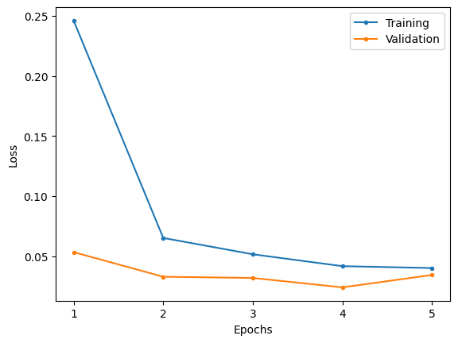
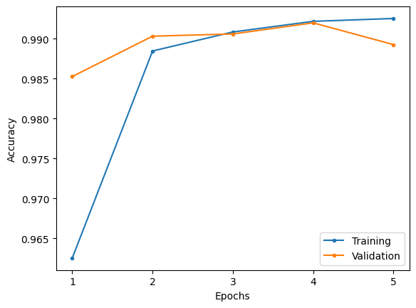

# Inception-V2

Implementation of batch normalization and the Inception-V2 following the descriptions provided in the research paper.

Note that there are some inaccuracies in the paper relating to the number of filters and resulting output shapes for some of the inception blocks. In those cases, the number of filters specified is used and the output shapes are adjusted.

## MNIST

### Model summary

|   Layer (type)   |    Output Shape    |  Param #  |
| :--------------: | :----------------: | :-------: |
|  2D convolution  | [-1, 64, 112, 112] |   9,408   |
|  2D batch norm   | [-1, 64, 112, 112] |    128    |
|       ReLU       | [-1, 64, 112, 112] |     0     |
|   2D max pool    |  [-1, 64, 56, 56]  |     0     |
|  2D convolution  | [-1, 192, 56, 56]  |  110,592  |
|  2D batch norm   | [-1, 192, 56, 56]  |    384    |
|       ReLU       | [-1, 192, 56, 56]  |     0     |
|   2D max pool    | [-1, 192, 28, 28]  |     0     |
| **inception 3a** |        ---         |    ---    |
|  2D convolution  |  [-1, 64, 28, 28]  |  12,288   |
|  2D batch norm   |  [-1, 64, 28, 28]  |    128    |
|       ReLU       |  [-1, 64, 28, 28]  |     0     |
|  2D convolution  |  [-1, 64, 28, 28]  |  36,864   |
|  2D batch norm   |  [-1, 64, 28, 28]  |    128    |
|       ReLU       |  [-1, 64, 28, 28]  |     0     |
|  2D convolution  |  [-1, 64, 28, 28]  |  12,288   |
|  2D batch norm   |  [-1, 64, 28, 28]  |    128    |
|       ReLU       |  [-1, 64, 28, 28]  |     0     |
|  2D convolution  |  [-1, 96, 28, 28]  |  55,296   |
|  2D batch norm   |  [-1, 96, 28, 28]  |    192    |
|       ReLU       |  [-1, 96, 28, 28]  |     0     |
|  2D convolution  |  [-1, 96, 28, 28]  |  82,944   |
|  2D batch norm   |  [-1, 96, 28, 28]  |    192    |
|       ReLU       |  [-1, 96, 28, 28]  |     0     |
| 2D average pool  | [-1, 192, 28, 28]  |     0     |
|  2D convolution  |  [-1, 32, 28, 28]  |   6,144   |
|  2D batch norm   |  [-1, 32, 28, 28]  |    64     |
|       ReLU       |  [-1, 32, 28, 28]  |     0     |
|  2D convolution  |  [-1, 64, 28, 28]  |  12,288   |
|  2D batch norm   |  [-1, 64, 28, 28]  |    128    |
|       ReLU       |  [-1, 64, 28, 28]  |     0     |
|  InceptionBlock  | [-1, 256, 28, 28]  |     0     |
| **inception_3b** |        ---         |    ---    |
|  2D convolution  |  [-1, 64, 28, 28]  |  16,384   |
|  2D batch norm   |  [-1, 64, 28, 28]  |    128    |
|       ReLU       |  [-1, 64, 28, 28]  |     0     |
|  2D convolution  |  [-1, 96, 28, 28]  |  55,296   |
|  2D batch norm   |  [-1, 96, 28, 28]  |    192    |
|       ReLU       |  [-1, 96, 28, 28]  |     0     |
|  2D convolution  |  [-1, 64, 28, 28]  |  16,384   |
|  2D batch norm   |  [-1, 64, 28, 28]  |    128    |
|       ReLU       |  [-1, 64, 28, 28]  |     0     |
|  2D convolution  |  [-1, 96, 28, 28]  |  55,296   |
|  2D batch norm   |  [-1, 96, 28, 28]  |    192    |
|       ReLU       |  [-1, 96, 28, 28]  |     0     |
|  2D convolution  |  [-1, 96, 28, 28]  |  82,944   |
|  2D batch norm   |  [-1, 96, 28, 28]  |    192    |
|       ReLU       |  [-1, 96, 28, 28]  |     0     |
| 2D average pool  | [-1, 256, 28, 28]  |     0     |
|  2D convolution  |  [-1, 64, 28, 28]  |  16,384   |
|  2D batch norm   |  [-1, 64, 28, 28]  |    128    |
|       ReLU       |  [-1, 64, 28, 28]  |     0     |
|  2D convolution  |  [-1, 64, 28, 28]  |  16,384   |
|  2D batch norm   |  [-1, 64, 28, 28]  |    128    |
|       ReLU       |  [-1, 64, 28, 28]  |     0     |
|  InceptionBlock  | [-1, 320, 28, 28]  |     0     |
| **inception_3c** |        ---         |    ---    |
|  2D convolution  | [-1, 128, 28, 28]  |  40,960   |
|  2D batch norm   | [-1, 128, 28, 28]  |    256    |
|       ReLU       | [-1, 128, 28, 28]  |     0     |
|  2D convolution  | [-1, 160, 14, 14]  |  184,320  |
|  2D batch norm   | [-1, 160, 14, 14]  |    320    |
|       ReLU       | [-1, 160, 14, 14]  |     0     |
|  2D convolution  |  [-1, 64, 28, 28]  |  20,480   |
|  2D batch norm   |  [-1, 64, 28, 28]  |    128    |
|       ReLU       |  [-1, 64, 28, 28]  |     0     |
|  2D convolution  |  [-1, 96, 28, 28]  |  55,296   |
|  2D batch norm   |  [-1, 96, 28, 28]  |    192    |
|       ReLU       |  [-1, 96, 28, 28]  |     0     |
|  2D convolution  |  [-1, 96, 14, 14]  |  82,944   |
|  2D batch norm   |  [-1, 96, 14, 14]  |    192    |
|       ReLU       |  [-1, 96, 14, 14]  |     0     |
|   2D max pool    | [-1, 320, 14, 14]  |     0     |
|     Identity     | [-1, 320, 14, 14]  |     0     |
|  InceptionBlock  | [-1, 576, 14, 14]  |     0     |
| **inception_4a** |        ---         |    ---    |
|  2D convolution  |  [-1, 64, 14, 14]  |  36,864   |
|  2D batch norm   |  [-1, 64, 14, 14]  |    128    |
|       ReLU       |  [-1, 64, 14, 14]  |     0     |
|  2D convolution  |  [-1, 96, 14, 14]  |  55,296   |
|  2D batch norm   |  [-1, 96, 14, 14]  |    192    |
|       ReLU       |  [-1, 96, 14, 14]  |     0     |
|  2D convolution  |  [-1, 96, 14, 14]  |  55,296   |
|  2D batch norm   |  [-1, 96, 14, 14]  |    192    |
|       ReLU       |  [-1, 96, 14, 14]  |     0     |
|  2D convolution  | [-1, 128, 14, 14]  |  110,592  |
|  2D batch norm   | [-1, 128, 14, 14]  |    256    |
|       ReLU       | [-1, 128, 14, 14]  |     0     |
|  2D convolution  | [-1, 128, 14, 14]  |  147,456  |
|  2D batch norm   | [-1, 128, 14, 14]  |    256    |
|       ReLU       | [-1, 128, 14, 14]  |     0     |
| 2D average pool  | [-1, 576, 14, 14]  |     0     |
|  2D convolution  | [-1, 128, 14, 14]  |  73,728   |
|  2D batch norm   | [-1, 128, 14, 14]  |    256    |
|       ReLU       | [-1, 128, 14, 14]  |     0     |
|  2D convolution  | [-1, 224, 14, 14]  |  129,024  |
|  2D batch norm   | [-1, 224, 14, 14]  |    448    |
|       ReLU       | [-1, 224, 14, 14]  |     0     |
|  InceptionBlock  | [-1, 576, 14, 14]  |     0     |
|    **aux_1**     |        ---         |    ---    |
| 2D average pool  |  [-1, 576, 4, 4]   |     0     |
|  2D convolution  |  [-1, 128, 4, 4]   |  73,728   |
|  2D batch norm   |  [-1, 128, 4, 4]   |    256    |
|       ReLU       |  [-1, 128, 4, 4]   |     0     |
|     Flatten      |     [-1, 2048]     |     0     |
|      Linear      |     [-1, 1024]     | 2,098,176 |
|       ReLU       |     [-1, 1024]     |     0     |
|     Dropout      |     [-1, 1024]     |     0     |
|      Linear      |      [-1, 10]      |  10,250   |
| **inception_4b** |        ---         |    ---    |
|  2D convolution  |  [-1, 96, 14, 14]  |  55,296   |
|  2D batch norm   |  [-1, 96, 14, 14]  |    192    |
|       ReLU       |  [-1, 96, 14, 14]  |     0     |
|  2D convolution  | [-1, 128, 14, 14]  |  110,592  |
|  2D batch norm   | [-1, 128, 14, 14]  |    256    |
|       ReLU       | [-1, 128, 14, 14]  |     0     |
|  2D convolution  |  [-1, 96, 14, 14]  |  55,296   |
|  2D batch norm   |  [-1, 96, 14, 14]  |    192    |
|       ReLU       |  [-1, 96, 14, 14]  |     0     |
|  2D convolution  | [-1, 128, 14, 14]  |  110,592  |
|  2D batch norm   | [-1, 128, 14, 14]  |    256    |
|       ReLU       | [-1, 128, 14, 14]  |     0     |
|  2D convolution  | [-1, 128, 14, 14]  |  147,456  |
|  2D batch norm   | [-1, 128, 14, 14]  |    256    |
|       ReLU       | [-1, 128, 14, 14]  |     0     |
| 2D average pool  | [-1, 576, 14, 14]  |     0     |
|  2D convolution  | [-1, 128, 14, 14]  |  73,728   |
|  2D batch norm   | [-1, 128, 14, 14]  |    256    |
|       ReLU       | [-1, 128, 14, 14]  |     0     |
|  2D convolution  | [-1, 192, 14, 14]  |  110,592  |
|  2D batch norm   | [-1, 192, 14, 14]  |    384    |
|       ReLU       | [-1, 192, 14, 14]  |     0     |
|  InceptionBlock  | [-1, 576, 14, 14]  |     0     |
| **inception_4c** |        ---         |    ---    |
|  2D convolution  | [-1, 128, 14, 14]  |  73,728   |
|  2D batch norm   | [-1, 128, 14, 14]  |    256    |
|       ReLU       | [-1, 128, 14, 14]  |     0     |
|  2D convolution  | [-1, 160, 14, 14]  |  184,320  |
|  2D batch norm   | [-1, 160, 14, 14]  |    320    |
|       ReLU       | [-1, 160, 14, 14]  |     0     |
|  2D convolution  | [-1, 128, 14, 14]  |  73,728   |
|  2D batch norm   | [-1, 128, 14, 14]  |    256    |
|       ReLU       | [-1, 128, 14, 14]  |     0     |
|  2D convolution  | [-1, 160, 14, 14]  |  184,320  |
|  2D batch norm   | [-1, 160, 14, 14]  |    320    |
|       ReLU       | [-1, 160, 14, 14]  |     0     |
|  2D convolution  | [-1, 160, 14, 14]  |  230,400  |
|  2D batch norm   | [-1, 160, 14, 14]  |    320    |
|       ReLU       | [-1, 160, 14, 14]  |     0     |
| 2D average pool  | [-1, 576, 14, 14]  |     0     |
|  2D convolution  | [-1, 128, 14, 14]  |  73,728   |
|  2D batch norm   | [-1, 128, 14, 14]  |    256    |
|       ReLU       | [-1, 128, 14, 14]  |     0     |
|  2D convolution  | [-1, 160, 14, 14]  |  92,160   |
|  2D batch norm   | [-1, 160, 14, 14]  |    320    |
|       ReLU       | [-1, 160, 14, 14]  |     0     |
|  InceptionBlock  | [-1, 608, 14, 14]  |     0     |
| **inception_4d** |        ---         |    ---    |
|  2D convolution  | [-1, 128, 14, 14]  |  77,824   |
|  2D batch norm   | [-1, 128, 14, 14]  |    256    |
|       ReLU       | [-1, 128, 14, 14]  |     0     |
|  2D convolution  | [-1, 192, 14, 14]  |  221,184  |
|  2D batch norm   | [-1, 192, 14, 14]  |    384    |
|       ReLU       | [-1, 192, 14, 14]  |     0     |
|  2D convolution  | [-1, 160, 14, 14]  |  97,280   |
|  2D batch norm   | [-1, 160, 14, 14]  |    320    |
|       ReLU       | [-1, 160, 14, 14]  |     0     |
|  2D convolution  | [-1, 192, 14, 14]  |  276,480  |
|  2D batch norm   | [-1, 192, 14, 14]  |    384    |
|       ReLU       | [-1, 192, 14, 14]  |     0     |
|  2D convolution  | [-1, 192, 14, 14]  |  331,776  |
|  2D batch norm   | [-1, 192, 14, 14]  |    384    |
|       ReLU       | [-1, 192, 14, 14]  |     0     |
| 2D average pool  | [-1, 608, 14, 14]  |     0     |
|  2D convolution  | [-1, 128, 14, 14]  |  77,824   |
|  2D batch norm   | [-1, 128, 14, 14]  |    256    |
|       ReLU       | [-1, 128, 14, 14]  |     0     |
|  2D convolution  |  [-1, 96, 14, 14]  |  58,368   |
|  2D batch norm   |  [-1, 96, 14, 14]  |    192    |
|       ReLU       |  [-1, 96, 14, 14]  |     0     |
|  InceptionBlock  | [-1, 608, 14, 14]  |     0     |
|    **aux_2**     |        ---         |    ---    |
| 2D average pool  |  [-1, 608, 4, 4]   |     0     |
|  2D convolution  |  [-1, 128, 4, 4]   |  77,824   |
|  2D batch norm   |  [-1, 128, 4, 4]   |    256    |
|       ReLU       |  [-1, 128, 4, 4]   |     0     |
|     Flatten      |     [-1, 2048]     |     0     |
|      Linear      |     [-1, 1024]     | 2,098,176 |
|       ReLU       |     [-1, 1024]     |     0     |
|     Dropout      |     [-1, 1024]     |     0     |
|      Linear      |      [-1, 10]      |  10,250   |
| **inception_4e** |        ---         |    ---    |
|  2D convolution  | [-1, 128, 14, 14]  |  77,824   |
|  2D batch norm   | [-1, 128, 14, 14]  |    256    |
|       ReLU       | [-1, 128, 14, 14]  |     0     |
|  2D convolution  |  [-1, 192, 7, 7]   |  221,184  |
|  2D batch norm   |  [-1, 192, 7, 7]   |    384    |
|       ReLU       |  [-1, 192, 7, 7]   |     0     |
|  2D convolution  | [-1, 192, 14, 14]  |  116,736  |
|  2D batch norm   | [-1, 192, 14, 14]  |    384    |
|       ReLU       | [-1, 192, 14, 14]  |     0     |
|  2D convolution  | [-1, 256, 14, 14]  |  442,368  |
|  2D batch norm   | [-1, 256, 14, 14]  |    512    |
|       ReLU       | [-1, 256, 14, 14]  |     0     |
|  2D convolution  |  [-1, 256, 7, 7]   |  589,824  |
|  2D batch norm   |  [-1, 256, 7, 7]   |    512    |
|       ReLU       |  [-1, 256, 7, 7]   |     0     |
|   2D max pool    |  [-1, 608, 7, 7]   |     0     |
|     Identity     |  [-1, 608, 7, 7]   |     0     |
|  InceptionBlock  |  [-1, 1056, 7, 7]  |     0     |
| **inception_5a** |        ---         |    ---    |
|  2D convolution  |  [-1, 192, 7, 7]   |  202,752  |
|  2D batch norm   |  [-1, 192, 7, 7]   |    384    |
|       ReLU       |  [-1, 192, 7, 7]   |     0     |
|  2D convolution  |  [-1, 320, 7, 7]   |  552,960  |
|  2D batch norm   |  [-1, 320, 7, 7]   |    640    |
|       ReLU       |  [-1, 320, 7, 7]   |     0     |
|  2D convolution  |  [-1, 160, 7, 7]   |  168,960  |
|  2D batch norm   |  [-1, 160, 7, 7]   |    320    |
|       ReLU       |  [-1, 160, 7, 7]   |     0     |
|  2D convolution  |  [-1, 224, 7, 7]   |  322,560  |
|  2D batch norm   |  [-1, 224, 7, 7]   |    448    |
|       ReLU       |  [-1, 224, 7, 7]   |     0     |
|  2D convolution  |  [-1, 224, 7, 7]   |  451,584  |
|  2D batch norm   |  [-1, 224, 7, 7]   |    448    |
|       ReLU       |  [-1, 224, 7, 7]   |     0     |
| 2D average pool  |  [-1, 1056, 7, 7]  |     0     |
|  2D convolution  |  [-1, 128, 7, 7]   |  135,168  |
|  2D batch norm   |  [-1, 128, 7, 7]   |    256    |
|       ReLU       |  [-1, 128, 7, 7]   |     0     |
|  2D convolution  |  [-1, 352, 7, 7]   |  371,712  |
|  2D batch norm   |  [-1, 352, 7, 7]   |    704    |
|       ReLU       |  [-1, 352, 7, 7]   |     0     |
|  InceptionBlock  |  [-1, 1024, 7, 7]  |     0     |
| **inception_5b** |        ---         |    ---    |
|  2D convolution  |  [-1, 192, 7, 7]   |  196,608  |
|  2D batch norm   |  [-1, 192, 7, 7]   |    384    |
|       ReLU       |  [-1, 192, 7, 7]   |     0     |
|  2D convolution  |  [-1, 320, 7, 7]   |  552,960  |
|  2D batch norm   |  [-1, 320, 7, 7]   |    640    |
|       ReLU       |  [-1, 320, 7, 7]   |     0     |
|  2D convolution  |  [-1, 192, 7, 7]   |  196,608  |
|  2D batch norm   |  [-1, 192, 7, 7]   |    384    |
|       ReLU       |  [-1, 192, 7, 7]   |     0     |
|  2D convolution  |  [-1, 224, 7, 7]   |  387,072  |
|  2D batch norm   |  [-1, 224, 7, 7]   |    448    |
|       ReLU       |  [-1, 224, 7, 7]   |     0     |
|  2D convolution  |  [-1, 224, 7, 7]   |  451,584  |
|  2D batch norm   |  [-1, 224, 7, 7]   |    448    |
|       ReLU       |  [-1, 224, 7, 7]   |     0     |
|   2D max pool    |  [-1, 1024, 7, 7]  |     0     |
|  2D convolution  |  [-1, 128, 7, 7]   |  131,072  |
|  2D batch norm   |  [-1, 128, 7, 7]   |    256    |
|       ReLU       |  [-1, 128, 7, 7]   |     0     |
|  2D convolution  |  [-1, 352, 7, 7]   |  360,448  |
|  2D batch norm   |  [-1, 352, 7, 7]   |    704    |
|       ReLU       |  [-1, 352, 7, 7]   |     0     |
|  InceptionBlock  |  [-1, 1024, 7, 7]  |     0     |
| 2D average pool  |  [-1, 1024, 1, 1]  |     0     |
|     Flatten      |     [-1, 1024]     |     0     |
|      Linear      |      [-1, 10]      |  10,250   |

|                                         |            |
| --------------------------------------- | ---------- |
| Total params                            | 14,635,166 |
| Trainable params                        | 14,635,166 |
| Total params excluding auxiliary params | 10,266,250 |
| Non-trainable params                    | 0          |

### Results

Trained over 5 epochs with a learning rate of 1e-4, batch size of 64, auxiliary loss weighting of 0.3 and weight decay of 0.01.

|                     Loss                      |                       Accuracy                        |
| :-------------------------------------------: | :---------------------------------------------------: |
|  |  |

|              | Training | Validation | Testing |
| :----------: | :------: | :--------: | :-----: |
|     Loss     |  0.0401  |   0.0344   | 0.0259  |
| Accuracy (%) |  99.25   |   98.93    |  99.27  |

| Class | Training Precision | Validation Precision | Testing Precision | Training Recall | Validation Recall | Testing Recall | Training F1 Score | Validation F1 Score | Testing F1 Score |
| :---: | :----------------: | :------------------: | :---------------: | :-------------: | :---------------: | :------------: | :---------------: | :-----------------: | :--------------: |
|   0   |       0.9956       |        0.9950        |      0.9959       |     0.9956      |      0.9955       |     1.0000     |      0.9956       |       0.9953        |      0.9980      |
|   1   |       0.9930       |        0.9970        |      0.9956       |     0.9933      |      0.9935       |     0.9982     |      0.9931       |       0.9952        |      0.9969      |
|   2   |       0.9928       |        0.9915        |      0.9961       |     0.9933      |      0.9938       |     0.9981     |      0.9931       |       0.9927        |      0.9971      |
|   3   |       0.9946       |        0.9886        |      0.9854       |     0.9916      |      0.9934       |     0.9990     |      0.9931       |       0.9910        |      0.9921      |
|   4   |       0.9911       |        0.9971        |      0.9979       |     0.9918      |      0.9639       |     0.9684     |      0.9915       |       0.9802        |      0.9829      |
|   5   |       0.9932       |        0.9937        |      0.9955       |     0.9919      |      0.9868       |     0.9843     |      0.9926       |       0.9902        |      0.9899      |
|   6   |       0.9930       |        0.9927        |      0.9989       |     0.9940      |      0.9943       |     0.9916     |      0.9935       |       0.9935        |      0.9953      |
|   7   |       0.9900       |        0.9768        |      0.9932       |     0.9932      |      0.9914       |     0.9942     |      0.9916       |       0.9841        |      0.9937      |
|   8   |       0.9931       |        0.9972        |      0.9990       |     0.9924      |      0.9900       |     0.9949     |      0.9927       |       0.9936        |      0.9969      |
|   9   |       0.9890       |        0.9644        |      0.9710       |     0.9882      |      0.9893       |     0.9960     |      0.9886       |       0.9767        |      0.9834      |

Inception-V2 is able to perform slightly better than GoogLeNet, while requiring less epochs to converge (5 as opposed to 20). It can also be seen from the graphs that the model is beginning to overfit quite quickly and weight decay was necessary to achieve the test performance.

## CIFAR 100

### Model summary

|   Layer (type)   |    Output Shape    |  Param #  |
| :--------------: | :----------------: | :-------: |
|  2D convolution  | [-1, 64, 112, 112] |   9,408   |
|  2D batch norm   | [-1, 64, 112, 112] |    128    |
|       ReLU       | [-1, 64, 112, 112] |     0     |
|   2D max pool    |  [-1, 64, 56, 56]  |     0     |
|  2D convolution  | [-1, 192, 56, 56]  |  110,592  |
|  2D batch norm   | [-1, 192, 56, 56]  |    384    |
|       ReLU       | [-1, 192, 56, 56]  |     0     |
|   2D max pool    | [-1, 192, 28, 28]  |     0     |
| **inception 3a** |        ---         |    ---    |
|  2D convolution  |  [-1, 64, 28, 28]  |  12,288   |
|  2D batch norm   |  [-1, 64, 28, 28]  |    128    |
|       ReLU       |  [-1, 64, 28, 28]  |     0     |
|  2D convolution  |  [-1, 64, 28, 28]  |  36,864   |
|  2D batch norm   |  [-1, 64, 28, 28]  |    128    |
|       ReLU       |  [-1, 64, 28, 28]  |     0     |
|  2D convolution  |  [-1, 64, 28, 28]  |  12,288   |
|  2D batch norm   |  [-1, 64, 28, 28]  |    128    |
|       ReLU       |  [-1, 64, 28, 28]  |     0     |
|  2D convolution  |  [-1, 96, 28, 28]  |  55,296   |
|  2D batch norm   |  [-1, 96, 28, 28]  |    192    |
|       ReLU       |  [-1, 96, 28, 28]  |     0     |
|  2D convolution  |  [-1, 96, 28, 28]  |  82,944   |
|  2D batch norm   |  [-1, 96, 28, 28]  |    192    |
|       ReLU       |  [-1, 96, 28, 28]  |     0     |
| 2D average pool  | [-1, 192, 28, 28]  |     0     |
|  2D convolution  |  [-1, 32, 28, 28]  |   6,144   |
|  2D batch norm   |  [-1, 32, 28, 28]  |    64     |
|       ReLU       |  [-1, 32, 28, 28]  |     0     |
|  2D convolution  |  [-1, 64, 28, 28]  |  12,288   |
|  2D batch norm   |  [-1, 64, 28, 28]  |    128    |
|       ReLU       |  [-1, 64, 28, 28]  |     0     |
|  InceptionBlock  | [-1, 256, 28, 28]  |     0     |
| **inception_3b** |        ---         |    ---    |
|  2D convolution  |  [-1, 64, 28, 28]  |  16,384   |
|  2D batch norm   |  [-1, 64, 28, 28]  |    128    |
|       ReLU       |  [-1, 64, 28, 28]  |     0     |
|  2D convolution  |  [-1, 96, 28, 28]  |  55,296   |
|  2D batch norm   |  [-1, 96, 28, 28]  |    192    |
|       ReLU       |  [-1, 96, 28, 28]  |     0     |
|  2D convolution  |  [-1, 64, 28, 28]  |  16,384   |
|  2D batch norm   |  [-1, 64, 28, 28]  |    128    |
|       ReLU       |  [-1, 64, 28, 28]  |     0     |
|  2D convolution  |  [-1, 96, 28, 28]  |  55,296   |
|  2D batch norm   |  [-1, 96, 28, 28]  |    192    |
|       ReLU       |  [-1, 96, 28, 28]  |     0     |
|  2D convolution  |  [-1, 96, 28, 28]  |  82,944   |
|  2D batch norm   |  [-1, 96, 28, 28]  |    192    |
|       ReLU       |  [-1, 96, 28, 28]  |     0     |
| 2D average pool  | [-1, 256, 28, 28]  |     0     |
|  2D convolution  |  [-1, 64, 28, 28]  |  16,384   |
|  2D batch norm   |  [-1, 64, 28, 28]  |    128    |
|       ReLU       |  [-1, 64, 28, 28]  |     0     |
|  2D convolution  |  [-1, 64, 28, 28]  |  16,384   |
|  2D batch norm   |  [-1, 64, 28, 28]  |    128    |
|       ReLU       |  [-1, 64, 28, 28]  |     0     |
|  InceptionBlock  | [-1, 320, 28, 28]  |     0     |
| **inception_3c** |        ---         |    ---    |
|  2D convolution  | [-1, 128, 28, 28]  |  40,960   |
|  2D batch norm   | [-1, 128, 28, 28]  |    256    |
|       ReLU       | [-1, 128, 28, 28]  |     0     |
|  2D convolution  | [-1, 160, 14, 14]  |  184,320  |
|  2D batch norm   | [-1, 160, 14, 14]  |    320    |
|       ReLU       | [-1, 160, 14, 14]  |     0     |
|  2D convolution  |  [-1, 64, 28, 28]  |  20,480   |
|  2D batch norm   |  [-1, 64, 28, 28]  |    128    |
|       ReLU       |  [-1, 64, 28, 28]  |     0     |
|  2D convolution  |  [-1, 96, 28, 28]  |  55,296   |
|  2D batch norm   |  [-1, 96, 28, 28]  |    192    |
|       ReLU       |  [-1, 96, 28, 28]  |     0     |
|  2D convolution  |  [-1, 96, 14, 14]  |  82,944   |
|  2D batch norm   |  [-1, 96, 14, 14]  |    192    |
|       ReLU       |  [-1, 96, 14, 14]  |     0     |
|   2D max pool    | [-1, 320, 14, 14]  |     0     |
|     Identity     | [-1, 320, 14, 14]  |     0     |
|  InceptionBlock  | [-1, 576, 14, 14]  |     0     |
| **inception_4a** |        ---         |    ---    |
|  2D convolution  |  [-1, 64, 14, 14]  |  36,864   |
|  2D batch norm   |  [-1, 64, 14, 14]  |    128    |
|       ReLU       |  [-1, 64, 14, 14]  |     0     |
|  2D convolution  |  [-1, 96, 14, 14]  |  55,296   |
|  2D batch norm   |  [-1, 96, 14, 14]  |    192    |
|       ReLU       |  [-1, 96, 14, 14]  |     0     |
|  2D convolution  |  [-1, 96, 14, 14]  |  55,296   |
|  2D batch norm   |  [-1, 96, 14, 14]  |    192    |
|       ReLU       |  [-1, 96, 14, 14]  |     0     |
|  2D convolution  | [-1, 128, 14, 14]  |  110,592  |
|  2D batch norm   | [-1, 128, 14, 14]  |    256    |
|       ReLU       | [-1, 128, 14, 14]  |     0     |
|  2D convolution  | [-1, 128, 14, 14]  |  147,456  |
|  2D batch norm   | [-1, 128, 14, 14]  |    256    |
|       ReLU       | [-1, 128, 14, 14]  |     0     |
| 2D average pool  | [-1, 576, 14, 14]  |     0     |
|  2D convolution  | [-1, 128, 14, 14]  |  73,728   |
|  2D batch norm   | [-1, 128, 14, 14]  |    256    |
|       ReLU       | [-1, 128, 14, 14]  |     0     |
|  2D convolution  | [-1, 224, 14, 14]  |  129,024  |
|  2D batch norm   | [-1, 224, 14, 14]  |    448    |
|       ReLU       | [-1, 224, 14, 14]  |     0     |
|  InceptionBlock  | [-1, 576, 14, 14]  |     0     |
|    **aux_1**     |        ---         |    ---    |
| 2D average pool  |  [-1, 576, 4, 4]   |     0     |
|  2D convolution  |  [-1, 128, 4, 4]   |  73,728   |
|  2D batch norm   |  [-1, 128, 4, 4]   |    256    |
|       ReLU       |  [-1, 128, 4, 4]   |     0     |
|     Flatten      |     [-1, 2048]     |     0     |
|      Linear      |     [-1, 1024]     | 2,098,176 |
|       ReLU       |     [-1, 1024]     |     0     |
|     Dropout      |     [-1, 1024]     |     0     |
|      Linear      |     [-1, 100]      |  102,500  |
| **inception_4b** |        ---         |    ---    |
|  2D convolution  |  [-1, 96, 14, 14]  |  55,296   |
|  2D batch norm   |  [-1, 96, 14, 14]  |    192    |
|       ReLU       |  [-1, 96, 14, 14]  |     0     |
|  2D convolution  | [-1, 128, 14, 14]  |  110,592  |
|  2D batch norm   | [-1, 128, 14, 14]  |    256    |
|       ReLU       | [-1, 128, 14, 14]  |     0     |
|  2D convolution  |  [-1, 96, 14, 14]  |  55,296   |
|  2D batch norm   |  [-1, 96, 14, 14]  |    192    |
|       ReLU       |  [-1, 96, 14, 14]  |     0     |
|  2D convolution  | [-1, 128, 14, 14]  |  110,592  |
|  2D batch norm   | [-1, 128, 14, 14]  |    256    |
|       ReLU       | [-1, 128, 14, 14]  |     0     |
|  2D convolution  | [-1, 128, 14, 14]  |  147,456  |
|  2D batch norm   | [-1, 128, 14, 14]  |    256    |
|       ReLU       | [-1, 128, 14, 14]  |     0     |
| 2D average pool  | [-1, 576, 14, 14]  |     0     |
|  2D convolution  | [-1, 128, 14, 14]  |  73,728   |
|  2D batch norm   | [-1, 128, 14, 14]  |    256    |
|       ReLU       | [-1, 128, 14, 14]  |     0     |
|  2D convolution  | [-1, 192, 14, 14]  |  110,592  |
|  2D batch norm   | [-1, 192, 14, 14]  |    384    |
|       ReLU       | [-1, 192, 14, 14]  |     0     |
|  InceptionBlock  | [-1, 576, 14, 14]  |     0     |
| **inception_4c** |        ---         |    ---    |
|  2D convolution  | [-1, 128, 14, 14]  |  73,728   |
|  2D batch norm   | [-1, 128, 14, 14]  |    256    |
|       ReLU       | [-1, 128, 14, 14]  |     0     |
|  2D convolution  | [-1, 160, 14, 14]  |  184,320  |
|  2D batch norm   | [-1, 160, 14, 14]  |    320    |
|       ReLU       | [-1, 160, 14, 14]  |     0     |
|  2D convolution  | [-1, 128, 14, 14]  |  73,728   |
|  2D batch norm   | [-1, 128, 14, 14]  |    256    |
|       ReLU       | [-1, 128, 14, 14]  |     0     |
|  2D convolution  | [-1, 160, 14, 14]  |  184,320  |
|  2D batch norm   | [-1, 160, 14, 14]  |    320    |
|       ReLU       | [-1, 160, 14, 14]  |     0     |
|  2D convolution  | [-1, 160, 14, 14]  |  230,400  |
|  2D batch norm   | [-1, 160, 14, 14]  |    320    |
|       ReLU       | [-1, 160, 14, 14]  |     0     |
| 2D average pool  | [-1, 576, 14, 14]  |     0     |
|  2D convolution  | [-1, 128, 14, 14]  |  73,728   |
|  2D batch norm   | [-1, 128, 14, 14]  |    256    |
|       ReLU       | [-1, 128, 14, 14]  |     0     |
|  2D convolution  | [-1, 160, 14, 14]  |  92,160   |
|  2D batch norm   | [-1, 160, 14, 14]  |    320    |
|       ReLU       | [-1, 160, 14, 14]  |     0     |
|  InceptionBlock  | [-1, 608, 14, 14]  |     0     |
| **inception_4d** |        ---         |    ---    |
|  2D convolution  | [-1, 128, 14, 14]  |  77,824   |
|  2D batch norm   | [-1, 128, 14, 14]  |    256    |
|       ReLU       | [-1, 128, 14, 14]  |     0     |
|  2D convolution  | [-1, 192, 14, 14]  |  221,184  |
|  2D batch norm   | [-1, 192, 14, 14]  |    384    |
|       ReLU       | [-1, 192, 14, 14]  |     0     |
|  2D convolution  | [-1, 160, 14, 14]  |  97,280   |
|  2D batch norm   | [-1, 160, 14, 14]  |    320    |
|       ReLU       | [-1, 160, 14, 14]  |     0     |
|  2D convolution  | [-1, 192, 14, 14]  |  276,480  |
|  2D batch norm   | [-1, 192, 14, 14]  |    384    |
|       ReLU       | [-1, 192, 14, 14]  |     0     |
|  2D convolution  | [-1, 192, 14, 14]  |  331,776  |
|  2D batch norm   | [-1, 192, 14, 14]  |    384    |
|       ReLU       | [-1, 192, 14, 14]  |     0     |
| 2D average pool  | [-1, 608, 14, 14]  |     0     |
|  2D convolution  | [-1, 128, 14, 14]  |  77,824   |
|  2D batch norm   | [-1, 128, 14, 14]  |    256    |
|       ReLU       | [-1, 128, 14, 14]  |     0     |
|  2D convolution  |  [-1, 96, 14, 14]  |  58,368   |
|  2D batch norm   |  [-1, 96, 14, 14]  |    192    |
|       ReLU       |  [-1, 96, 14, 14]  |     0     |
|  InceptionBlock  | [-1, 608, 14, 14]  |     0     |
|    **aux_2**     |        ---         |    ---    |
| 2D average pool  |  [-1, 608, 4, 4]   |     0     |
|  2D convolution  |  [-1, 128, 4, 4]   |  77,824   |
|  2D batch norm   |  [-1, 128, 4, 4]   |    256    |
|       ReLU       |  [-1, 128, 4, 4]   |     0     |
|     Flatten      |     [-1, 2048]     |     0     |
|      Linear      |     [-1, 1024]     | 2,098,176 |
|       ReLU       |     [-1, 1024]     |     0     |
|     Dropout      |     [-1, 1024]     |     0     |
|      Linear      |     [-1, 100]      |  102,500  |
| **inception_4e** |        ---         |    ---    |
|  2D convolution  | [-1, 128, 14, 14]  |  77,824   |
|  2D batch norm   | [-1, 128, 14, 14]  |    256    |
|       ReLU       | [-1, 128, 14, 14]  |     0     |
|  2D convolution  |  [-1, 192, 7, 7]   |  221,184  |
|  2D batch norm   |  [-1, 192, 7, 7]   |    384    |
|       ReLU       |  [-1, 192, 7, 7]   |     0     |
|  2D convolution  | [-1, 192, 14, 14]  |  116,736  |
|  2D batch norm   | [-1, 192, 14, 14]  |    384    |
|       ReLU       | [-1, 192, 14, 14]  |     0     |
|  2D convolution  | [-1, 256, 14, 14]  |  442,368  |
|  2D batch norm   | [-1, 256, 14, 14]  |    512    |
|       ReLU       | [-1, 256, 14, 14]  |     0     |
|  2D convolution  |  [-1, 256, 7, 7]   |  589,824  |
|  2D batch norm   |  [-1, 256, 7, 7]   |    512    |
|       ReLU       |  [-1, 256, 7, 7]   |     0     |
|   2D max pool    |  [-1, 608, 7, 7]   |     0     |
|     Identity     |  [-1, 608, 7, 7]   |     0     |
|  InceptionBlock  |  [-1, 1056, 7, 7]  |     0     |
| **inception_5a** |        ---         |    ---    |
|  2D convolution  |  [-1, 192, 7, 7]   |  202,752  |
|  2D batch norm   |  [-1, 192, 7, 7]   |    384    |
|       ReLU       |  [-1, 192, 7, 7]   |     0     |
|  2D convolution  |  [-1, 320, 7, 7]   |  552,960  |
|  2D batch norm   |  [-1, 320, 7, 7]   |    640    |
|       ReLU       |  [-1, 320, 7, 7]   |     0     |
|  2D convolution  |  [-1, 160, 7, 7]   |  168,960  |
|  2D batch norm   |  [-1, 160, 7, 7]   |    320    |
|       ReLU       |  [-1, 160, 7, 7]   |     0     |
|  2D convolution  |  [-1, 224, 7, 7]   |  322,560  |
|  2D batch norm   |  [-1, 224, 7, 7]   |    448    |
|       ReLU       |  [-1, 224, 7, 7]   |     0     |
|  2D convolution  |  [-1, 224, 7, 7]   |  451,584  |
|  2D batch norm   |  [-1, 224, 7, 7]   |    448    |
|       ReLU       |  [-1, 224, 7, 7]   |     0     |
| 2D average pool  |  [-1, 1056, 7, 7]  |     0     |
|  2D convolution  |  [-1, 128, 7, 7]   |  135,168  |
|  2D batch norm   |  [-1, 128, 7, 7]   |    256    |
|       ReLU       |  [-1, 128, 7, 7]   |     0     |
|  2D convolution  |  [-1, 352, 7, 7]   |  371,712  |
|  2D batch norm   |  [-1, 352, 7, 7]   |    704    |
|       ReLU       |  [-1, 352, 7, 7]   |     0     |
|  InceptionBlock  |  [-1, 1024, 7, 7]  |     0     |
| **inception_5b** |        ---         |    ---    |
|  2D convolution  |  [-1, 192, 7, 7]   |  196,608  |
|  2D batch norm   |  [-1, 192, 7, 7]   |    384    |
|       ReLU       |  [-1, 192, 7, 7]   |     0     |
|  2D convolution  |  [-1, 320, 7, 7]   |  552,960  |
|  2D batch norm   |  [-1, 320, 7, 7]   |    640    |
|       ReLU       |  [-1, 320, 7, 7]   |     0     |
|  2D convolution  |  [-1, 192, 7, 7]   |  196,608  |
|  2D batch norm   |  [-1, 192, 7, 7]   |    384    |
|       ReLU       |  [-1, 192, 7, 7]   |     0     |
|  2D convolution  |  [-1, 224, 7, 7]   |  387,072  |
|  2D batch norm   |  [-1, 224, 7, 7]   |    448    |
|       ReLU       |  [-1, 224, 7, 7]   |     0     |
|  2D convolution  |  [-1, 224, 7, 7]   |  451,584  |
|  2D batch norm   |  [-1, 224, 7, 7]   |    448    |
|       ReLU       |  [-1, 224, 7, 7]   |     0     |
|   2D max pool    |  [-1, 1024, 7, 7]  |     0     |
|  2D convolution  |  [-1, 128, 7, 7]   |  131,072  |
|  2D batch norm   |  [-1, 128, 7, 7]   |    256    |
|       ReLU       |  [-1, 128, 7, 7]   |     0     |
|  2D convolution  |  [-1, 352, 7, 7]   |  360,448  |
|  2D batch norm   |  [-1, 352, 7, 7]   |    704    |
|       ReLU       |  [-1, 352, 7, 7]   |     0     |
|  InceptionBlock  |  [-1, 1024, 7, 7]  |     0     |
| 2D average pool  |  [-1, 1024, 1, 1]  |     0     |
|     Flatten      |     [-1, 1024]     |     0     |
|      Linear      |     [-1, 100]      |  102,500  |

|                                         |            |
| --------------------------------------- | ---------- |
| Total params                            | 14,911,916 |
| Trainable params                        | 14,911,916 |
| Total params excluding auxiliary params | 10,358,500 |
| Non-trainable params                    | 0          |

## References

Research paper: https://arxiv.org/pdf/1412.6980.pdf
