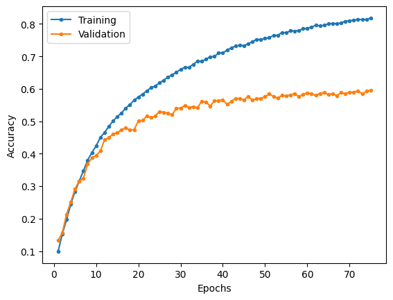

# Inception-V2

Implementation of batch normalization and the Inception-V2 following the descriptions provided in the research paper.

Note that there are some inaccuracies in the paper relating to the number of filters and resulting output shapes for some of the inception blocks. In those cases, the number of filters specified is used and the output shapes are adjusted.

## MNIST

### Model summary

|   Layer (type)   |    Output Shape    |  Param #  |
| :--------------: | :----------------: | :-------: |
|  2D convolution  | [-1, 64, 112, 112] |   9,408   |
|  2D batch norm   | [-1, 64, 112, 112] |    128    |
|       ReLU       | [-1, 64, 112, 112] |     0     |
|   2D max pool    |  [-1, 64, 56, 56]  |     0     |
|  2D convolution  | [-1, 192, 56, 56]  |  110,592  |
|  2D batch norm   | [-1, 192, 56, 56]  |    384    |
|       ReLU       | [-1, 192, 56, 56]  |     0     |
|   2D max pool    | [-1, 192, 28, 28]  |     0     |
| **inception 3a** |        ---         |    ---    |
|  2D convolution  |  [-1, 64, 28, 28]  |  12,288   |
|  2D batch norm   |  [-1, 64, 28, 28]  |    128    |
|       ReLU       |  [-1, 64, 28, 28]  |     0     |
|  2D convolution  |  [-1, 64, 28, 28]  |  36,864   |
|  2D batch norm   |  [-1, 64, 28, 28]  |    128    |
|       ReLU       |  [-1, 64, 28, 28]  |     0     |
|  2D convolution  |  [-1, 64, 28, 28]  |  12,288   |
|  2D batch norm   |  [-1, 64, 28, 28]  |    128    |
|       ReLU       |  [-1, 64, 28, 28]  |     0     |
|  2D convolution  |  [-1, 96, 28, 28]  |  55,296   |
|  2D batch norm   |  [-1, 96, 28, 28]  |    192    |
|       ReLU       |  [-1, 96, 28, 28]  |     0     |
|  2D convolution  |  [-1, 96, 28, 28]  |  82,944   |
|  2D batch norm   |  [-1, 96, 28, 28]  |    192    |
|       ReLU       |  [-1, 96, 28, 28]  |     0     |
| 2D average pool  | [-1, 192, 28, 28]  |     0     |
|  2D convolution  |  [-1, 32, 28, 28]  |   6,144   |
|  2D batch norm   |  [-1, 32, 28, 28]  |    64     |
|       ReLU       |  [-1, 32, 28, 28]  |     0     |
|  2D convolution  |  [-1, 64, 28, 28]  |  12,288   |
|  2D batch norm   |  [-1, 64, 28, 28]  |    128    |
|       ReLU       |  [-1, 64, 28, 28]  |     0     |
|  InceptionBlock  | [-1, 256, 28, 28]  |     0     |
| **inception_3b** |        ---         |    ---    |
|  2D convolution  |  [-1, 64, 28, 28]  |  16,384   |
|  2D batch norm   |  [-1, 64, 28, 28]  |    128    |
|       ReLU       |  [-1, 64, 28, 28]  |     0     |
|  2D convolution  |  [-1, 96, 28, 28]  |  55,296   |
|  2D batch norm   |  [-1, 96, 28, 28]  |    192    |
|       ReLU       |  [-1, 96, 28, 28]  |     0     |
|  2D convolution  |  [-1, 64, 28, 28]  |  16,384   |
|  2D batch norm   |  [-1, 64, 28, 28]  |    128    |
|       ReLU       |  [-1, 64, 28, 28]  |     0     |
|  2D convolution  |  [-1, 96, 28, 28]  |  55,296   |
|  2D batch norm   |  [-1, 96, 28, 28]  |    192    |
|       ReLU       |  [-1, 96, 28, 28]  |     0     |
|  2D convolution  |  [-1, 96, 28, 28]  |  82,944   |
|  2D batch norm   |  [-1, 96, 28, 28]  |    192    |
|       ReLU       |  [-1, 96, 28, 28]  |     0     |
| 2D average pool  | [-1, 256, 28, 28]  |     0     |
|  2D convolution  |  [-1, 64, 28, 28]  |  16,384   |
|  2D batch norm   |  [-1, 64, 28, 28]  |    128    |
|       ReLU       |  [-1, 64, 28, 28]  |     0     |
|  2D convolution  |  [-1, 64, 28, 28]  |  16,384   |
|  2D batch norm   |  [-1, 64, 28, 28]  |    128    |
|       ReLU       |  [-1, 64, 28, 28]  |     0     |
|  InceptionBlock  | [-1, 320, 28, 28]  |     0     |
| **inception_3c** |        ---         |    ---    |
|  2D convolution  | [-1, 128, 28, 28]  |  40,960   |
|  2D batch norm   | [-1, 128, 28, 28]  |    256    |
|       ReLU       | [-1, 128, 28, 28]  |     0     |
|  2D convolution  | [-1, 160, 14, 14]  |  184,320  |
|  2D batch norm   | [-1, 160, 14, 14]  |    320    |
|       ReLU       | [-1, 160, 14, 14]  |     0     |
|  2D convolution  |  [-1, 64, 28, 28]  |  20,480   |
|  2D batch norm   |  [-1, 64, 28, 28]  |    128    |
|       ReLU       |  [-1, 64, 28, 28]  |     0     |
|  2D convolution  |  [-1, 96, 28, 28]  |  55,296   |
|  2D batch norm   |  [-1, 96, 28, 28]  |    192    |
|       ReLU       |  [-1, 96, 28, 28]  |     0     |
|  2D convolution  |  [-1, 96, 14, 14]  |  82,944   |
|  2D batch norm   |  [-1, 96, 14, 14]  |    192    |
|       ReLU       |  [-1, 96, 14, 14]  |     0     |
|   2D max pool    | [-1, 320, 14, 14]  |     0     |
|     Identity     | [-1, 320, 14, 14]  |     0     |
|  InceptionBlock  | [-1, 576, 14, 14]  |     0     |
| **inception_4a** |        ---         |    ---    |
|  2D convolution  |  [-1, 64, 14, 14]  |  36,864   |
|  2D batch norm   |  [-1, 64, 14, 14]  |    128    |
|       ReLU       |  [-1, 64, 14, 14]  |     0     |
|  2D convolution  |  [-1, 96, 14, 14]  |  55,296   |
|  2D batch norm   |  [-1, 96, 14, 14]  |    192    |
|       ReLU       |  [-1, 96, 14, 14]  |     0     |
|  2D convolution  |  [-1, 96, 14, 14]  |  55,296   |
|  2D batch norm   |  [-1, 96, 14, 14]  |    192    |
|       ReLU       |  [-1, 96, 14, 14]  |     0     |
|  2D convolution  | [-1, 128, 14, 14]  |  110,592  |
|  2D batch norm   | [-1, 128, 14, 14]  |    256    |
|       ReLU       | [-1, 128, 14, 14]  |     0     |
|  2D convolution  | [-1, 128, 14, 14]  |  147,456  |
|  2D batch norm   | [-1, 128, 14, 14]  |    256    |
|       ReLU       | [-1, 128, 14, 14]  |     0     |
| 2D average pool  | [-1, 576, 14, 14]  |     0     |
|  2D convolution  | [-1, 128, 14, 14]  |  73,728   |
|  2D batch norm   | [-1, 128, 14, 14]  |    256    |
|       ReLU       | [-1, 128, 14, 14]  |     0     |
|  2D convolution  | [-1, 224, 14, 14]  |  129,024  |
|  2D batch norm   | [-1, 224, 14, 14]  |    448    |
|       ReLU       | [-1, 224, 14, 14]  |     0     |
|  InceptionBlock  | [-1, 576, 14, 14]  |     0     |
|    **aux_1**     |        ---         |    ---    |
| 2D average pool  |  [-1, 576, 4, 4]   |     0     |
|  2D convolution  |  [-1, 128, 4, 4]   |  73,728   |
|  2D batch norm   |  [-1, 128, 4, 4]   |    256    |
|       ReLU       |  [-1, 128, 4, 4]   |     0     |
|     Flatten      |     [-1, 2048]     |     0     |
|      Linear      |     [-1, 1024]     | 2,098,176 |
|       ReLU       |     [-1, 1024]     |     0     |
|     Dropout      |     [-1, 1024]     |     0     |
|      Linear      |      [-1, 10]      |  10,250   |
| **inception_4b** |        ---         |    ---    |
|  2D convolution  |  [-1, 96, 14, 14]  |  55,296   |
|  2D batch norm   |  [-1, 96, 14, 14]  |    192    |
|       ReLU       |  [-1, 96, 14, 14]  |     0     |
|  2D convolution  | [-1, 128, 14, 14]  |  110,592  |
|  2D batch norm   | [-1, 128, 14, 14]  |    256    |
|       ReLU       | [-1, 128, 14, 14]  |     0     |
|  2D convolution  |  [-1, 96, 14, 14]  |  55,296   |
|  2D batch norm   |  [-1, 96, 14, 14]  |    192    |
|       ReLU       |  [-1, 96, 14, 14]  |     0     |
|  2D convolution  | [-1, 128, 14, 14]  |  110,592  |
|  2D batch norm   | [-1, 128, 14, 14]  |    256    |
|       ReLU       | [-1, 128, 14, 14]  |     0     |
|  2D convolution  | [-1, 128, 14, 14]  |  147,456  |
|  2D batch norm   | [-1, 128, 14, 14]  |    256    |
|       ReLU       | [-1, 128, 14, 14]  |     0     |
| 2D average pool  | [-1, 576, 14, 14]  |     0     |
|  2D convolution  | [-1, 128, 14, 14]  |  73,728   |
|  2D batch norm   | [-1, 128, 14, 14]  |    256    |
|       ReLU       | [-1, 128, 14, 14]  |     0     |
|  2D convolution  | [-1, 192, 14, 14]  |  110,592  |
|  2D batch norm   | [-1, 192, 14, 14]  |    384    |
|       ReLU       | [-1, 192, 14, 14]  |     0     |
|  InceptionBlock  | [-1, 576, 14, 14]  |     0     |
| **inception_4c** |        ---         |    ---    |
|  2D convolution  | [-1, 128, 14, 14]  |  73,728   |
|  2D batch norm   | [-1, 128, 14, 14]  |    256    |
|       ReLU       | [-1, 128, 14, 14]  |     0     |
|  2D convolution  | [-1, 160, 14, 14]  |  184,320  |
|  2D batch norm   | [-1, 160, 14, 14]  |    320    |
|       ReLU       | [-1, 160, 14, 14]  |     0     |
|  2D convolution  | [-1, 128, 14, 14]  |  73,728   |
|  2D batch norm   | [-1, 128, 14, 14]  |    256    |
|       ReLU       | [-1, 128, 14, 14]  |     0     |
|  2D convolution  | [-1, 160, 14, 14]  |  184,320  |
|  2D batch norm   | [-1, 160, 14, 14]  |    320    |
|       ReLU       | [-1, 160, 14, 14]  |     0     |
|  2D convolution  | [-1, 160, 14, 14]  |  230,400  |
|  2D batch norm   | [-1, 160, 14, 14]  |    320    |
|       ReLU       | [-1, 160, 14, 14]  |     0     |
| 2D average pool  | [-1, 576, 14, 14]  |     0     |
|  2D convolution  | [-1, 128, 14, 14]  |  73,728   |
|  2D batch norm   | [-1, 128, 14, 14]  |    256    |
|       ReLU       | [-1, 128, 14, 14]  |     0     |
|  2D convolution  | [-1, 160, 14, 14]  |  92,160   |
|  2D batch norm   | [-1, 160, 14, 14]  |    320    |
|       ReLU       | [-1, 160, 14, 14]  |     0     |
|  InceptionBlock  | [-1, 608, 14, 14]  |     0     |
| **inception_4d** |        ---         |    ---    |
|  2D convolution  | [-1, 128, 14, 14]  |  77,824   |
|  2D batch norm   | [-1, 128, 14, 14]  |    256    |
|       ReLU       | [-1, 128, 14, 14]  |     0     |
|  2D convolution  | [-1, 192, 14, 14]  |  221,184  |
|  2D batch norm   | [-1, 192, 14, 14]  |    384    |
|       ReLU       | [-1, 192, 14, 14]  |     0     |
|  2D convolution  | [-1, 160, 14, 14]  |  97,280   |
|  2D batch norm   | [-1, 160, 14, 14]  |    320    |
|       ReLU       | [-1, 160, 14, 14]  |     0     |
|  2D convolution  | [-1, 192, 14, 14]  |  276,480  |
|  2D batch norm   | [-1, 192, 14, 14]  |    384    |
|       ReLU       | [-1, 192, 14, 14]  |     0     |
|  2D convolution  | [-1, 192, 14, 14]  |  331,776  |
|  2D batch norm   | [-1, 192, 14, 14]  |    384    |
|       ReLU       | [-1, 192, 14, 14]  |     0     |
| 2D average pool  | [-1, 608, 14, 14]  |     0     |
|  2D convolution  | [-1, 128, 14, 14]  |  77,824   |
|  2D batch norm   | [-1, 128, 14, 14]  |    256    |
|       ReLU       | [-1, 128, 14, 14]  |     0     |
|  2D convolution  |  [-1, 96, 14, 14]  |  58,368   |
|  2D batch norm   |  [-1, 96, 14, 14]  |    192    |
|       ReLU       |  [-1, 96, 14, 14]  |     0     |
|  InceptionBlock  | [-1, 608, 14, 14]  |     0     |
|    **aux_2**     |        ---         |    ---    |
| 2D average pool  |  [-1, 608, 4, 4]   |     0     |
|  2D convolution  |  [-1, 128, 4, 4]   |  77,824   |
|  2D batch norm   |  [-1, 128, 4, 4]   |    256    |
|       ReLU       |  [-1, 128, 4, 4]   |     0     |
|     Flatten      |     [-1, 2048]     |     0     |
|      Linear      |     [-1, 1024]     | 2,098,176 |
|       ReLU       |     [-1, 1024]     |     0     |
|     Dropout      |     [-1, 1024]     |     0     |
|      Linear      |      [-1, 10]      |  10,250   |
| **inception_4e** |        ---         |    ---    |
|  2D convolution  | [-1, 128, 14, 14]  |  77,824   |
|  2D batch norm   | [-1, 128, 14, 14]  |    256    |
|       ReLU       | [-1, 128, 14, 14]  |     0     |
|  2D convolution  |  [-1, 192, 7, 7]   |  221,184  |
|  2D batch norm   |  [-1, 192, 7, 7]   |    384    |
|       ReLU       |  [-1, 192, 7, 7]   |     0     |
|  2D convolution  | [-1, 192, 14, 14]  |  116,736  |
|  2D batch norm   | [-1, 192, 14, 14]  |    384    |
|       ReLU       | [-1, 192, 14, 14]  |     0     |
|  2D convolution  | [-1, 256, 14, 14]  |  442,368  |
|  2D batch norm   | [-1, 256, 14, 14]  |    512    |
|       ReLU       | [-1, 256, 14, 14]  |     0     |
|  2D convolution  |  [-1, 256, 7, 7]   |  589,824  |
|  2D batch norm   |  [-1, 256, 7, 7]   |    512    |
|       ReLU       |  [-1, 256, 7, 7]   |     0     |
|   2D max pool    |  [-1, 608, 7, 7]   |     0     |
|     Identity     |  [-1, 608, 7, 7]   |     0     |
|  InceptionBlock  |  [-1, 1056, 7, 7]  |     0     |
| **inception_5a** |        ---         |    ---    |
|  2D convolution  |  [-1, 192, 7, 7]   |  202,752  |
|  2D batch norm   |  [-1, 192, 7, 7]   |    384    |
|       ReLU       |  [-1, 192, 7, 7]   |     0     |
|  2D convolution  |  [-1, 320, 7, 7]   |  552,960  |
|  2D batch norm   |  [-1, 320, 7, 7]   |    640    |
|       ReLU       |  [-1, 320, 7, 7]   |     0     |
|  2D convolution  |  [-1, 160, 7, 7]   |  168,960  |
|  2D batch norm   |  [-1, 160, 7, 7]   |    320    |
|       ReLU       |  [-1, 160, 7, 7]   |     0     |
|  2D convolution  |  [-1, 224, 7, 7]   |  322,560  |
|  2D batch norm   |  [-1, 224, 7, 7]   |    448    |
|       ReLU       |  [-1, 224, 7, 7]   |     0     |
|  2D convolution  |  [-1, 224, 7, 7]   |  451,584  |
|  2D batch norm   |  [-1, 224, 7, 7]   |    448    |
|       ReLU       |  [-1, 224, 7, 7]   |     0     |
| 2D average pool  |  [-1, 1056, 7, 7]  |     0     |
|  2D convolution  |  [-1, 128, 7, 7]   |  135,168  |
|  2D batch norm   |  [-1, 128, 7, 7]   |    256    |
|       ReLU       |  [-1, 128, 7, 7]   |     0     |
|  2D convolution  |  [-1, 352, 7, 7]   |  371,712  |
|  2D batch norm   |  [-1, 352, 7, 7]   |    704    |
|       ReLU       |  [-1, 352, 7, 7]   |     0     |
|  InceptionBlock  |  [-1, 1024, 7, 7]  |     0     |
| **inception_5b** |        ---         |    ---    |
|  2D convolution  |  [-1, 192, 7, 7]   |  196,608  |
|  2D batch norm   |  [-1, 192, 7, 7]   |    384    |
|       ReLU       |  [-1, 192, 7, 7]   |     0     |
|  2D convolution  |  [-1, 320, 7, 7]   |  552,960  |
|  2D batch norm   |  [-1, 320, 7, 7]   |    640    |
|       ReLU       |  [-1, 320, 7, 7]   |     0     |
|  2D convolution  |  [-1, 192, 7, 7]   |  196,608  |
|  2D batch norm   |  [-1, 192, 7, 7]   |    384    |
|       ReLU       |  [-1, 192, 7, 7]   |     0     |
|  2D convolution  |  [-1, 224, 7, 7]   |  387,072  |
|  2D batch norm   |  [-1, 224, 7, 7]   |    448    |
|       ReLU       |  [-1, 224, 7, 7]   |     0     |
|  2D convolution  |  [-1, 224, 7, 7]   |  451,584  |
|  2D batch norm   |  [-1, 224, 7, 7]   |    448    |
|       ReLU       |  [-1, 224, 7, 7]   |     0     |
|   2D max pool    |  [-1, 1024, 7, 7]  |     0     |
|  2D convolution  |  [-1, 128, 7, 7]   |  131,072  |
|  2D batch norm   |  [-1, 128, 7, 7]   |    256    |
|       ReLU       |  [-1, 128, 7, 7]   |     0     |
|  2D convolution  |  [-1, 352, 7, 7]   |  360,448  |
|  2D batch norm   |  [-1, 352, 7, 7]   |    704    |
|       ReLU       |  [-1, 352, 7, 7]   |     0     |
|  InceptionBlock  |  [-1, 1024, 7, 7]  |     0     |
| 2D average pool  |  [-1, 1024, 1, 1]  |     0     |
|     Flatten      |     [-1, 1024]     |     0     |
|      Linear      |      [-1, 10]      |  10,250   |

|                                         |            |
| --------------------------------------- | ---------- |
| Total params                            | 14,635,166 |
| Trainable params                        | 14,635,166 |
| Total params excluding auxiliary params | 10,266,250 |
| Non-trainable params                    | 0          |

### Results

Trained over 5 epochs with a learning rate of 1e-4, batch size of 64, auxiliary loss weighting of 0.3 and weight decay of 0.01.

|                     Loss                      |                       Accuracy                        |
| :-------------------------------------------: | :---------------------------------------------------: |
|  |  |

|              | Training | Validation | Testing |
| :----------: | :------: | :--------: | :-----: |
|     Loss     |  0.0401  |   0.0344   | 0.0259  |
| Accuracy (%) |  99.25   |   98.93    |  99.27  |

| Class | Training Precision | Validation Precision | Testing Precision | Training Recall | Validation Recall | Testing Recall | Training F1 Score | Validation F1 Score | Testing F1 Score |
| :---: | :----------------: | :------------------: | :---------------: | :-------------: | :---------------: | :------------: | :---------------: | :-----------------: | :--------------: |
|   0   |       0.9956       |        0.9950        |      0.9959       |     0.9956      |      0.9955       |     1.0000     |      0.9956       |       0.9953        |      0.9980      |
|   1   |       0.9930       |        0.9970        |      0.9956       |     0.9933      |      0.9935       |     0.9982     |      0.9931       |       0.9952        |      0.9969      |
|   2   |       0.9928       |        0.9915        |      0.9961       |     0.9933      |      0.9938       |     0.9981     |      0.9931       |       0.9927        |      0.9971      |
|   3   |       0.9946       |        0.9886        |      0.9854       |     0.9916      |      0.9934       |     0.9990     |      0.9931       |       0.9910        |      0.9921      |
|   4   |       0.9911       |        0.9971        |      0.9979       |     0.9918      |      0.9639       |     0.9684     |      0.9915       |       0.9802        |      0.9829      |
|   5   |       0.9932       |        0.9937        |      0.9955       |     0.9919      |      0.9868       |     0.9843     |      0.9926       |       0.9902        |      0.9899      |
|   6   |       0.9930       |        0.9927        |      0.9989       |     0.9940      |      0.9943       |     0.9916     |      0.9935       |       0.9935        |      0.9953      |
|   7   |       0.9900       |        0.9768        |      0.9932       |     0.9932      |      0.9914       |     0.9942     |      0.9916       |       0.9841        |      0.9937      |
|   8   |       0.9931       |        0.9972        |      0.9990       |     0.9924      |      0.9900       |     0.9949     |      0.9927       |       0.9936        |      0.9969      |
|   9   |       0.9890       |        0.9644        |      0.9710       |     0.9882      |      0.9893       |     0.9960     |      0.9886       |       0.9767        |      0.9834      |

Inception-V2 is able to perform slightly better than GoogLeNet, while requiring less epochs to converge (5 as opposed to 20). It can also be seen from the graphs that the model is beginning to overfit quite quickly and weight decay was necessary to achieve the test performance.

## CIFAR 100

### Model summary

|   Layer (type)   |    Output Shape    |  Param #  |
| :--------------: | :----------------: | :-------: |
|  2D convolution  | [-1, 64, 112, 112] |   9,408   |
|  2D batch norm   | [-1, 64, 112, 112] |    128    |
|       ReLU       | [-1, 64, 112, 112] |     0     |
|   2D max pool    |  [-1, 64, 56, 56]  |     0     |
|  2D convolution  | [-1, 192, 56, 56]  |  110,592  |
|  2D batch norm   | [-1, 192, 56, 56]  |    384    |
|       ReLU       | [-1, 192, 56, 56]  |     0     |
|   2D max pool    | [-1, 192, 28, 28]  |     0     |
| **inception 3a** |        ---         |    ---    |
|  2D convolution  |  [-1, 64, 28, 28]  |  12,288   |
|  2D batch norm   |  [-1, 64, 28, 28]  |    128    |
|       ReLU       |  [-1, 64, 28, 28]  |     0     |
|  2D convolution  |  [-1, 64, 28, 28]  |  36,864   |
|  2D batch norm   |  [-1, 64, 28, 28]  |    128    |
|       ReLU       |  [-1, 64, 28, 28]  |     0     |
|  2D convolution  |  [-1, 64, 28, 28]  |  12,288   |
|  2D batch norm   |  [-1, 64, 28, 28]  |    128    |
|       ReLU       |  [-1, 64, 28, 28]  |     0     |
|  2D convolution  |  [-1, 96, 28, 28]  |  55,296   |
|  2D batch norm   |  [-1, 96, 28, 28]  |    192    |
|       ReLU       |  [-1, 96, 28, 28]  |     0     |
|  2D convolution  |  [-1, 96, 28, 28]  |  82,944   |
|  2D batch norm   |  [-1, 96, 28, 28]  |    192    |
|       ReLU       |  [-1, 96, 28, 28]  |     0     |
| 2D average pool  | [-1, 192, 28, 28]  |     0     |
|  2D convolution  |  [-1, 32, 28, 28]  |   6,144   |
|  2D batch norm   |  [-1, 32, 28, 28]  |    64     |
|       ReLU       |  [-1, 32, 28, 28]  |     0     |
|  2D convolution  |  [-1, 64, 28, 28]  |  12,288   |
|  2D batch norm   |  [-1, 64, 28, 28]  |    128    |
|       ReLU       |  [-1, 64, 28, 28]  |     0     |
|  InceptionBlock  | [-1, 256, 28, 28]  |     0     |
| **inception_3b** |        ---         |    ---    |
|  2D convolution  |  [-1, 64, 28, 28]  |  16,384   |
|  2D batch norm   |  [-1, 64, 28, 28]  |    128    |
|       ReLU       |  [-1, 64, 28, 28]  |     0     |
|  2D convolution  |  [-1, 96, 28, 28]  |  55,296   |
|  2D batch norm   |  [-1, 96, 28, 28]  |    192    |
|       ReLU       |  [-1, 96, 28, 28]  |     0     |
|  2D convolution  |  [-1, 64, 28, 28]  |  16,384   |
|  2D batch norm   |  [-1, 64, 28, 28]  |    128    |
|       ReLU       |  [-1, 64, 28, 28]  |     0     |
|  2D convolution  |  [-1, 96, 28, 28]  |  55,296   |
|  2D batch norm   |  [-1, 96, 28, 28]  |    192    |
|       ReLU       |  [-1, 96, 28, 28]  |     0     |
|  2D convolution  |  [-1, 96, 28, 28]  |  82,944   |
|  2D batch norm   |  [-1, 96, 28, 28]  |    192    |
|       ReLU       |  [-1, 96, 28, 28]  |     0     |
| 2D average pool  | [-1, 256, 28, 28]  |     0     |
|  2D convolution  |  [-1, 64, 28, 28]  |  16,384   |
|  2D batch norm   |  [-1, 64, 28, 28]  |    128    |
|       ReLU       |  [-1, 64, 28, 28]  |     0     |
|  2D convolution  |  [-1, 64, 28, 28]  |  16,384   |
|  2D batch norm   |  [-1, 64, 28, 28]  |    128    |
|       ReLU       |  [-1, 64, 28, 28]  |     0     |
|  InceptionBlock  | [-1, 320, 28, 28]  |     0     |
| **inception_3c** |        ---         |    ---    |
|  2D convolution  | [-1, 128, 28, 28]  |  40,960   |
|  2D batch norm   | [-1, 128, 28, 28]  |    256    |
|       ReLU       | [-1, 128, 28, 28]  |     0     |
|  2D convolution  | [-1, 160, 14, 14]  |  184,320  |
|  2D batch norm   | [-1, 160, 14, 14]  |    320    |
|       ReLU       | [-1, 160, 14, 14]  |     0     |
|  2D convolution  |  [-1, 64, 28, 28]  |  20,480   |
|  2D batch norm   |  [-1, 64, 28, 28]  |    128    |
|       ReLU       |  [-1, 64, 28, 28]  |     0     |
|  2D convolution  |  [-1, 96, 28, 28]  |  55,296   |
|  2D batch norm   |  [-1, 96, 28, 28]  |    192    |
|       ReLU       |  [-1, 96, 28, 28]  |     0     |
|  2D convolution  |  [-1, 96, 14, 14]  |  82,944   |
|  2D batch norm   |  [-1, 96, 14, 14]  |    192    |
|       ReLU       |  [-1, 96, 14, 14]  |     0     |
|   2D max pool    | [-1, 320, 14, 14]  |     0     |
|     Identity     | [-1, 320, 14, 14]  |     0     |
|  InceptionBlock  | [-1, 576, 14, 14]  |     0     |
| **inception_4a** |        ---         |    ---    |
|  2D convolution  |  [-1, 64, 14, 14]  |  36,864   |
|  2D batch norm   |  [-1, 64, 14, 14]  |    128    |
|       ReLU       |  [-1, 64, 14, 14]  |     0     |
|  2D convolution  |  [-1, 96, 14, 14]  |  55,296   |
|  2D batch norm   |  [-1, 96, 14, 14]  |    192    |
|       ReLU       |  [-1, 96, 14, 14]  |     0     |
|  2D convolution  |  [-1, 96, 14, 14]  |  55,296   |
|  2D batch norm   |  [-1, 96, 14, 14]  |    192    |
|       ReLU       |  [-1, 96, 14, 14]  |     0     |
|  2D convolution  | [-1, 128, 14, 14]  |  110,592  |
|  2D batch norm   | [-1, 128, 14, 14]  |    256    |
|       ReLU       | [-1, 128, 14, 14]  |     0     |
|  2D convolution  | [-1, 128, 14, 14]  |  147,456  |
|  2D batch norm   | [-1, 128, 14, 14]  |    256    |
|       ReLU       | [-1, 128, 14, 14]  |     0     |
| 2D average pool  | [-1, 576, 14, 14]  |     0     |
|  2D convolution  | [-1, 128, 14, 14]  |  73,728   |
|  2D batch norm   | [-1, 128, 14, 14]  |    256    |
|       ReLU       | [-1, 128, 14, 14]  |     0     |
|  2D convolution  | [-1, 224, 14, 14]  |  129,024  |
|  2D batch norm   | [-1, 224, 14, 14]  |    448    |
|       ReLU       | [-1, 224, 14, 14]  |     0     |
|  InceptionBlock  | [-1, 576, 14, 14]  |     0     |
|    **aux_1**     |        ---         |    ---    |
| 2D average pool  |  [-1, 576, 4, 4]   |     0     |
|  2D convolution  |  [-1, 128, 4, 4]   |  73,728   |
|  2D batch norm   |  [-1, 128, 4, 4]   |    256    |
|       ReLU       |  [-1, 128, 4, 4]   |     0     |
|     Flatten      |     [-1, 2048]     |     0     |
|      Linear      |     [-1, 1024]     | 2,098,176 |
|       ReLU       |     [-1, 1024]     |     0     |
|     Dropout      |     [-1, 1024]     |     0     |
|      Linear      |     [-1, 100]      |  102,500  |
| **inception_4b** |        ---         |    ---    |
|  2D convolution  |  [-1, 96, 14, 14]  |  55,296   |
|  2D batch norm   |  [-1, 96, 14, 14]  |    192    |
|       ReLU       |  [-1, 96, 14, 14]  |     0     |
|  2D convolution  | [-1, 128, 14, 14]  |  110,592  |
|  2D batch norm   | [-1, 128, 14, 14]  |    256    |
|       ReLU       | [-1, 128, 14, 14]  |     0     |
|  2D convolution  |  [-1, 96, 14, 14]  |  55,296   |
|  2D batch norm   |  [-1, 96, 14, 14]  |    192    |
|       ReLU       |  [-1, 96, 14, 14]  |     0     |
|  2D convolution  | [-1, 128, 14, 14]  |  110,592  |
|  2D batch norm   | [-1, 128, 14, 14]  |    256    |
|       ReLU       | [-1, 128, 14, 14]  |     0     |
|  2D convolution  | [-1, 128, 14, 14]  |  147,456  |
|  2D batch norm   | [-1, 128, 14, 14]  |    256    |
|       ReLU       | [-1, 128, 14, 14]  |     0     |
| 2D average pool  | [-1, 576, 14, 14]  |     0     |
|  2D convolution  | [-1, 128, 14, 14]  |  73,728   |
|  2D batch norm   | [-1, 128, 14, 14]  |    256    |
|       ReLU       | [-1, 128, 14, 14]  |     0     |
|  2D convolution  | [-1, 192, 14, 14]  |  110,592  |
|  2D batch norm   | [-1, 192, 14, 14]  |    384    |
|       ReLU       | [-1, 192, 14, 14]  |     0     |
|  InceptionBlock  | [-1, 576, 14, 14]  |     0     |
| **inception_4c** |        ---         |    ---    |
|  2D convolution  | [-1, 128, 14, 14]  |  73,728   |
|  2D batch norm   | [-1, 128, 14, 14]  |    256    |
|       ReLU       | [-1, 128, 14, 14]  |     0     |
|  2D convolution  | [-1, 160, 14, 14]  |  184,320  |
|  2D batch norm   | [-1, 160, 14, 14]  |    320    |
|       ReLU       | [-1, 160, 14, 14]  |     0     |
|  2D convolution  | [-1, 128, 14, 14]  |  73,728   |
|  2D batch norm   | [-1, 128, 14, 14]  |    256    |
|       ReLU       | [-1, 128, 14, 14]  |     0     |
|  2D convolution  | [-1, 160, 14, 14]  |  184,320  |
|  2D batch norm   | [-1, 160, 14, 14]  |    320    |
|       ReLU       | [-1, 160, 14, 14]  |     0     |
|  2D convolution  | [-1, 160, 14, 14]  |  230,400  |
|  2D batch norm   | [-1, 160, 14, 14]  |    320    |
|       ReLU       | [-1, 160, 14, 14]  |     0     |
| 2D average pool  | [-1, 576, 14, 14]  |     0     |
|  2D convolution  | [-1, 128, 14, 14]  |  73,728   |
|  2D batch norm   | [-1, 128, 14, 14]  |    256    |
|       ReLU       | [-1, 128, 14, 14]  |     0     |
|  2D convolution  | [-1, 160, 14, 14]  |  92,160   |
|  2D batch norm   | [-1, 160, 14, 14]  |    320    |
|       ReLU       | [-1, 160, 14, 14]  |     0     |
|  InceptionBlock  | [-1, 608, 14, 14]  |     0     |
| **inception_4d** |        ---         |    ---    |
|  2D convolution  | [-1, 128, 14, 14]  |  77,824   |
|  2D batch norm   | [-1, 128, 14, 14]  |    256    |
|       ReLU       | [-1, 128, 14, 14]  |     0     |
|  2D convolution  | [-1, 192, 14, 14]  |  221,184  |
|  2D batch norm   | [-1, 192, 14, 14]  |    384    |
|       ReLU       | [-1, 192, 14, 14]  |     0     |
|  2D convolution  | [-1, 160, 14, 14]  |  97,280   |
|  2D batch norm   | [-1, 160, 14, 14]  |    320    |
|       ReLU       | [-1, 160, 14, 14]  |     0     |
|  2D convolution  | [-1, 192, 14, 14]  |  276,480  |
|  2D batch norm   | [-1, 192, 14, 14]  |    384    |
|       ReLU       | [-1, 192, 14, 14]  |     0     |
|  2D convolution  | [-1, 192, 14, 14]  |  331,776  |
|  2D batch norm   | [-1, 192, 14, 14]  |    384    |
|       ReLU       | [-1, 192, 14, 14]  |     0     |
| 2D average pool  | [-1, 608, 14, 14]  |     0     |
|  2D convolution  | [-1, 128, 14, 14]  |  77,824   |
|  2D batch norm   | [-1, 128, 14, 14]  |    256    |
|       ReLU       | [-1, 128, 14, 14]  |     0     |
|  2D convolution  |  [-1, 96, 14, 14]  |  58,368   |
|  2D batch norm   |  [-1, 96, 14, 14]  |    192    |
|       ReLU       |  [-1, 96, 14, 14]  |     0     |
|  InceptionBlock  | [-1, 608, 14, 14]  |     0     |
|    **aux_2**     |        ---         |    ---    |
| 2D average pool  |  [-1, 608, 4, 4]   |     0     |
|  2D convolution  |  [-1, 128, 4, 4]   |  77,824   |
|  2D batch norm   |  [-1, 128, 4, 4]   |    256    |
|       ReLU       |  [-1, 128, 4, 4]   |     0     |
|     Flatten      |     [-1, 2048]     |     0     |
|      Linear      |     [-1, 1024]     | 2,098,176 |
|       ReLU       |     [-1, 1024]     |     0     |
|     Dropout      |     [-1, 1024]     |     0     |
|      Linear      |     [-1, 100]      |  102,500  |
| **inception_4e** |        ---         |    ---    |
|  2D convolution  | [-1, 128, 14, 14]  |  77,824   |
|  2D batch norm   | [-1, 128, 14, 14]  |    256    |
|       ReLU       | [-1, 128, 14, 14]  |     0     |
|  2D convolution  |  [-1, 192, 7, 7]   |  221,184  |
|  2D batch norm   |  [-1, 192, 7, 7]   |    384    |
|       ReLU       |  [-1, 192, 7, 7]   |     0     |
|  2D convolution  | [-1, 192, 14, 14]  |  116,736  |
|  2D batch norm   | [-1, 192, 14, 14]  |    384    |
|       ReLU       | [-1, 192, 14, 14]  |     0     |
|  2D convolution  | [-1, 256, 14, 14]  |  442,368  |
|  2D batch norm   | [-1, 256, 14, 14]  |    512    |
|       ReLU       | [-1, 256, 14, 14]  |     0     |
|  2D convolution  |  [-1, 256, 7, 7]   |  589,824  |
|  2D batch norm   |  [-1, 256, 7, 7]   |    512    |
|       ReLU       |  [-1, 256, 7, 7]   |     0     |
|   2D max pool    |  [-1, 608, 7, 7]   |     0     |
|     Identity     |  [-1, 608, 7, 7]   |     0     |
|  InceptionBlock  |  [-1, 1056, 7, 7]  |     0     |
| **inception_5a** |        ---         |    ---    |
|  2D convolution  |  [-1, 192, 7, 7]   |  202,752  |
|  2D batch norm   |  [-1, 192, 7, 7]   |    384    |
|       ReLU       |  [-1, 192, 7, 7]   |     0     |
|  2D convolution  |  [-1, 320, 7, 7]   |  552,960  |
|  2D batch norm   |  [-1, 320, 7, 7]   |    640    |
|       ReLU       |  [-1, 320, 7, 7]   |     0     |
|  2D convolution  |  [-1, 160, 7, 7]   |  168,960  |
|  2D batch norm   |  [-1, 160, 7, 7]   |    320    |
|       ReLU       |  [-1, 160, 7, 7]   |     0     |
|  2D convolution  |  [-1, 224, 7, 7]   |  322,560  |
|  2D batch norm   |  [-1, 224, 7, 7]   |    448    |
|       ReLU       |  [-1, 224, 7, 7]   |     0     |
|  2D convolution  |  [-1, 224, 7, 7]   |  451,584  |
|  2D batch norm   |  [-1, 224, 7, 7]   |    448    |
|       ReLU       |  [-1, 224, 7, 7]   |     0     |
| 2D average pool  |  [-1, 1056, 7, 7]  |     0     |
|  2D convolution  |  [-1, 128, 7, 7]   |  135,168  |
|  2D batch norm   |  [-1, 128, 7, 7]   |    256    |
|       ReLU       |  [-1, 128, 7, 7]   |     0     |
|  2D convolution  |  [-1, 352, 7, 7]   |  371,712  |
|  2D batch norm   |  [-1, 352, 7, 7]   |    704    |
|       ReLU       |  [-1, 352, 7, 7]   |     0     |
|  InceptionBlock  |  [-1, 1024, 7, 7]  |     0     |
| **inception_5b** |        ---         |    ---    |
|  2D convolution  |  [-1, 192, 7, 7]   |  196,608  |
|  2D batch norm   |  [-1, 192, 7, 7]   |    384    |
|       ReLU       |  [-1, 192, 7, 7]   |     0     |
|  2D convolution  |  [-1, 320, 7, 7]   |  552,960  |
|  2D batch norm   |  [-1, 320, 7, 7]   |    640    |
|       ReLU       |  [-1, 320, 7, 7]   |     0     |
|  2D convolution  |  [-1, 192, 7, 7]   |  196,608  |
|  2D batch norm   |  [-1, 192, 7, 7]   |    384    |
|       ReLU       |  [-1, 192, 7, 7]   |     0     |
|  2D convolution  |  [-1, 224, 7, 7]   |  387,072  |
|  2D batch norm   |  [-1, 224, 7, 7]   |    448    |
|       ReLU       |  [-1, 224, 7, 7]   |     0     |
|  2D convolution  |  [-1, 224, 7, 7]   |  451,584  |
|  2D batch norm   |  [-1, 224, 7, 7]   |    448    |
|       ReLU       |  [-1, 224, 7, 7]   |     0     |
|   2D max pool    |  [-1, 1024, 7, 7]  |     0     |
|  2D convolution  |  [-1, 128, 7, 7]   |  131,072  |
|  2D batch norm   |  [-1, 128, 7, 7]   |    256    |
|       ReLU       |  [-1, 128, 7, 7]   |     0     |
|  2D convolution  |  [-1, 352, 7, 7]   |  360,448  |
|  2D batch norm   |  [-1, 352, 7, 7]   |    704    |
|       ReLU       |  [-1, 352, 7, 7]   |     0     |
|  InceptionBlock  |  [-1, 1024, 7, 7]  |     0     |
| 2D average pool  |  [-1, 1024, 1, 1]  |     0     |
|     Flatten      |     [-1, 1024]     |     0     |
|      Linear      |     [-1, 100]      |  102,500  |

|                                         |            |
| --------------------------------------- | ---------- |
| Total params                            | 14,911,916 |
| Trainable params                        | 14,911,916 |
| Total params excluding auxiliary params | 10,358,500 |
| Non-trainable params                    | 0          |

### Results

Training over 75 epochs with a learning rate of 1e-4, batch size of 64, auxiliary loss weighting of 0.3 and weight decay of 0.01.

|                         Loss                         |                           Accuracy                           |
| :--------------------------------------------------: | :----------------------------------------------------------: |
|  |  |

|              | Training | Validation | Testing |
| :----------: | :------: | :--------: | :-----: |
|     Loss     |  1.4656  |   1.6425   | 1.3616  |
| Accuracy (%) |  81.83   |   59.59    |  66.92  |

|     Class     | Training Precision | Validation Precision | Testing Precision | Training Recall | Validation Recall | Testing Recall | Training F1 Score | Validation F1 Score | Testing F1 Score |
| :-----------: | :----------------: | :------------------: | :---------------: | :-------------: | :---------------: | :------------: | :---------------: | :-----------------: | :--------------: |
|     apple     |       0.9028       |        0.8310        |      0.9506       |     0.9078      |      0.8310       |     0.7700     |      0.9053       |       0.8310        |      0.8508      |
| aquarium_fish |       0.8771       |        0.5875        |      0.7130       |     0.8674      |      0.6812       |     0.8200     |      0.8722       |       0.6309        |      0.7628      |
|     baby      |       0.8069       |        0.5210        |      0.6374       |     0.7920      |      0.5029       |     0.5800     |      0.7994       |       0.5118        |      0.6073      |
|     bear      |       0.7373       |        0.5500        |      0.6438       |     0.7373      |      0.4000       |     0.4700     |      0.7373       |       0.4632        |      0.5434      |
|    beaver     |       0.7699       |        0.3097        |      0.3708       |     0.7721      |      0.5570       |     0.6600     |      0.7710       |       0.3981        |      0.4748      |
|      bed      |       0.7682       |        0.6165        |      0.7021       |     0.7925      |      0.5359       |     0.6600     |      0.7801       |       0.5734        |      0.6804      |
|      bee      |       0.8682       |        0.6950        |      0.6937       |     0.8657      |      0.6533       |     0.7700     |      0.8670       |       0.6735        |      0.7299      |
|    beetle     |       0.8414       |        0.6099        |      0.7312       |     0.8204      |      0.6232       |     0.6800     |      0.8308       |       0.6165        |      0.7047      |
|    bicycle    |       0.8754       |        0.7259        |      0.7876       |     0.8421      |      0.6203       |     0.8900     |      0.8584       |       0.6689        |      0.8357      |
|    bottle     |       0.8935       |        0.8431        |      0.8214       |     0.8754      |      0.5548       |     0.6900     |      0.8843       |       0.6693        |      0.7500      |
|     bowl      |       0.7523       |        0.3648        |      0.4248       |     0.7176      |      0.3791       |     0.4800     |      0.7345       |       0.3718        |      0.4507      |
|      boy      |       0.7607       |        0.6026        |      0.4857       |     0.6967      |      0.2814       |     0.3400     |      0.7273       |       0.3837        |      0.4000      |
|    bridge     |       0.8229       |        0.5537        |      0.6881       |     0.8205      |      0.6577       |     0.7500     |      0.8217       |       0.6012        |      0.7177      |
|      bus      |       0.8028       |        0.5486        |      0.6465       |     0.8028      |      0.5643       |     0.6400     |      0.8028       |       0.5563        |      0.6432      |
|   butterfly   |       0.8416       |        0.5421        |      0.4459       |     0.8416      |      0.6478       |     0.7000     |      0.8416       |       0.5903        |      0.5447      |
|     camel     |       0.8016       |        0.6667        |      0.6300       |     0.8287      |      0.5833       |     0.6300     |      0.8149       |       0.6222        |      0.6300      |
|      can      |       0.8199       |        0.5970        |      0.7111       |     0.8402      |      0.5839       |     0.6400     |      0.8299       |       0.5904        |      0.6737      |
|    castle     |       0.8805       |        0.6150        |      0.7719       |     0.8653      |      0.7616       |     0.8800     |      0.8728       |       0.6805        |      0.8224      |
|  caterpillar  |       0.8187       |        0.5298        |      0.6154       |     0.8388      |      0.6642       |     0.5600     |      0.8286       |       0.5894        |      0.5864      |
|    cattle     |       0.8018       |        0.5500        |      0.6148       |     0.7970      |      0.6000       |     0.7500     |      0.7994       |       0.5739        |      0.6757      |
|     chair     |       0.8722       |        0.8596        |      0.9186       |     0.8796      |      0.6853       |     0.7900     |      0.8759       |       0.7626        |      0.8495      |
|  chimpanzee   |       0.8508       |        0.4578        |      0.7222       |     0.8603      |      0.8028       |     0.9100     |      0.8556       |       0.5831        |      0.8053      |
|     clock     |       0.8338       |        0.5096        |      0.5172       |     0.8416      |      0.5955       |     0.7500     |      0.8377       |       0.5492        |      0.6122      |
|     cloud     |       0.7550       |        0.6686        |      0.8902       |     0.8703      |      0.7647       |     0.7300     |      0.8086       |       0.7134        |      0.8022      |
|   cockroach   |       0.8811       |        0.7943        |      0.8721       |     0.9314      |      0.7467       |     0.7500     |      0.9056       |       0.7698        |      0.8065      |
|     couch     |       0.7994       |        0.5714        |      0.5444       |     0.8227      |      0.4103       |     0.4900     |      0.8109       |       0.4776        |      0.5158      |
|     crab      |       0.7977       |        0.4964        |      0.6566       |     0.7886      |      0.4533       |     0.6500     |      0.7931       |       0.4739        |      0.6533      |
|   crocodile   |       0.7778       |        0.4345        |      0.5254       |     0.7778      |      0.5214       |     0.6200     |      0.7778       |       0.4740        |      0.5688      |
|      cup      |       0.8094       |        0.7398        |      0.7976       |     0.8166      |      0.5617       |     0.6700     |      0.8130       |       0.6386        |      0.7283      |
|   dinosaur    |       0.8220       |        0.6218        |      0.6744       |     0.7929      |      0.5564       |     0.5800     |      0.8072       |       0.5873        |      0.6237      |
|    dolphin    |       0.7845       |        0.5578        |      0.7308       |     0.7889      |      0.5857       |     0.5700     |      0.7867       |       0.5714        |      0.6404      |
|   elephant    |       0.8379       |        0.6642        |      0.6792       |     0.8083      |      0.5652       |     0.7200     |      0.8228       |       0.6107        |      0.6990      |
|   flatfish    |       0.7906       |        0.4862        |      0.6095       |     0.7701      |      0.5789       |     0.6400     |      0.7802       |       0.5285        |      0.6244      |
|    forest     |       0.7486       |        0.4231        |      0.4832       |     0.7570      |      0.6197       |     0.7200     |      0.7528       |       0.5029        |      0.5783      |
|      fox      |       0.8863       |        0.7273        |      0.9206       |     0.8515      |      0.5035       |     0.5800     |      0.8686       |       0.5950        |      0.7117      |
|     girl      |       0.7445       |        0.4430        |      0.5062       |     0.7285      |      0.5156       |     0.4100     |      0.7364       |       0.4765        |      0.4530      |
|    hamster    |       0.8433       |        0.7234        |      0.8481       |     0.8555      |      0.6623       |     0.6700     |      0.8494       |       0.6915        |      0.7486      |
|     house     |       0.8351       |        0.5969        |      0.7075       |     0.8536      |      0.5580       |     0.7500     |      0.8443       |       0.5768        |      0.7282      |
|   kangaroo    |       0.8037       |        0.4409        |      0.6951       |     0.8059      |      0.4516       |     0.5700     |      0.8048       |       0.4462        |      0.6264      |
|   keyboard    |       0.9014       |        0.7233        |      0.9121       |     0.8911      |      0.7616       |     0.8300     |      0.8963       |       0.7419        |      0.8691      |
|     lamp      |       0.8036       |        0.4254        |      0.5385       |     0.7600      |      0.5133       |     0.6300     |      0.7812       |       0.4653        |      0.5806      |
|  lawn_mower   |       0.8687       |        0.7708        |      0.8571       |     0.9147      |      0.6938       |     0.7800     |      0.8911       |       0.7303        |      0.8168      |
|    leopard    |       0.8115       |        0.5196        |      0.5468       |     0.8227      |      0.6691       |     0.7600     |      0.8171       |       0.5849        |      0.6360      |
|     lion      |       0.8588       |        0.8060        |      0.9138       |     0.8539      |      0.7152       |     0.5300     |      0.8563       |       0.7579        |      0.6709      |
|    lizard     |       0.7587       |        0.4464        |      0.4330       |     0.7632      |      0.3165       |     0.4200     |      0.7609       |       0.3704        |      0.4264      |
|    lobster    |       0.7875       |        0.5833        |      0.7206       |     0.7875      |      0.3810       |     0.4900     |      0.7875       |       0.4609        |      0.5833      |
|      man      |       0.7485       |        0.4206        |      0.3660       |     0.7485      |      0.5422       |     0.5600     |      0.7485       |       0.4737        |      0.4427      |
|  maple_tree   |       0.7403       |        0.5845        |      0.6698       |     0.7066      |      0.5570       |     0.7100     |      0.7230       |       0.5704        |      0.6893      |
|  motorcycle   |       0.8549       |        0.5740        |      0.7705       |     0.8804      |      0.7348       |     0.9400     |      0.8675       |       0.6445        |      0.8468      |
|   mountain    |       0.8244       |        0.6667        |      0.7658       |     0.8269      |      0.7152       |     0.8500     |      0.8256       |       0.6901        |      0.8057      |
|     mouse     |       0.7365       |        0.4167        |      0.5100       |     0.7345      |      0.4452       |     0.5100     |      0.7355       |       0.4305        |      0.5100      |
|   mushroom    |       0.8559       |        0.7440        |      0.7582       |     0.8559      |      0.6078       |     0.6900     |      0.8559       |       0.6691        |      0.7225      |
|   oak_tree    |       0.7027       |        0.6415        |      0.6154       |     0.7558      |      0.6538       |     0.6400     |      0.7283       |       0.6476        |      0.6275      |
|    orange     |       0.9050       |        0.8175        |      0.9255       |     0.9295      |      0.7863       |     0.8700     |      0.9171       |       0.8016        |      0.8969      |
|    orchid     |       0.8814       |        0.7869        |      0.7921       |     0.8814      |      0.6575       |     0.8000     |      0.8814       |       0.7164        |      0.7960      |
|     otter     |       0.7485       |        0.4149        |      0.5362       |     0.7022      |      0.2708       |     0.3700     |      0.7246       |       0.3277        |      0.4379      |
|   palm_tree   |       0.8684       |        0.7740        |      0.7632       |     0.8438      |      0.7635       |     0.8700     |      0.8559       |       0.7687        |      0.8131      |
|     pear      |       0.8306       |        0.7692        |      0.8395       |     0.8446      |      0.6164       |     0.6800     |      0.8375       |       0.6844        |      0.7514      |
| pickup_truck  |       0.9000       |        0.7465        |      0.8539       |     0.8644      |      0.7260       |     0.7600     |      0.8818       |       0.7361        |      0.8042      |
|   pine_tree   |       0.7082       |        0.6923        |      0.7465       |     0.7225      |      0.4091       |     0.5300     |      0.7153       |       0.5143        |      0.6199      |
|     plain     |       0.8360       |        0.7009        |      0.8353       |     0.8705      |      0.5985       |     0.7100     |      0.8529       |       0.6457        |      0.7676      |
|     plate     |       0.8441       |        0.6205        |      0.6739       |     0.8567      |      0.6242       |     0.6200     |      0.8504       |       0.6224        |      0.6458      |
|     poppy     |       0.8580       |        0.5234        |      0.4754       |     0.8678      |      0.8816       |     0.8700     |      0.8629       |       0.6569        |      0.6148      |
|   porcupine   |       0.7886       |        0.6210        |      0.7879       |     0.8151      |      0.5385       |     0.5200     |      0.8017       |       0.5768        |      0.6265      |
|    possum     |       0.7658       |        0.6519        |      0.5393       |     0.7612      |      0.6242       |     0.4800     |      0.7635       |       0.6378        |      0.5079      |
|    rabbit     |       0.7808       |        0.4534        |      0.4661       |     0.7602      |      0.4620       |     0.5500     |      0.7704       |       0.4577        |      0.5046      |
|    raccoon    |       0.8344       |        0.6821        |      0.8571       |     0.7907      |      0.6603       |     0.7200     |      0.8119       |       0.6710        |      0.7826      |
|      ray      |       0.7898       |        0.5355        |      0.6087       |     0.8018      |      0.4826       |     0.5600     |      0.7958       |       0.5076        |      0.5833      |
|     road      |       0.8686       |        0.8261        |      0.9091       |     0.8612      |      0.7755       |     0.9000     |      0.8649       |       0.8000        |      0.9045      |
|    rocket     |       0.8646       |        0.8878        |      0.8750       |     0.8817      |      0.6000       |     0.6300     |      0.8731       |       0.7160        |      0.7326      |
|     rose      |       0.8571       |        0.7870        |      0.8133       |     0.8548      |      0.6296       |     0.6100     |      0.8560       |       0.6996        |      0.6971      |
|      sea      |       0.8046       |        0.5677        |      0.6565       |     0.8733      |      0.7956       |     0.8600     |      0.8375       |       0.6626        |      0.7446      |
|     seal      |       0.7838       |        0.2535        |      0.4948       |     0.7291      |      0.2535       |     0.4800     |      0.7554       |       0.2535        |      0.4873      |
|     shark     |       0.7696       |        0.5099        |      0.4954       |     0.8114      |      0.5133       |     0.5400     |      0.7900       |       0.5116        |      0.5167      |
|     shrew     |       0.7899       |        0.3708        |      0.4724       |     0.7585      |      0.4459       |     0.6000     |      0.7739       |       0.4049        |      0.5286      |
|     skunk     |       0.8366       |        0.7397        |      0.8936       |     0.8555      |      0.7347       |     0.8400     |      0.8459       |       0.7372        |      0.8660      |
|  skyscraper   |       0.8529       |        0.7738        |      0.8165       |     0.8478      |      0.7879       |     0.8900     |      0.8503       |       0.7808        |      0.8517      |
|     snail     |       0.8532       |        0.6218        |      0.6813       |     0.8158      |      0.6139       |     0.6200     |      0.8341       |       0.6178        |      0.6492      |
|     snake     |       0.8070       |        0.4153        |      0.5378       |     0.7709      |      0.5352       |     0.6400     |      0.7886       |       0.4677        |      0.5845      |
|    spider     |       0.8406       |        0.6729        |      0.7586       |     0.8146      |      0.5000       |     0.6600     |      0.8274       |       0.5737        |      0.7059      |
|   squirrel    |       0.8016       |        0.4706        |      0.5354       |     0.8082      |      0.5333       |     0.5300     |      0.8049       |       0.5000        |      0.5327      |
|   streetcar   |       0.7941       |        0.7217        |      0.7105       |     0.8108      |      0.4970       |     0.5400     |      0.8024       |       0.5887        |      0.6136      |
|   sunflower   |       0.9197       |        0.9450        |      0.9882       |     0.9096      |      0.7630       |     0.8400     |      0.9146       |       0.8443        |      0.9081      |
| sweet_pepper  |       0.8232       |        0.7447        |      0.7500       |     0.8529      |      0.6287       |     0.6000     |      0.8378       |       0.6818        |      0.6667      |
|     table     |       0.8080       |        0.5917        |      0.6154       |     0.8174      |      0.4581       |     0.5600     |      0.8127       |       0.5164        |      0.5864      |
|     tank      |       0.7892       |        0.6993        |      0.8765       |     0.8147      |      0.6687       |     0.7100     |      0.8017       |       0.6837        |      0.7845      |
|   telephone   |       0.8780       |        0.6477        |      0.7374       |     0.8551      |      0.7355       |     0.7300     |      0.8664       |       0.6888        |      0.7337      |
|  television   |       0.8348       |        0.4473        |      0.4917       |     0.8254      |      0.7310       |     0.8900     |      0.8300       |       0.5550        |      0.6335      |
|     tiger     |       0.8779       |        0.6257        |      0.7043       |     0.8604      |      0.7517       |     0.8100     |      0.8691       |       0.6829        |      0.7535      |
|    tractor    |       0.8455       |        0.4958        |      0.6040       |     0.8480      |      0.7405       |     0.9000     |      0.8467       |       0.5939        |      0.7229      |
|     train     |       0.8405       |        0.5779        |      0.6538       |     0.8310      |      0.6138       |     0.8500     |      0.8357       |       0.5953        |      0.7391      |
|     trout     |       0.8743       |        0.7459        |      0.8242       |     0.8464      |      0.5871       |     0.7500     |      0.8601       |       0.6570        |      0.7853      |
|     tulip     |       0.7982       |        0.6471        |      0.5517       |     0.7843      |      0.6306       |     0.4800     |      0.7912       |       0.6387        |      0.5134      |
|    turtle     |       0.8024       |        0.4867        |      0.5909       |     0.7746      |      0.4740       |     0.5200     |      0.7882       |       0.4803        |      0.5532      |
|   wardrobe    |       0.8232       |        0.6717        |      0.8654       |     0.8922      |      0.8012       |     0.9000     |      0.8563       |       0.7308        |      0.8824      |
|     whale     |       0.7929       |        0.5796        |      0.7128       |     0.7701      |      0.5987       |     0.6700     |      0.7813       |       0.5890        |      0.6907      |
|  willow_tree  |       0.6975       |        0.5220        |      0.6170       |     0.7259      |      0.6051       |     0.5800     |      0.7114       |       0.5605        |      0.5979      |
|     wolf      |       0.8148       |        0.8235        |      0.8243       |     0.8125      |      0.5676       |     0.6100     |      0.8137       |       0.6720        |      0.7011      |
|     woman     |       0.7378       |        0.6071        |      0.5254       |     0.7191      |      0.3542       |     0.3100     |      0.7283       |       0.4474        |      0.3899      |
|     worm      |       0.8310       |        0.5772        |      0.7841       |     0.8357      |      0.5035       |     0.6900     |      0.8333       |       0.5379        |      0.7340      |

## References

Research paper: https://arxiv.org/pdf/1412.6980.pdf
