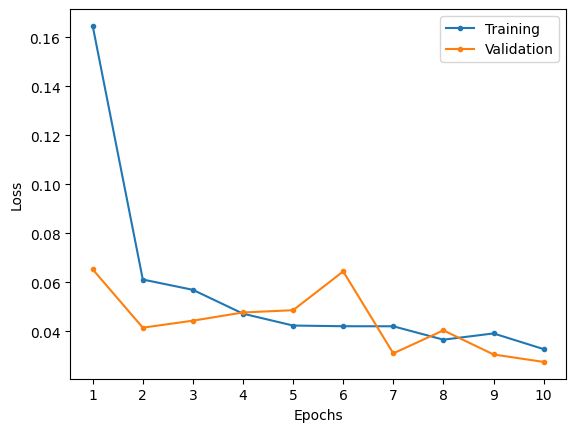
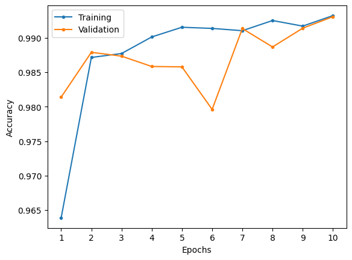
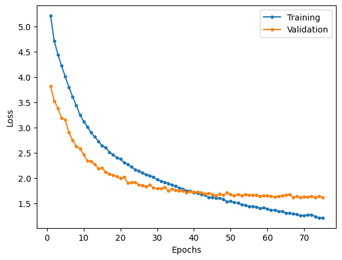
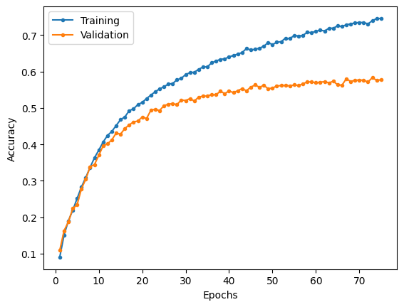

# Inception-V3

Implementation of Inception-V3 following the descriptions provided in the research paper.

Note that the research paper does not provide exact channel counts for the internals of the inception blocks, so the implementation may not be an exact replica.

## MNIST

### Model summary

|     Layer (type)     |    Output Shape    |  Param #  |
| :------------------: | :----------------: | :-------: |
|    2D convolution    | [-1, 32, 149, 149] |    864    |
|    2D batch norm     | [-1, 32, 149, 149] |    64     |
|         ReLU         | [-1, 32, 149, 149] |     0     |
|    2D convolution    | [-1, 32, 147, 147] |   9,216   |
|    2D batch norm     | [-1, 32, 147, 147] |    64     |
|         ReLU         | [-1, 32, 147, 147] |     0     |
|    2D convolution    | [-1, 64, 147, 147] |  18,432   |
|    2D batch norm     | [-1, 64, 147, 147] |    128    |
|         ReLU         | [-1, 64, 147, 147] |     0     |
|    2D max pooling    |  [-1, 64, 73, 73]  |     0     |
|    2D convolution    |  [-1, 80, 71, 71]  |  46,080   |
|    2D batch norm     |  [-1, 80, 71, 71]  |    160    |
|         ReLU         |  [-1, 80, 71, 71]  |     0     |
|    2D convolution    | [-1, 192, 35, 35]  |  138,240  |
|    2D batch norm     | [-1, 192, 35, 35]  |    384    |
|         ReLU         | [-1, 192, 35, 35]  |     0     |
| **inception fig 5a** |        ---         |    ---    |
|    2D convolution    |  [-1, 64, 35, 35]  |  12,288   |
|    2D batch norm     |  [-1, 64, 35, 35]  |    128    |
|         ReLU         |  [-1, 64, 35, 35]  |     0     |
|    2D convolution    |  [-1, 64, 35, 35]  |  36,864   |
|    2D batch norm     |  [-1, 64, 35, 35]  |    128    |
|         ReLU         |  [-1, 64, 35, 35]  |     0     |
|    2D convolution    |  [-1, 64, 35, 35]  |  36,864   |
|    2D batch norm     |  [-1, 64, 35, 35]  |    128    |
|         ReLU         |  [-1, 64, 35, 35]  |     0     |
|    2D convolution    |  [-1, 64, 35, 35]  |  12,288   |
|    2D batch norm     |  [-1, 64, 35, 35]  |    128    |
|         ReLU         |  [-1, 64, 35, 35]  |     0     |
|    2D convolution    |  [-1, 64, 35, 35]  |  36,864   |
|    2D batch norm     |  [-1, 64, 35, 35]  |    128    |
|         ReLU         |  [-1, 64, 35, 35]  |     0     |
|    2D max pooling    | [-1, 192, 35, 35]  |     0     |
|    2D convolution    |  [-1, 96, 35, 35]  |  18,432   |
|    2D batch norm     |  [-1, 96, 35, 35]  |    192    |
|         ReLU         |  [-1, 96, 35, 35]  |     0     |
|    2D convolution    |  [-1, 32, 35, 35]  |   6,144   |
|    2D batch norm     |  [-1, 32, 35, 35]  |    64     |
|         ReLU         |  [-1, 32, 35, 35]  |     0     |
| **inception fig 5b** |        ---         |    ---    |
|    2D convolution    |  [-1, 64, 35, 35]  |  16,384   |
|    2D batch norm     |  [-1, 64, 35, 35]  |    128    |
|         ReLU         |  [-1, 64, 35, 35]  |     0     |
|    2D convolution    |  [-1, 64, 35, 35]  |  36,864   |
|    2D batch norm     |  [-1, 64, 35, 35]  |    128    |
|         ReLU         |  [-1, 64, 35, 35]  |     0     |
|    2D convolution    |  [-1, 64, 35, 35]  |  36,864   |
|    2D batch norm     |  [-1, 64, 35, 35]  |    128    |
|         ReLU         |  [-1, 64, 35, 35]  |     0     |
|    2D convolution    |  [-1, 64, 35, 35]  |  16,384   |
|    2D batch norm     |  [-1, 64, 35, 35]  |    128    |
|         ReLU         |  [-1, 64, 35, 35]  |     0     |
|    2D convolution    |  [-1, 64, 35, 35]  |  36,864   |
|    2D batch norm     |  [-1, 64, 35, 35]  |    128    |
|         ReLU         |  [-1, 64, 35, 35]  |     0     |
|    2D max pooling    | [-1, 256, 35, 35]  |     0     |
|    2D convolution    |  [-1, 96, 35, 35]  |  24,576   |
|    2D batch norm     |  [-1, 96, 35, 35]  |    192    |
|         ReLU         |  [-1, 96, 35, 35]  |     0     |
|    2D convolution    |  [-1, 64, 35, 35]  |  16,384   |
|    2D batch norm     |  [-1, 64, 35, 35]  |    128    |
|         ReLU         |  [-1, 64, 35, 35]  |     0     |
| **inception fig 5c** |        ---         |    ---    |
|    2D convolution    |  [-1, 64, 35, 35]  |  18,432   |
|    2D batch norm     |  [-1, 64, 35, 35]  |    128    |
|         ReLU         |  [-1, 64, 35, 35]  |     0     |
|    2D convolution    |  [-1, 64, 35, 35]  |  36,864   |
|    2D batch norm     |  [-1, 64, 35, 35]  |    128    |
|         ReLU         |  [-1, 64, 35, 35]  |     0     |
|    2D convolution    |  [-1, 64, 35, 35]  |  36,864   |
|    2D batch norm     |  [-1, 64, 35, 35]  |    128    |
|         ReLU         |  [-1, 64, 35, 35]  |     0     |
|    2D convolution    |  [-1, 64, 35, 35]  |  18,432   |
|    2D batch norm     |  [-1, 64, 35, 35]  |    128    |
|         ReLU         |  [-1, 64, 35, 35]  |     0     |
|    2D convolution    |  [-1, 64, 35, 35]  |  36,864   |
|    2D batch norm     |  [-1, 64, 35, 35]  |    128    |
|         ReLU         |  [-1, 64, 35, 35]  |     0     |
|    2D max pooling    | [-1, 288, 35, 35]  |     0     |
|    2D convolution    |  [-1, 96, 35, 35]  |  27,648   |
|    2D batch norm     |  [-1, 96, 35, 35]  |    192    |
|         ReLU         |  [-1, 96, 35, 35]  |     0     |
|    2D convolution    |  [-1, 64, 35, 35]  |  18,432   |
|    2D batch norm     |  [-1, 64, 35, 35]  |    128    |
|         ReLU         |  [-1, 64, 35, 35]  |     0     |
|  **grid reduction**  |        ---         |    ---    |
|    2D convolution    | [-1, 384, 35, 35]  |  110,592  |
|    2D batch norm     | [-1, 384, 35, 35]  |    768    |
|         ReLU         | [-1, 384, 35, 35]  |     0     |
|    2D convolution    | [-1, 384, 35, 35]  | 1,327,104 |
|    2D batch norm     | [-1, 384, 35, 35]  |    768    |
|         ReLU         | [-1, 384, 35, 35]  |     0     |
|    2D convolution    | [-1, 384, 17, 17]  | 1,327,104 |
|    2D batch norm     | [-1, 384, 17, 17]  |    768    |
|         ReLU         | [-1, 384, 17, 17]  |     0     |
|    2D convolution    |  [-1, 96, 35, 35]  |  27,648   |
|    2D batch norm     |  [-1, 96, 35, 35]  |    192    |
|         ReLU         |  [-1, 96, 35, 35]  |     0     |
|    2D convolution    |  [-1, 96, 17, 17]  |  82,944   |
|    2D batch norm     |  [-1, 96, 17, 17]  |    192    |
|         ReLU         |  [-1, 96, 17, 17]  |     0     |
|    2D max pooling    | [-1, 288, 17, 17]  |     0     |
| **inception fig 6a** |        ---         |    ---    |
|    2D convolution    | [-1, 128, 17, 17]  |  98,304   |
|    2D batch norm     | [-1, 128, 17, 17]  |    256    |
|         ReLU         | [-1, 128, 17, 17]  |     0     |
|    2D convolution    | [-1, 128, 17, 17]  |  114,688  |
|    2D batch norm     | [-1, 128, 17, 17]  |    256    |
|         ReLU         | [-1, 128, 17, 17]  |     0     |
|    2D convolution    | [-1, 128, 17, 17]  |  114,688  |
|    2D batch norm     | [-1, 128, 17, 17]  |    256    |
|         ReLU         | [-1, 128, 17, 17]  |     0     |
|    2D convolution    | [-1, 128, 17, 17]  |  114,688  |
|    2D batch norm     | [-1, 128, 17, 17]  |    256    |
|         ReLU         | [-1, 128, 17, 17]  |     0     |
|    2D convolution    | [-1, 192, 17, 17]  |  172,032  |
|    2D batch norm     | [-1, 192, 17, 17]  |    384    |
|         ReLU         | [-1, 192, 17, 17]  |     0     |
|    2D convolution    | [-1, 128, 17, 17]  |  98,304   |
|    2D batch norm     | [-1, 128, 17, 17]  |    256    |
|         ReLU         | [-1, 128, 17, 17]  |     0     |
|    2D convolution    | [-1, 128, 17, 17]  |  114,688  |
|    2D batch norm     | [-1, 128, 17, 17]  |    256    |
|         ReLU         | [-1, 128, 17, 17]  |     0     |
|    2D convolution    | [-1, 192, 17, 17]  |  172,032  |
|    2D batch norm     | [-1, 192, 17, 17]  |    384    |
|         ReLU         | [-1, 192, 17, 17]  |     0     |
|    2D max pooling    | [-1, 768, 17, 17]  |     0     |
|    2D convolution    | [-1, 192, 17, 17]  |  147,456  |
|    2D batch norm     | [-1, 192, 17, 17]  |    384    |
|         ReLU         | [-1, 192, 17, 17]  |     0     |
|    2D convolution    | [-1, 192, 17, 17]  |  147,456  |
|    2D batch norm     | [-1, 192, 17, 17]  |    384    |
|         ReLU         | [-1, 192, 17, 17]  |     0     |
| **inception fig 6b** |        ---         |    ---    |
|    2D convolution    | [-1, 144, 17, 17]  |  110,592  |
|    2D batch norm     | [-1, 144, 17, 17]  |    288    |
|         ReLU         | [-1, 144, 17, 17]  |     0     |
|    2D convolution    | [-1, 144, 17, 17]  |  145,152  |
|    2D batch norm     | [-1, 144, 17, 17]  |    288    |
|         ReLU         | [-1, 144, 17, 17]  |     0     |
|    2D convolution    | [-1, 144, 17, 17]  |  145,152  |
|    2D batch norm     | [-1, 144, 17, 17]  |    288    |
|         ReLU         | [-1, 144, 17, 17]  |     0     |
|    2D convolution    | [-1, 144, 17, 17]  |  145,152  |
|    2D batch norm     | [-1, 144, 17, 17]  |    288    |
|         ReLU         | [-1, 144, 17, 17]  |     0     |
|    2D convolution    | [-1, 192, 17, 17]  |  193,536  |
|    2D batch norm     | [-1, 192, 17, 17]  |    384    |
|         ReLU         | [-1, 192, 17, 17]  |     0     |
|    2D convolution    | [-1, 144, 17, 17]  |  110,592  |
|    2D batch norm     | [-1, 144, 17, 17]  |    288    |
|         ReLU         | [-1, 144, 17, 17]  |     0     |
|    2D convolution    | [-1, 144, 17, 17]  |  145,152  |
|    2D batch norm     | [-1, 144, 17, 17]  |    288    |
|         ReLU         | [-1, 144, 17, 17]  |     0     |
|    2D convolution    | [-1, 192, 17, 17]  |  193,536  |
|    2D batch norm     | [-1, 192, 17, 17]  |    384    |
|         ReLU         | [-1, 192, 17, 17]  |     0     |
|    2D max pooling    | [-1, 768, 17, 17]  |     0     |
|    2D convolution    | [-1, 192, 17, 17]  |  147,456  |
|    2D batch norm     | [-1, 192, 17, 17]  |    384    |
|         ReLU         | [-1, 192, 17, 17]  |     0     |
|    2D convolution    | [-1, 192, 17, 17]  |  147,456  |
|    2D batch norm     | [-1, 192, 17, 17]  |    384    |
|         ReLU         | [-1, 192, 17, 17]  |     0     |
| **inception fig 6c** |        ---         |    ---    |
|    2D convolution    | [-1, 160, 17, 17]  |  122,880  |
|    2D batch norm     | [-1, 160, 17, 17]  |    320    |
|         ReLU         | [-1, 160, 17, 17]  |     0     |
|    2D convolution    | [-1, 160, 17, 17]  |  179,200  |
|    2D batch norm     | [-1, 160, 17, 17]  |    320    |
|         ReLU         | [-1, 160, 17, 17]  |     0     |
|    2D convolution    | [-1, 160, 17, 17]  |  179,200  |
|    2D batch norm     | [-1, 160, 17, 17]  |    320    |
|         ReLU         | [-1, 160, 17, 17]  |     0     |
|    2D convolution    | [-1, 160, 17, 17]  |  179,200  |
|    2D batch norm     | [-1, 160, 17, 17]  |    320    |
|         ReLU         | [-1, 160, 17, 17]  |     0     |
|    2D convolution    | [-1, 192, 17, 17]  |  215,040  |
|    2D batch norm     | [-1, 192, 17, 17]  |    384    |
|         ReLU         | [-1, 192, 17, 17]  |     0     |
|    2D convolution    | [-1, 160, 17, 17]  |  122,880  |
|    2D batch norm     | [-1, 160, 17, 17]  |    320    |
|         ReLU         | [-1, 160, 17, 17]  |     0     |
|    2D convolution    | [-1, 160, 17, 17]  |  179,200  |
|    2D batch norm     | [-1, 160, 17, 17]  |    320    |
|         ReLU         | [-1, 160, 17, 17]  |     0     |
|    2D convolution    | [-1, 192, 17, 17]  |  215,040  |
|    2D batch norm     | [-1, 192, 17, 17]  |    384    |
|         ReLU         | [-1, 192, 17, 17]  |     0     |
|    2D max pooling    | [-1, 768, 17, 17]  |     0     |
|    2D convolution    | [-1, 192, 17, 17]  |  147,456  |
|    2D batch norm     | [-1, 192, 17, 17]  |    384    |
|         ReLU         | [-1, 192, 17, 17]  |     0     |
|    2D convolution    | [-1, 192, 17, 17]  |  147,456  |
|    2D batch norm     | [-1, 192, 17, 17]  |    384    |
|         ReLU         | [-1, 192, 17, 17]  |     0     |
| **inception fig 6c** |        ---         |    ---    |
|    2D convolution    | [-1, 176, 17, 17]  |  135,168  |
|    2D batch norm     | [-1, 176, 17, 17]  |    352    |
|         ReLU         | [-1, 176, 17, 17]  |     0     |
|    2D convolution    | [-1, 176, 17, 17]  |  216,832  |
|    2D batch norm     | [-1, 176, 17, 17]  |    352    |
|         ReLU         | [-1, 176, 17, 17]  |     0     |
|    2D convolution    | [-1, 176, 17, 17]  |  216,832  |
|    2D batch norm     | [-1, 176, 17, 17]  |    352    |
|         ReLU         | [-1, 176, 17, 17]  |     0     |
|    2D convolution    | [-1, 176, 17, 17]  |  216,832  |
|    2D batch norm     | [-1, 176, 17, 17]  |    352    |
|         ReLU         | [-1, 176, 17, 17]  |     0     |
|    2D convolution    | [-1, 192, 17, 17]  |  236,544  |
|    2D batch norm     | [-1, 192, 17, 17]  |    384    |
|         ReLU         | [-1, 192, 17, 17]  |     0     |
|    2D convolution    | [-1, 176, 17, 17]  |  135,168  |
|    2D batch norm     | [-1, 176, 17, 17]  |    352    |
|         ReLU         | [-1, 176, 17, 17]  |     0     |
|    2D convolution    | [-1, 176, 17, 17]  |  216,832  |
|    2D batch norm     | [-1, 176, 17, 17]  |    352    |
|         ReLU         | [-1, 176, 17, 17]  |     0     |
|    2D convolution    | [-1, 192, 17, 17]  |  236,544  |
|    2D batch norm     | [-1, 192, 17, 17]  |    384    |
|         ReLU         | [-1, 192, 17, 17]  |     0     |
|    2D max pooling    | [-1, 768, 17, 17]  |     0     |
|    2D convolution    | [-1, 192, 17, 17]  |  147,456  |
|    2D batch norm     | [-1, 192, 17, 17]  |    384    |
|         ReLU         | [-1, 192, 17, 17]  |     0     |
|    2D convolution    | [-1, 192, 17, 17]  |  147,456  |
|    2D batch norm     | [-1, 192, 17, 17]  |    384    |
|         ReLU         | [-1, 192, 17, 17]  |     0     |
| **inception fig 6d** |        ---         |    ---    |
|    2D convolution    | [-1, 192, 17, 17]  |  147,456  |
|    2D batch norm     | [-1, 192, 17, 17]  |    384    |
|         ReLU         | [-1, 192, 17, 17]  |     0     |
|    2D convolution    | [-1, 192, 17, 17]  |  258,048  |
|    2D batch norm     | [-1, 192, 17, 17]  |    384    |
|         ReLU         | [-1, 192, 17, 17]  |     0     |
|    2D convolution    | [-1, 192, 17, 17]  |  258,048  |
|    2D batch norm     | [-1, 192, 17, 17]  |    384    |
|         ReLU         | [-1, 192, 17, 17]  |     0     |
|    2D convolution    | [-1, 192, 17, 17]  |  258,048  |
|    2D batch norm     | [-1, 192, 17, 17]  |    384    |
|         ReLU         | [-1, 192, 17, 17]  |     0     |
|    2D convolution    | [-1, 192, 17, 17]  |  258,048  |
|    2D batch norm     | [-1, 192, 17, 17]  |    384    |
|         ReLU         | [-1, 192, 17, 17]  |     0     |
|    2D convolution    | [-1, 192, 17, 17]  |  147,456  |
|    2D batch norm     | [-1, 192, 17, 17]  |    384    |
|         ReLU         | [-1, 192, 17, 17]  |     0     |
|    2D convolution    | [-1, 192, 17, 17]  |  258,048  |
|    2D batch norm     | [-1, 192, 17, 17]  |    384    |
|         ReLU         | [-1, 192, 17, 17]  |     0     |
|    2D convolution    | [-1, 192, 17, 17]  |  258,048  |
|    2D batch norm     | [-1, 192, 17, 17]  |    384    |
|         ReLU         | [-1, 192, 17, 17]  |     0     |
|    2D max pooling    | [-1, 768, 17, 17]  |     0     |
|    2D convolution    | [-1, 192, 17, 17]  |  147,456  |
|    2D batch norm     | [-1, 192, 17, 17]  |    384    |
|         ReLU         | [-1, 192, 17, 17]  |     0     |
|    2D convolution    | [-1, 192, 17, 17]  |  147,456  |
|    2D batch norm     | [-1, 192, 17, 17]  |    384    |
|         ReLU         | [-1, 192, 17, 17]  |     0     |
|       **aux**        |        ---         |    ---    |
|    AvgPool2d-344     |  [-1, 768, 5, 5]   |     0     |
|    2D convolution    |  [-1, 128, 5, 5]   |  98,304   |
|    2D batch norm     |  [-1, 128, 5, 5]   |    256    |
|         ReLU         |  [-1, 128, 5, 5]   |     0     |
|       Flatten        |     [-1, 3200]     |     0     |
|        Linear        |     [-1, 1024]     | 3,277,824 |
|        Linear        |      [-1, 10]      |  10,250   |
|  **grid reduction**  |        ---         |    ---    |
|    2D convolution    | [-1, 384, 17, 17]  |  294,912  |
|    2D batch norm     | [-1, 384, 17, 17]  |    768    |
|         ReLU         | [-1, 384, 17, 17]  |     0     |
|    2D convolution    | [-1, 384, 17, 17]  | 1,327,104 |
|    2D batch norm     | [-1, 384, 17, 17]  |    768    |
|         ReLU         | [-1, 384, 17, 17]  |     0     |
|    2D convolution    |  [-1, 384, 8, 8]   | 1,327,104 |
|    2D batch norm     |  [-1, 384, 8, 8]   |    768    |
|         ReLU         |  [-1, 384, 8, 8]   |     0     |
|    2D convolution    | [-1, 128, 17, 17]  |  98,304   |
|    2D batch norm     | [-1, 128, 17, 17]  |    256    |
|         ReLU         | [-1, 128, 17, 17]  |     0     |
|    2D convolution    |  [-1, 128, 8, 8]   |  147,456  |
|    2D batch norm     |  [-1, 128, 8, 8]   |    256    |
|         ReLU         |  [-1, 128, 8, 8]   |     0     |
|    2D max pooling    |  [-1, 768, 8, 8]   |     0     |
| **inception fig 7a** |        ---         |    ---    |
|    2D convolution    |  [-1, 208, 8, 8]   |  266,240  |
|    2D batch norm     |  [-1, 208, 8, 8]   |    416    |
|         ReLU         |  [-1, 208, 8, 8]   |     0     |
|    2D convolution    |  [-1, 208, 8, 8]   |  389,376  |
|    2D batch norm     |  [-1, 208, 8, 8]   |    416    |
|         ReLU         |  [-1, 208, 8, 8]   |     0     |
|    2D convolution    |  [-1, 208, 8, 8]   |  266,240  |
|    2D batch norm     |  [-1, 208, 8, 8]   |    416    |
|         ReLU         |  [-1, 208, 8, 8]   |     0     |
|    2D convolution    |  [-1, 208, 8, 8]   |  129,792  |
|    2D batch norm     |  [-1, 208, 8, 8]   |    416    |
|         ReLU         |  [-1, 208, 8, 8]   |     0     |
|    2D convolution    |  [-1, 208, 8, 8]   |  129,792  |
|    2D batch norm     |  [-1, 208, 8, 8]   |    416    |
|         ReLU         |  [-1, 208, 8, 8]   |     0     |
|    2D convolution    |  [-1, 208, 8, 8]   |  129,792  |
|    2D batch norm     |  [-1, 208, 8, 8]   |    416    |
|         ReLU         |  [-1, 208, 8, 8]   |     0     |
|    2D convolution    |  [-1, 208, 8, 8]   |  129,792  |
|    2D batch norm     |  [-1, 208, 8, 8]   |    416    |
|         ReLU         |  [-1, 208, 8, 8]   |     0     |
|    2D max pooling    |  [-1, 1280, 8, 8]  |     0     |
|    2D convolution    |  [-1, 416, 8, 8]   |  532,480  |
|    2D batch norm     |  [-1, 416, 8, 8]   |    832    |
|         ReLU         |  [-1, 416, 8, 8]   |     0     |
|    2D convolution    |  [-1, 416, 8, 8]   |  532,480  |
|    2D batch norm     |  [-1, 416, 8, 8]   |    832    |
|         ReLU         |  [-1, 416, 8, 8]   |     0     |
| **inception fig 7b** |        ---         |    ---    |
|    2D convolution    |  [-1, 256, 8, 8]   |  425,984  |
|    2D batch norm     |  [-1, 256, 8, 8]   |    512    |
|         ReLU         |  [-1, 256, 8, 8]   |     0     |
|    2D convolution    |  [-1, 256, 8, 8]   |  589,824  |
|    2D batch norm     |  [-1, 256, 8, 8]   |    512    |
|         ReLU         |  [-1, 256, 8, 8]   |     0     |
|    2D convolution    |  [-1, 256, 8, 8]   |  425,984  |
|    2D batch norm     |  [-1, 256, 8, 8]   |    512    |
|         ReLU         |  [-1, 256, 8, 8]   |     0     |
|    2D convolution    |  [-1, 256, 8, 8]   |  196,608  |
|    2D batch norm     |  [-1, 256, 8, 8]   |    512    |
|         ReLU         |  [-1, 256, 8, 8]   |     0     |
|    2D convolution    |  [-1, 256, 8, 8]   |  196,608  |
|    2D batch norm     |  [-1, 256, 8, 8]   |    512    |
|         ReLU         |  [-1, 256, 8, 8]   |     0     |
|    2D convolution    |  [-1, 256, 8, 8]   |  196,608  |
|    2D batch norm     |  [-1, 256, 8, 8]   |    512    |
|         ReLU         |  [-1, 256, 8, 8]   |     0     |
|    2D convolution    |  [-1, 256, 8, 8]   |  196,608  |
|    2D batch norm     |  [-1, 256, 8, 8]   |    512    |
|         ReLU         |  [-1, 256, 8, 8]   |     0     |
|    2D max pooling    |  [-1, 1664, 8, 8]  |     0     |
|    2D convolution    |  [-1, 512, 8, 8]   |  851,968  |
|    2D batch norm     |  [-1, 512, 8, 8]   |   1,024   |
|         ReLU         |  [-1, 512, 8, 8]   |     0     |
|    2D convolution    |  [-1, 512, 8, 8]   |  851,968  |
|    2D batch norm     |  [-1, 512, 8, 8]   |   1,024   |
|         ReLU         |  [-1, 512, 8, 8]   |     0     |
|    2D avg pooling    |  [-1, 2048, 1, 1]  |     0     |
|       Flatten        |     [-1, 2048]     |     0     |
|        Linear        |      [-1, 10]      |  20,490   |

|                                         |            |
| --------------------------------------- | ---------- |
| Total params                            | 25,212,020 |
| Trainable params                        | 25,212,020 |
| Total params excluding auxiliary params | 21,825,386 |
| Non-trainable params                    | 0          |

### Results

Trained over 10 epochs with a learning rate of 1e-4, batch size of 32, auxiliary loss weighting of 0.3, label smoothing factor of 1e-4 and weight decay of 0.01.

|                     Loss                      |                       Accuracy                        |
| :-------------------------------------------: | :---------------------------------------------------: |
|  |  |

|              | Training | Validation | Testing |
| :----------: | :------: | :--------: | :-----: |
|     Loss     |  0.0328  |   0.0276   | 0.0204  |
| Accuracy (%) |  99.32   |   99.31    |  99.52  |

| Class | Training Precision | Validation Precision | Testing Precision | Training Recall | Validation Recall | Testing Recall | Training F1 Score | Validation F1 Score | Testing F1 Score |
| :---: | :----------------: | :------------------: | :---------------: | :-------------: | :---------------: | :------------: | :---------------: | :-----------------: | :--------------: |
|   0   |       0.9953       |        0.9962        |      0.9969       |     0.9973      |      0.9962       |     0.9990     |      0.9963       |       0.9962        |      0.9980      |
|   1   |       0.9953       |        0.9936        |      0.9947       |     0.9956      |      0.9965       |     0.9947     |      0.9955       |       0.9950        |      0.9947      |
|   2   |       0.9933       |        0.9900        |      0.9923       |     0.9930      |      0.9939       |     0.9971     |      0.9931       |       0.9919        |      0.9947      |
|   3   |       0.9946       |        0.9983        |      0.9970       |     0.9928      |      0.9923       |     0.9960     |      0.9937       |       0.9953        |      0.9965      |
|   4   |       0.9910       |        0.9912        |      0.9959       |     0.9910      |      0.9912       |     0.9959     |      0.9910       |       0.9912        |      0.9959      |
|   5   |       0.9927       |        0.9943        |      0.9911       |     0.9925      |      0.9936       |     0.9966     |      0.9926       |       0.9940        |      0.9939      |
|   6   |       0.9934       |        0.9901        |      0.9927       |     0.9944      |      0.9972       |     0.9969     |      0.9939       |       0.9937        |      0.9948      |
|   7   |       0.9924       |        0.9961        |      0.9961       |     0.9944      |      0.9907       |     0.9883     |      0.9934       |       0.9934        |      0.9922      |
|   8   |       0.9934       |        0.9954        |      0.9990       |     0.9915      |      0.9858       |     0.9959     |      0.9924       |       0.9906        |      0.9974      |
|   9   |       0.9903       |        0.9854        |      0.9960       |     0.9893      |      0.9924       |     0.9921     |      0.9898       |       0.9889        |      0.9940      |

Compared to Inception-BN, Inception-V3 performs slightly better across the data sets but required more epochs to train. Despite containing almost twice as many parameters, the performance did not scale accordingly, which may be due to the MNIST dataset lacking significant complexity. From the loss and accuracy graphs, it is evident that the performance began regressing but was eventually able to recover. This recovery could be attributed to the use of label smoothing.

## CIFAR 100

### Model summary

|     Layer (type)     |    Output Shape    |  Param #  |
| :------------------: | :----------------: | :-------: |
|    2D convolution    | [-1, 32, 149, 149] |    864    |
|    2D batch norm     | [-1, 32, 149, 149] |    64     |
|         ReLU         | [-1, 32, 149, 149] |     0     |
|    2D convolution    | [-1, 32, 147, 147] |   9,216   |
|    2D batch norm     | [-1, 32, 147, 147] |    64     |
|         ReLU         | [-1, 32, 147, 147] |     0     |
|    2D convolution    | [-1, 64, 147, 147] |  18,432   |
|    2D batch norm     | [-1, 64, 147, 147] |    128    |
|         ReLU         | [-1, 64, 147, 147] |     0     |
|    2D max pooling    |  [-1, 64, 73, 73]  |     0     |
|    2D convolution    |  [-1, 80, 71, 71]  |  46,080   |
|    2D batch norm     |  [-1, 80, 71, 71]  |    160    |
|         ReLU         |  [-1, 80, 71, 71]  |     0     |
|    2D convolution    | [-1, 192, 35, 35]  |  138,240  |
|    2D batch norm     | [-1, 192, 35, 35]  |    384    |
|         ReLU         | [-1, 192, 35, 35]  |     0     |
| **inception fig 5a** |        ---         |    ---    |
|    2D convolution    |  [-1, 64, 35, 35]  |  12,288   |
|    2D batch norm     |  [-1, 64, 35, 35]  |    128    |
|         ReLU         |  [-1, 64, 35, 35]  |     0     |
|    2D convolution    |  [-1, 64, 35, 35]  |  36,864   |
|    2D batch norm     |  [-1, 64, 35, 35]  |    128    |
|         ReLU         |  [-1, 64, 35, 35]  |     0     |
|    2D convolution    |  [-1, 64, 35, 35]  |  36,864   |
|    2D batch norm     |  [-1, 64, 35, 35]  |    128    |
|         ReLU         |  [-1, 64, 35, 35]  |     0     |
|    2D convolution    |  [-1, 64, 35, 35]  |  12,288   |
|    2D batch norm     |  [-1, 64, 35, 35]  |    128    |
|         ReLU         |  [-1, 64, 35, 35]  |     0     |
|    2D convolution    |  [-1, 64, 35, 35]  |  36,864   |
|    2D batch norm     |  [-1, 64, 35, 35]  |    128    |
|         ReLU         |  [-1, 64, 35, 35]  |     0     |
|    2D max pooling    | [-1, 192, 35, 35]  |     0     |
|    2D convolution    |  [-1, 96, 35, 35]  |  18,432   |
|    2D batch norm     |  [-1, 96, 35, 35]  |    192    |
|         ReLU         |  [-1, 96, 35, 35]  |     0     |
|    2D convolution    |  [-1, 32, 35, 35]  |   6,144   |
|    2D batch norm     |  [-1, 32, 35, 35]  |    64     |
|         ReLU         |  [-1, 32, 35, 35]  |     0     |
| **inception fig 5b** |        ---         |    ---    |
|    2D convolution    |  [-1, 64, 35, 35]  |  16,384   |
|    2D batch norm     |  [-1, 64, 35, 35]  |    128    |
|         ReLU         |  [-1, 64, 35, 35]  |     0     |
|    2D convolution    |  [-1, 64, 35, 35]  |  36,864   |
|    2D batch norm     |  [-1, 64, 35, 35]  |    128    |
|         ReLU         |  [-1, 64, 35, 35]  |     0     |
|    2D convolution    |  [-1, 64, 35, 35]  |  36,864   |
|    2D batch norm     |  [-1, 64, 35, 35]  |    128    |
|         ReLU         |  [-1, 64, 35, 35]  |     0     |
|    2D convolution    |  [-1, 64, 35, 35]  |  16,384   |
|    2D batch norm     |  [-1, 64, 35, 35]  |    128    |
|         ReLU         |  [-1, 64, 35, 35]  |     0     |
|    2D convolution    |  [-1, 64, 35, 35]  |  36,864   |
|    2D batch norm     |  [-1, 64, 35, 35]  |    128    |
|         ReLU         |  [-1, 64, 35, 35]  |     0     |
|    2D max pooling    | [-1, 256, 35, 35]  |     0     |
|    2D convolution    |  [-1, 96, 35, 35]  |  24,576   |
|    2D batch norm     |  [-1, 96, 35, 35]  |    192    |
|         ReLU         |  [-1, 96, 35, 35]  |     0     |
|    2D convolution    |  [-1, 64, 35, 35]  |  16,384   |
|    2D batch norm     |  [-1, 64, 35, 35]  |    128    |
|         ReLU         |  [-1, 64, 35, 35]  |     0     |
| **inception fig 5c** |        ---         |    ---    |
|    2D convolution    |  [-1, 64, 35, 35]  |  18,432   |
|    2D batch norm     |  [-1, 64, 35, 35]  |    128    |
|         ReLU         |  [-1, 64, 35, 35]  |     0     |
|    2D convolution    |  [-1, 64, 35, 35]  |  36,864   |
|    2D batch norm     |  [-1, 64, 35, 35]  |    128    |
|         ReLU         |  [-1, 64, 35, 35]  |     0     |
|    2D convolution    |  [-1, 64, 35, 35]  |  36,864   |
|    2D batch norm     |  [-1, 64, 35, 35]  |    128    |
|         ReLU         |  [-1, 64, 35, 35]  |     0     |
|    2D convolution    |  [-1, 64, 35, 35]  |  18,432   |
|    2D batch norm     |  [-1, 64, 35, 35]  |    128    |
|         ReLU         |  [-1, 64, 35, 35]  |     0     |
|    2D convolution    |  [-1, 64, 35, 35]  |  36,864   |
|    2D batch norm     |  [-1, 64, 35, 35]  |    128    |
|         ReLU         |  [-1, 64, 35, 35]  |     0     |
|    2D max pooling    | [-1, 288, 35, 35]  |     0     |
|    2D convolution    |  [-1, 96, 35, 35]  |  27,648   |
|    2D batch norm     |  [-1, 96, 35, 35]  |    192    |
|         ReLU         |  [-1, 96, 35, 35]  |     0     |
|    2D convolution    |  [-1, 64, 35, 35]  |  18,432   |
|    2D batch norm     |  [-1, 64, 35, 35]  |    128    |
|         ReLU         |  [-1, 64, 35, 35]  |     0     |
|  **grid reduction**  |        ---         |    ---    |
|    2D convolution    | [-1, 384, 35, 35]  |  110,592  |
|    2D batch norm     | [-1, 384, 35, 35]  |    768    |
|         ReLU         | [-1, 384, 35, 35]  |     0     |
|    2D convolution    | [-1, 384, 35, 35]  | 1,327,104 |
|    2D batch norm     | [-1, 384, 35, 35]  |    768    |
|         ReLU         | [-1, 384, 35, 35]  |     0     |
|    2D convolution    | [-1, 384, 17, 17]  | 1,327,104 |
|    2D batch norm     | [-1, 384, 17, 17]  |    768    |
|         ReLU         | [-1, 384, 17, 17]  |     0     |
|    2D convolution    |  [-1, 96, 35, 35]  |  27,648   |
|    2D batch norm     |  [-1, 96, 35, 35]  |    192    |
|         ReLU         |  [-1, 96, 35, 35]  |     0     |
|    2D convolution    |  [-1, 96, 17, 17]  |  82,944   |
|    2D batch norm     |  [-1, 96, 17, 17]  |    192    |
|         ReLU         |  [-1, 96, 17, 17]  |     0     |
|    2D max pooling    | [-1, 288, 17, 17]  |     0     |
| **inception fig 6a** |        ---         |    ---    |
|    2D convolution    | [-1, 128, 17, 17]  |  98,304   |
|    2D batch norm     | [-1, 128, 17, 17]  |    256    |
|         ReLU         | [-1, 128, 17, 17]  |     0     |
|    2D convolution    | [-1, 128, 17, 17]  |  114,688  |
|    2D batch norm     | [-1, 128, 17, 17]  |    256    |
|         ReLU         | [-1, 128, 17, 17]  |     0     |
|    2D convolution    | [-1, 128, 17, 17]  |  114,688  |
|    2D batch norm     | [-1, 128, 17, 17]  |    256    |
|         ReLU         | [-1, 128, 17, 17]  |     0     |
|    2D convolution    | [-1, 128, 17, 17]  |  114,688  |
|    2D batch norm     | [-1, 128, 17, 17]  |    256    |
|         ReLU         | [-1, 128, 17, 17]  |     0     |
|    2D convolution    | [-1, 192, 17, 17]  |  172,032  |
|    2D batch norm     | [-1, 192, 17, 17]  |    384    |
|         ReLU         | [-1, 192, 17, 17]  |     0     |
|    2D convolution    | [-1, 128, 17, 17]  |  98,304   |
|    2D batch norm     | [-1, 128, 17, 17]  |    256    |
|         ReLU         | [-1, 128, 17, 17]  |     0     |
|    2D convolution    | [-1, 128, 17, 17]  |  114,688  |
|    2D batch norm     | [-1, 128, 17, 17]  |    256    |
|         ReLU         | [-1, 128, 17, 17]  |     0     |
|    2D convolution    | [-1, 192, 17, 17]  |  172,032  |
|    2D batch norm     | [-1, 192, 17, 17]  |    384    |
|         ReLU         | [-1, 192, 17, 17]  |     0     |
|    2D max pooling    | [-1, 768, 17, 17]  |     0     |
|    2D convolution    | [-1, 192, 17, 17]  |  147,456  |
|    2D batch norm     | [-1, 192, 17, 17]  |    384    |
|         ReLU         | [-1, 192, 17, 17]  |     0     |
|    2D convolution    | [-1, 192, 17, 17]  |  147,456  |
|    2D batch norm     | [-1, 192, 17, 17]  |    384    |
|         ReLU         | [-1, 192, 17, 17]  |     0     |
| **inception fig 6b** |        ---         |    ---    |
|    2D convolution    | [-1, 144, 17, 17]  |  110,592  |
|    2D batch norm     | [-1, 144, 17, 17]  |    288    |
|         ReLU         | [-1, 144, 17, 17]  |     0     |
|    2D convolution    | [-1, 144, 17, 17]  |  145,152  |
|    2D batch norm     | [-1, 144, 17, 17]  |    288    |
|         ReLU         | [-1, 144, 17, 17]  |     0     |
|    2D convolution    | [-1, 144, 17, 17]  |  145,152  |
|    2D batch norm     | [-1, 144, 17, 17]  |    288    |
|         ReLU         | [-1, 144, 17, 17]  |     0     |
|    2D convolution    | [-1, 144, 17, 17]  |  145,152  |
|    2D batch norm     | [-1, 144, 17, 17]  |    288    |
|         ReLU         | [-1, 144, 17, 17]  |     0     |
|    2D convolution    | [-1, 192, 17, 17]  |  193,536  |
|    2D batch norm     | [-1, 192, 17, 17]  |    384    |
|         ReLU         | [-1, 192, 17, 17]  |     0     |
|    2D convolution    | [-1, 144, 17, 17]  |  110,592  |
|    2D batch norm     | [-1, 144, 17, 17]  |    288    |
|         ReLU         | [-1, 144, 17, 17]  |     0     |
|    2D convolution    | [-1, 144, 17, 17]  |  145,152  |
|    2D batch norm     | [-1, 144, 17, 17]  |    288    |
|         ReLU         | [-1, 144, 17, 17]  |     0     |
|    2D convolution    | [-1, 192, 17, 17]  |  193,536  |
|    2D batch norm     | [-1, 192, 17, 17]  |    384    |
|         ReLU         | [-1, 192, 17, 17]  |     0     |
|    2D max pooling    | [-1, 768, 17, 17]  |     0     |
|    2D convolution    | [-1, 192, 17, 17]  |  147,456  |
|    2D batch norm     | [-1, 192, 17, 17]  |    384    |
|         ReLU         | [-1, 192, 17, 17]  |     0     |
|    2D convolution    | [-1, 192, 17, 17]  |  147,456  |
|    2D batch norm     | [-1, 192, 17, 17]  |    384    |
|         ReLU         | [-1, 192, 17, 17]  |     0     |
| **inception fig 6c** |        ---         |    ---    |
|    2D convolution    | [-1, 160, 17, 17]  |  122,880  |
|    2D batch norm     | [-1, 160, 17, 17]  |    320    |
|         ReLU         | [-1, 160, 17, 17]  |     0     |
|    2D convolution    | [-1, 160, 17, 17]  |  179,200  |
|    2D batch norm     | [-1, 160, 17, 17]  |    320    |
|         ReLU         | [-1, 160, 17, 17]  |     0     |
|    2D convolution    | [-1, 160, 17, 17]  |  179,200  |
|    2D batch norm     | [-1, 160, 17, 17]  |    320    |
|         ReLU         | [-1, 160, 17, 17]  |     0     |
|    2D convolution    | [-1, 160, 17, 17]  |  179,200  |
|    2D batch norm     | [-1, 160, 17, 17]  |    320    |
|         ReLU         | [-1, 160, 17, 17]  |     0     |
|    2D convolution    | [-1, 192, 17, 17]  |  215,040  |
|    2D batch norm     | [-1, 192, 17, 17]  |    384    |
|         ReLU         | [-1, 192, 17, 17]  |     0     |
|    2D convolution    | [-1, 160, 17, 17]  |  122,880  |
|    2D batch norm     | [-1, 160, 17, 17]  |    320    |
|         ReLU         | [-1, 160, 17, 17]  |     0     |
|    2D convolution    | [-1, 160, 17, 17]  |  179,200  |
|    2D batch norm     | [-1, 160, 17, 17]  |    320    |
|         ReLU         | [-1, 160, 17, 17]  |     0     |
|    2D convolution    | [-1, 192, 17, 17]  |  215,040  |
|    2D batch norm     | [-1, 192, 17, 17]  |    384    |
|         ReLU         | [-1, 192, 17, 17]  |     0     |
|    2D max pooling    | [-1, 768, 17, 17]  |     0     |
|    2D convolution    | [-1, 192, 17, 17]  |  147,456  |
|    2D batch norm     | [-1, 192, 17, 17]  |    384    |
|         ReLU         | [-1, 192, 17, 17]  |     0     |
|    2D convolution    | [-1, 192, 17, 17]  |  147,456  |
|    2D batch norm     | [-1, 192, 17, 17]  |    384    |
|         ReLU         | [-1, 192, 17, 17]  |     0     |
| **inception fig 6c** |        ---         |    ---    |
|    2D convolution    | [-1, 176, 17, 17]  |  135,168  |
|    2D batch norm     | [-1, 176, 17, 17]  |    352    |
|         ReLU         | [-1, 176, 17, 17]  |     0     |
|    2D convolution    | [-1, 176, 17, 17]  |  216,832  |
|    2D batch norm     | [-1, 176, 17, 17]  |    352    |
|         ReLU         | [-1, 176, 17, 17]  |     0     |
|    2D convolution    | [-1, 176, 17, 17]  |  216,832  |
|    2D batch norm     | [-1, 176, 17, 17]  |    352    |
|         ReLU         | [-1, 176, 17, 17]  |     0     |
|    2D convolution    | [-1, 176, 17, 17]  |  216,832  |
|    2D batch norm     | [-1, 176, 17, 17]  |    352    |
|         ReLU         | [-1, 176, 17, 17]  |     0     |
|    2D convolution    | [-1, 192, 17, 17]  |  236,544  |
|    2D batch norm     | [-1, 192, 17, 17]  |    384    |
|         ReLU         | [-1, 192, 17, 17]  |     0     |
|    2D convolution    | [-1, 176, 17, 17]  |  135,168  |
|    2D batch norm     | [-1, 176, 17, 17]  |    352    |
|         ReLU         | [-1, 176, 17, 17]  |     0     |
|    2D convolution    | [-1, 176, 17, 17]  |  216,832  |
|    2D batch norm     | [-1, 176, 17, 17]  |    352    |
|         ReLU         | [-1, 176, 17, 17]  |     0     |
|    2D convolution    | [-1, 192, 17, 17]  |  236,544  |
|    2D batch norm     | [-1, 192, 17, 17]  |    384    |
|         ReLU         | [-1, 192, 17, 17]  |     0     |
|    2D max pooling    | [-1, 768, 17, 17]  |     0     |
|    2D convolution    | [-1, 192, 17, 17]  |  147,456  |
|    2D batch norm     | [-1, 192, 17, 17]  |    384    |
|         ReLU         | [-1, 192, 17, 17]  |     0     |
|    2D convolution    | [-1, 192, 17, 17]  |  147,456  |
|    2D batch norm     | [-1, 192, 17, 17]  |    384    |
|         ReLU         | [-1, 192, 17, 17]  |     0     |
| **inception fig 6d** |        ---         |    ---    |
|    2D convolution    | [-1, 192, 17, 17]  |  147,456  |
|    2D batch norm     | [-1, 192, 17, 17]  |    384    |
|         ReLU         | [-1, 192, 17, 17]  |     0     |
|    2D convolution    | [-1, 192, 17, 17]  |  258,048  |
|    2D batch norm     | [-1, 192, 17, 17]  |    384    |
|         ReLU         | [-1, 192, 17, 17]  |     0     |
|    2D convolution    | [-1, 192, 17, 17]  |  258,048  |
|    2D batch norm     | [-1, 192, 17, 17]  |    384    |
|         ReLU         | [-1, 192, 17, 17]  |     0     |
|    2D convolution    | [-1, 192, 17, 17]  |  258,048  |
|    2D batch norm     | [-1, 192, 17, 17]  |    384    |
|         ReLU         | [-1, 192, 17, 17]  |     0     |
|    2D convolution    | [-1, 192, 17, 17]  |  258,048  |
|    2D batch norm     | [-1, 192, 17, 17]  |    384    |
|         ReLU         | [-1, 192, 17, 17]  |     0     |
|    2D convolution    | [-1, 192, 17, 17]  |  147,456  |
|    2D batch norm     | [-1, 192, 17, 17]  |    384    |
|         ReLU         | [-1, 192, 17, 17]  |     0     |
|    2D convolution    | [-1, 192, 17, 17]  |  258,048  |
|    2D batch norm     | [-1, 192, 17, 17]  |    384    |
|         ReLU         | [-1, 192, 17, 17]  |     0     |
|    2D convolution    | [-1, 192, 17, 17]  |  258,048  |
|    2D batch norm     | [-1, 192, 17, 17]  |    384    |
|         ReLU         | [-1, 192, 17, 17]  |     0     |
|    2D max pooling    | [-1, 768, 17, 17]  |     0     |
|    2D convolution    | [-1, 192, 17, 17]  |  147,456  |
|    2D batch norm     | [-1, 192, 17, 17]  |    384    |
|         ReLU         | [-1, 192, 17, 17]  |     0     |
|    2D convolution    | [-1, 192, 17, 17]  |  147,456  |
|    2D batch norm     | [-1, 192, 17, 17]  |    384    |
|         ReLU         | [-1, 192, 17, 17]  |     0     |
|       **aux**        |        ---         |    ---    |
|    AvgPool2d-344     |  [-1, 768, 5, 5]   |     0     |
|    2D convolution    |  [-1, 128, 5, 5]   |  98,304   |
|    2D batch norm     |  [-1, 128, 5, 5]   |    256    |
|         ReLU         |  [-1, 128, 5, 5]   |     0     |
|       Flatten        |     [-1, 3200]     |     0     |
|        Linear        |     [-1, 1024]     | 3,277,824 |
|        Linear        |     [-1, 100]      |  102,500  |
|  **grid reduction**  |        ---         |    ---    |
|    2D convolution    | [-1, 384, 17, 17]  |  294,912  |
|    2D batch norm     | [-1, 384, 17, 17]  |    768    |
|         ReLU         | [-1, 384, 17, 17]  |     0     |
|    2D convolution    | [-1, 384, 17, 17]  | 1,327,104 |
|    2D batch norm     | [-1, 384, 17, 17]  |    768    |
|         ReLU         | [-1, 384, 17, 17]  |     0     |
|    2D convolution    |  [-1, 384, 8, 8]   | 1,327,104 |
|    2D batch norm     |  [-1, 384, 8, 8]   |    768    |
|         ReLU         |  [-1, 384, 8, 8]   |     0     |
|    2D convolution    | [-1, 128, 17, 17]  |  98,304   |
|    2D batch norm     | [-1, 128, 17, 17]  |    256    |
|         ReLU         | [-1, 128, 17, 17]  |     0     |
|    2D convolution    |  [-1, 128, 8, 8]   |  147,456  |
|    2D batch norm     |  [-1, 128, 8, 8]   |    256    |
|         ReLU         |  [-1, 128, 8, 8]   |     0     |
|    2D max pooling    |  [-1, 768, 8, 8]   |     0     |
| **inception fig 7a** |        ---         |    ---    |
|    2D convolution    |  [-1, 208, 8, 8]   |  266,240  |
|    2D batch norm     |  [-1, 208, 8, 8]   |    416    |
|         ReLU         |  [-1, 208, 8, 8]   |     0     |
|    2D convolution    |  [-1, 208, 8, 8]   |  389,376  |
|    2D batch norm     |  [-1, 208, 8, 8]   |    416    |
|         ReLU         |  [-1, 208, 8, 8]   |     0     |
|    2D convolution    |  [-1, 208, 8, 8]   |  266,240  |
|    2D batch norm     |  [-1, 208, 8, 8]   |    416    |
|         ReLU         |  [-1, 208, 8, 8]   |     0     |
|    2D convolution    |  [-1, 208, 8, 8]   |  129,792  |
|    2D batch norm     |  [-1, 208, 8, 8]   |    416    |
|         ReLU         |  [-1, 208, 8, 8]   |     0     |
|    2D convolution    |  [-1, 208, 8, 8]   |  129,792  |
|    2D batch norm     |  [-1, 208, 8, 8]   |    416    |
|         ReLU         |  [-1, 208, 8, 8]   |     0     |
|    2D convolution    |  [-1, 208, 8, 8]   |  129,792  |
|    2D batch norm     |  [-1, 208, 8, 8]   |    416    |
|         ReLU         |  [-1, 208, 8, 8]   |     0     |
|    2D convolution    |  [-1, 208, 8, 8]   |  129,792  |
|    2D batch norm     |  [-1, 208, 8, 8]   |    416    |
|         ReLU         |  [-1, 208, 8, 8]   |     0     |
|    2D max pooling    |  [-1, 1280, 8, 8]  |     0     |
|    2D convolution    |  [-1, 416, 8, 8]   |  532,480  |
|    2D batch norm     |  [-1, 416, 8, 8]   |    832    |
|         ReLU         |  [-1, 416, 8, 8]   |     0     |
|    2D convolution    |  [-1, 416, 8, 8]   |  532,480  |
|    2D batch norm     |  [-1, 416, 8, 8]   |    832    |
|         ReLU         |  [-1, 416, 8, 8]   |     0     |
| **inception fig 7b** |        ---         |    ---    |
|    2D convolution    |  [-1, 256, 8, 8]   |  425,984  |
|    2D batch norm     |  [-1, 256, 8, 8]   |    512    |
|         ReLU         |  [-1, 256, 8, 8]   |     0     |
|    2D convolution    |  [-1, 256, 8, 8]   |  589,824  |
|    2D batch norm     |  [-1, 256, 8, 8]   |    512    |
|         ReLU         |  [-1, 256, 8, 8]   |     0     |
|    2D convolution    |  [-1, 256, 8, 8]   |  425,984  |
|    2D batch norm     |  [-1, 256, 8, 8]   |    512    |
|         ReLU         |  [-1, 256, 8, 8]   |     0     |
|    2D convolution    |  [-1, 256, 8, 8]   |  196,608  |
|    2D batch norm     |  [-1, 256, 8, 8]   |    512    |
|         ReLU         |  [-1, 256, 8, 8]   |     0     |
|    2D convolution    |  [-1, 256, 8, 8]   |  196,608  |
|    2D batch norm     |  [-1, 256, 8, 8]   |    512    |
|         ReLU         |  [-1, 256, 8, 8]   |     0     |
|    2D convolution    |  [-1, 256, 8, 8]   |  196,608  |
|    2D batch norm     |  [-1, 256, 8, 8]   |    512    |
|         ReLU         |  [-1, 256, 8, 8]   |     0     |
|    2D convolution    |  [-1, 256, 8, 8]   |  196,608  |
|    2D batch norm     |  [-1, 256, 8, 8]   |    512    |
|         ReLU         |  [-1, 256, 8, 8]   |     0     |
|    2D max pooling    |  [-1, 1664, 8, 8]  |     0     |
|    2D convolution    |  [-1, 512, 8, 8]   |  851,968  |
|    2D batch norm     |  [-1, 512, 8, 8]   |   1,024   |
|         ReLU         |  [-1, 512, 8, 8]   |     0     |
|    2D convolution    |  [-1, 512, 8, 8]   |  851,968  |
|    2D batch norm     |  [-1, 512, 8, 8]   |   1,024   |
|         ReLU         |  [-1, 512, 8, 8]   |     0     |
|    2D avg pooling    |  [-1, 2048, 1, 1]  |     0     |
|       Flatten        |     [-1, 2048]     |     0     |
|        Linear        |     [-1, 100]      |  204,900  |

|                                         |            |
| --------------------------------------- | ---------- |
| Total params                            | 25,488,680 |
| Trainable params                        | 25,488,680 |
| Total params excluding auxiliary params | 22,009,796 |
| Non-trainable params                    | 0          |

### Results

Training over 75 epochs with a learning rate of 1e-4, batch size of 32, auxiliary loss weighting of 0.3, label smoothing factor of 1e-4 and weight decay of 0.01.

|                         Loss                         |                           Accuracy                           |
| :--------------------------------------------------: | :----------------------------------------------------------: |
|  |  |

|              | Training | Validation | Testing |
| :----------: | :------: | :--------: | :-----: |
|     Loss     |  1.2131  |   1.6166   | 1.1977  |
| Accuracy (%) |  74.56   |   57.73    |  67.62  |

|     Class     | Training Precision | Validation Precision | Testing Precision | Training Recall | Validation Recall | Testing Recall | Training F1 Score | Validation F1 Score | Testing F1 Score |
| :-----------: | :----------------: | :------------------: | :---------------: | :-------------: | :---------------: | :------------: | :---------------: | :-----------------: | :--------------: |
|     apple     |       0.8543       |        0.8074        |      0.9341       |     0.8714      |      0.7267       |     0.8500     |      0.8628       |       0.7649        |      0.8901      |
| aquarium_fish |       0.8187       |        0.6433        |      0.8132       |     0.8257      |      0.7333       |     0.7400     |      0.8222       |       0.6854        |      0.7749      |
|     baby      |       0.6775       |        0.4714        |      0.4783       |     0.7143      |      0.4400       |     0.5500     |      0.6954       |       0.4552        |      0.5116      |
|     bear      |       0.6402       |        0.4675        |      0.6203       |     0.6457      |      0.2400       |     0.4900     |      0.6430       |       0.3172        |      0.5475      |
|    beaver     |       0.6173       |        0.6486        |      0.5738       |     0.6314      |      0.3200       |     0.3500     |      0.6243       |       0.4286        |      0.4348      |
|      bed      |       0.7041       |        0.5578        |      0.6148       |     0.6800      |      0.5467       |     0.7500     |      0.6919       |       0.5522        |      0.6757      |
|      bee      |       0.7529       |        0.7344        |      0.7742       |     0.7486      |      0.6267       |     0.7200     |      0.7507       |       0.6763        |      0.7461      |
|    beetle     |       0.7685       |        0.3983        |      0.5400       |     0.7114      |      0.6267       |     0.8100     |      0.7389       |       0.4870        |      0.6480      |
|    bicycle    |       0.8095       |        0.5856        |      0.8378       |     0.8257      |      0.7067       |     0.9300     |      0.8175       |       0.6405        |      0.8815      |
|    bottle     |       0.8023       |        0.5576        |      0.7767       |     0.8000      |      0.6133       |     0.8000     |      0.8011       |       0.5841        |      0.7882      |
|     bowl      |       0.6738       |        0.3043        |      0.4088       |     0.6257      |      0.4200       |     0.5600     |      0.6489       |       0.3529        |      0.4726      |
|      boy      |       0.6913       |        0.3583        |      0.5273       |     0.6143      |      0.4467       |     0.5800     |      0.6505       |       0.3976        |      0.5524      |
|    bridge     |       0.7508       |        0.6947        |      0.8172       |     0.7143      |      0.4400       |     0.7600     |      0.7321       |       0.5388        |      0.7876      |
|      bus      |       0.7580       |        0.6795        |      0.7857       |     0.7429      |      0.3533       |     0.4400     |      0.7504       |       0.4649        |      0.5641      |
|   butterfly   |       0.7753       |        0.6894        |      0.6857       |     0.7886      |      0.6067       |     0.7200     |      0.7819       |       0.6454        |      0.7024      |
|     camel     |       0.6789       |        0.6695        |      0.7722       |     0.6886      |      0.5267       |     0.6100     |      0.6837       |       0.5896        |      0.6816      |
|      can      |       0.8064       |        0.6636        |      0.8026       |     0.7971      |      0.4733       |     0.6100     |      0.8017       |       0.5525        |      0.6932      |
|    castle     |       0.8115       |        0.6687        |      0.8851       |     0.8486      |      0.7267       |     0.7700     |      0.8296       |       0.6965        |      0.8235      |
|  caterpillar  |       0.7604       |        0.4706        |      0.5285       |     0.7800      |      0.6400       |     0.6500     |      0.7701       |       0.5424        |      0.5830      |
|    cattle     |       0.7375       |        0.5179        |      0.5241       |     0.7143      |      0.5800       |     0.7600     |      0.7257       |       0.5472        |      0.6204      |
|     chair     |       0.8006       |        0.7168        |      0.8155       |     0.8257      |      0.8267       |     0.8400     |      0.8129       |       0.7678        |      0.8276      |
|  chimpanzee   |       0.7567       |        0.5188        |      0.7542       |     0.8086      |      0.8267       |     0.8900     |      0.7818       |       0.6375        |      0.8165      |
|     clock     |       0.7982       |        0.6940        |      0.8171       |     0.7800      |      0.6200       |     0.6700     |      0.7890       |       0.6549        |      0.7363      |
|     cloud     |       0.6843       |        0.5879        |      0.8000       |     0.8114      |      0.7800       |     0.7600     |      0.7425       |       0.6705        |      0.7795      |
|   cockroach   |       0.8247       |        0.8596        |      0.9167       |     0.8600      |      0.6533       |     0.7700     |      0.8420       |       0.7424        |      0.8370      |
|     couch     |       0.6899       |        0.4752        |      0.4960       |     0.7057      |      0.4467       |     0.6200     |      0.6977       |       0.4605        |      0.5511      |
|     crab      |       0.7622       |        0.4286        |      0.5431       |     0.7143      |      0.4400       |     0.6300     |      0.7375       |       0.4342        |      0.5833      |
|   crocodile   |       0.6934       |        0.5068        |      0.5843       |     0.7171      |      0.4933       |     0.5200     |      0.7051       |       0.5000        |      0.5503      |
|      cup      |       0.7345       |        0.5765        |      0.8222       |     0.7429      |      0.6533       |     0.7400     |      0.7386       |       0.6125        |      0.7789      |
|   dinosaur    |       0.7645       |        0.5065        |      0.7250       |     0.7514      |      0.5200       |     0.5800     |      0.7579       |       0.5132        |      0.6444      |
|    dolphin    |       0.7054       |        0.5267        |      0.7160       |     0.7114      |      0.5267       |     0.5800     |      0.7084       |       0.5267        |      0.6409      |
|   elephant    |       0.7216       |        0.5755        |      0.8551       |     0.7257      |      0.5333       |     0.5900     |      0.7236       |       0.5536        |      0.6982      |
|   flatfish    |       0.6857       |        0.5159        |      0.6552       |     0.6857      |      0.4333       |     0.5700     |      0.6857       |       0.4710        |      0.6096      |
|    forest     |       0.6468       |        0.6354        |      0.6410       |     0.7114      |      0.4067       |     0.5000     |      0.6776       |       0.4959        |      0.5618      |
|      fox      |       0.7885       |        0.7800        |      0.8293       |     0.7457      |      0.5200       |     0.6800     |      0.7665       |       0.6240        |      0.7473      |
|     girl      |       0.6515       |        0.6377        |      0.6279       |     0.5714      |      0.2933       |     0.2700     |      0.6088       |       0.4018        |      0.3776      |
|    hamster    |       0.7803       |        0.5221        |      0.6930       |     0.7914      |      0.7867       |     0.7900     |      0.7858       |       0.6277        |      0.7383      |
|     house     |       0.7522       |        0.5337        |      0.7333       |     0.7200      |      0.5800       |     0.6600     |      0.7358       |       0.5559        |      0.6947      |
|   kangaroo    |       0.7244       |        0.6321        |      0.6389       |     0.7286      |      0.4467       |     0.4600     |      0.7265       |       0.5234        |      0.5349      |
|   keyboard    |       0.8366       |        0.5100        |      0.7304       |     0.8486      |      0.8467       |     0.8400     |      0.8426       |       0.6366        |      0.7814      |
|     lamp      |       0.6982       |        0.6195        |      0.6588       |     0.6543      |      0.4667       |     0.5600     |      0.6755       |       0.5323        |      0.6054      |
|  lawn_mower   |       0.7673       |        0.6901        |      0.9022       |     0.7914      |      0.6533       |     0.8300     |      0.7792       |       0.6712        |      0.8646      |
|    leopard    |       0.7723       |        0.4619        |      0.5857       |     0.7657      |      0.7267       |     0.8200     |      0.7690       |       0.5648        |      0.6833      |
|     lion      |       0.7143       |        0.7447        |      0.8553       |     0.7857      |      0.7000       |     0.6500     |      0.7483       |       0.7216        |      0.7386      |
|    lizard     |       0.7092       |        0.3467        |      0.2529       |     0.6829      |      0.4600       |     0.6500     |      0.6958       |       0.3954        |      0.3641      |
|    lobster    |       0.6797       |        0.5378        |      0.5310       |     0.6971      |      0.4267       |     0.6000     |      0.6883       |       0.4758        |      0.5634      |
|      man      |       0.7066       |        0.5943        |      0.5584       |     0.6743      |      0.4200       |     0.4300     |      0.6901       |       0.4922        |      0.4859      |
|  maple_tree   |       0.7190       |        0.5074        |      0.4859       |     0.6800      |      0.6867       |     0.6900     |      0.6990       |       0.5836        |      0.5702      |
|  motorcycle   |       0.8011       |        0.5864        |      0.8230       |     0.8057      |      0.7467       |     0.9300     |      0.8034       |       0.6569        |      0.8732      |
|   mountain    |       0.7695       |        0.7027        |      0.7830       |     0.7629      |      0.6933       |     0.8300     |      0.7661       |       0.6980        |      0.8058      |
|     mouse     |       0.6535       |        0.3665        |      0.4796       |     0.6143      |      0.3933       |     0.4700     |      0.6333       |       0.3794        |      0.4747      |
|   mushroom    |       0.7374       |        0.8718        |      0.8493       |     0.7543      |      0.4533       |     0.6200     |      0.7458       |       0.5965        |      0.7168      |
|   oak_tree    |       0.6494       |        0.5191        |      0.5536       |     0.7143      |      0.6333       |     0.6200     |      0.6803       |       0.5706        |      0.5849      |
|    orange     |       0.8528       |        0.7456        |      0.7731       |     0.8771      |      0.8400       |     0.9200     |      0.8648       |       0.7900        |      0.8402      |
|    orchid     |       0.8287       |        0.6095        |      0.7083       |     0.8571      |      0.6867       |     0.8500     |      0.8427       |       0.6458        |      0.7727      |
|     otter     |       0.6285       |        0.3529        |      0.4444       |     0.5800      |      0.2000       |     0.3200     |      0.6033       |       0.2553        |      0.3721      |
|   palm_tree   |       0.7904       |        0.7290        |      0.8300       |     0.7971      |      0.7533       |     0.8300     |      0.7937       |       0.7410        |      0.8300      |
|     pear      |       0.7645       |        0.8043        |      0.9516       |     0.7886      |      0.4933       |     0.5900     |      0.7764       |       0.6116        |      0.7284      |
| pickup_truck  |       0.8081       |        0.6705        |      0.8265       |     0.7943      |      0.7867       |     0.8100     |      0.8012       |       0.7239        |      0.8182      |
|   pine_tree   |       0.6490       |        0.4809        |      0.6790       |     0.6286      |      0.4200       |     0.5500     |      0.6386       |       0.4484        |      0.6077      |
|     plain     |       0.7787       |        0.5714        |      0.7603       |     0.8143      |      0.7733       |     0.9200     |      0.7961       |       0.6572        |      0.8326      |
|     plate     |       0.7925       |        0.6299        |      0.6937       |     0.7857      |      0.6467       |     0.7700     |      0.7891       |       0.6382        |      0.7299      |
|     poppy     |       0.8153       |        0.6544        |      0.7551       |     0.8200      |      0.5933       |     0.7400     |      0.8177       |       0.6224        |      0.7475      |
|   porcupine   |       0.7159       |        0.4837        |      0.5556       |     0.7343      |      0.6933       |     0.7000     |      0.7250       |       0.5699        |      0.6195      |
|    possum     |       0.7803       |        0.4313        |      0.5044       |     0.7000      |      0.6067       |     0.5700     |      0.7380       |       0.5042        |      0.5352      |
|    rabbit     |       0.6638       |        0.4265        |      0.4567       |     0.6543      |      0.3867       |     0.5800     |      0.6590       |       0.4056        |      0.5110      |
|    raccoon    |       0.8133       |        0.8491        |      0.8889       |     0.7714      |      0.6000       |     0.7200     |      0.7918       |       0.7031        |      0.7956      |
|      ray      |       0.6944       |        0.5271        |      0.5506       |     0.7143      |      0.4533       |     0.4900     |      0.7042       |       0.4875        |      0.5185      |
|     road      |       0.8414       |        0.8095        |      0.8980       |     0.8486      |      0.6800       |     0.8800     |      0.8450       |       0.7391        |      0.8889      |
|    rocket     |       0.7821       |        0.7881        |      0.8111       |     0.8000      |      0.6200       |     0.7300     |      0.7910       |       0.6940        |      0.7684      |
|     rose      |       0.8039       |        0.6129        |      0.6860       |     0.8200      |      0.7600       |     0.8300     |      0.8119       |       0.6786        |      0.7511      |
|      sea      |       0.7411       |        0.6549        |      0.6571       |     0.7771      |      0.6200       |     0.6900     |      0.7587       |       0.6370        |      0.6732      |
|     seal      |       0.5968       |        0.3578        |      0.5902       |     0.5371      |      0.2600       |     0.3600     |      0.5654       |       0.3012        |      0.4472      |
|     shark     |       0.7005       |        0.5154        |      0.5495       |     0.7286      |      0.4467       |     0.6100     |      0.7143       |       0.4786        |      0.5782      |
|     shrew     |       0.6512       |        0.4876        |      0.5116       |     0.6400      |      0.3933       |     0.4400     |      0.6455       |       0.4354        |      0.4731      |
|     skunk     |       0.8267       |        0.7724        |      0.8283       |     0.8314      |      0.7467       |     0.8200     |      0.8291       |       0.7593        |      0.8241      |
|  skyscraper   |       0.7684       |        0.7724        |      0.9333       |     0.8057      |      0.7467       |     0.8400     |      0.7866       |       0.7593        |      0.8842      |
|     snail     |       0.7515       |        0.6911        |      0.7294       |     0.7343      |      0.5667       |     0.6200     |      0.7428       |       0.6227        |      0.6703      |
|     snake     |       0.6943       |        0.5146        |      0.6522       |     0.6943      |      0.3533       |     0.4500     |      0.6943       |       0.4190        |      0.5325      |
|    spider     |       0.7464       |        0.4915        |      0.6937       |     0.7486      |      0.5800       |     0.7700     |      0.7475       |       0.5321        |      0.7299      |
|   squirrel    |       0.7061       |        0.5345        |      0.5490       |     0.7000      |      0.4133       |     0.5600     |      0.7030       |       0.4662        |      0.5545      |
|   streetcar   |       0.7679       |        0.5000        |      0.6160       |     0.7371      |      0.6133       |     0.7700     |      0.7522       |       0.5509        |      0.6844      |
|   sunflower   |       0.8966       |        0.8707        |      0.9000       |     0.8914      |      0.8533       |     0.9000     |      0.8940       |       0.8620        |      0.9000      |
| sweet_pepper  |       0.7521       |        0.6148        |      0.7209       |     0.7800      |      0.5533       |     0.6200     |      0.7658       |       0.5825        |      0.6667      |
|     table     |       0.7447       |        0.6765        |      0.6739       |     0.7086      |      0.4600       |     0.6200     |      0.7262       |       0.5476        |      0.6458      |
|     tank      |       0.7324       |        0.5897        |      0.6949       |     0.7743      |      0.7667       |     0.8200     |      0.7528       |       0.6667        |      0.7523      |
|   telephone   |       0.7867       |        0.6689        |      0.8551       |     0.7800      |      0.6600       |     0.5900     |      0.7834       |       0.6644        |      0.6982      |
|  television   |       0.7611       |        0.6174        |      0.6667       |     0.7829      |      0.6133       |     0.8400     |      0.7718       |       0.6154        |      0.7434      |
|     tiger     |       0.8278       |        0.5475        |      0.6719       |     0.7829      |      0.8067       |     0.8600     |      0.8047       |       0.6523        |      0.7544      |
|    tractor    |       0.8125       |        0.7222        |      0.8202       |     0.7800      |      0.5200       |     0.7300     |      0.7959       |       0.6047        |      0.7725      |
|     train     |       0.7314       |        0.3870        |      0.6585       |     0.7314      |      0.5933       |     0.8100     |      0.7314       |       0.4684        |      0.7265      |
|     trout     |       0.8081       |        0.7561        |      0.7981       |     0.7943      |      0.6200       |     0.8300     |      0.8012       |       0.6813        |      0.8137      |
|     tulip     |       0.7530       |        0.4410        |      0.6484       |     0.7143      |      0.5733       |     0.5900     |      0.7331       |       0.4986        |      0.6178      |
|    turtle     |       0.7179       |        0.5600        |      0.6329       |     0.7200      |      0.3733       |     0.5000     |      0.7190       |       0.4480        |      0.5587      |
|   wardrobe    |       0.8369       |        0.8976        |      0.9111       |     0.8943      |      0.7600       |     0.8200     |      0.8646       |       0.8231        |      0.8632      |
|     whale     |       0.7331       |        0.5340        |      0.6875       |     0.7457      |      0.6800       |     0.6600     |      0.7394       |       0.5982        |      0.6735      |
|  willow_tree  |       0.6788       |        0.4703        |      0.5673       |     0.6943      |      0.5800       |     0.5900     |      0.6864       |       0.5194        |      0.5784      |
|     wolf      |       0.7688       |        0.6667        |      0.9412       |     0.7600      |      0.5733       |     0.6400     |      0.7644       |       0.6165        |      0.7619      |
|     woman     |       0.6361       |        0.4797        |      0.4878       |     0.6343      |      0.4733       |     0.6000     |      0.6352       |       0.4765        |      0.5381      |
|     worm      |       0.7403       |        0.5000        |      0.6387       |     0.7657      |      0.6467       |     0.7600     |      0.7528       |       0.5640        |      0.6941      |

Despite having double the number of parameters compared to Inception batch norm, there is only a minor improvement in the testing accuracy. That being said, the model does not appear to be overfitting as much as Inception batch norm but it is still present, which can be seen in the loss graph.

Compared to ResNet, Inception V3 is comparable in parameters but performs noticeable better in the test set.

## References

Research paper: https://arxiv.org/pdf/1512.00567.pdf
