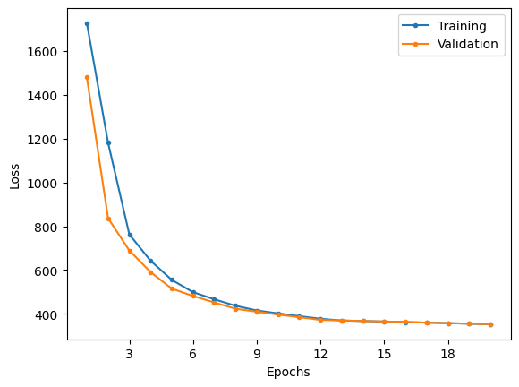
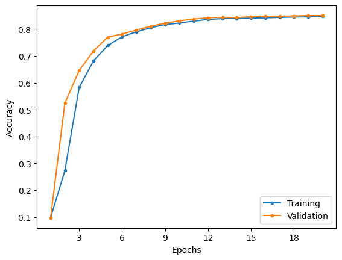
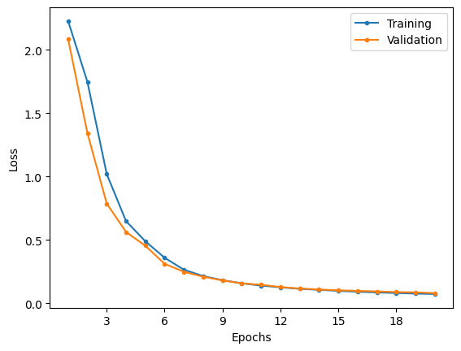
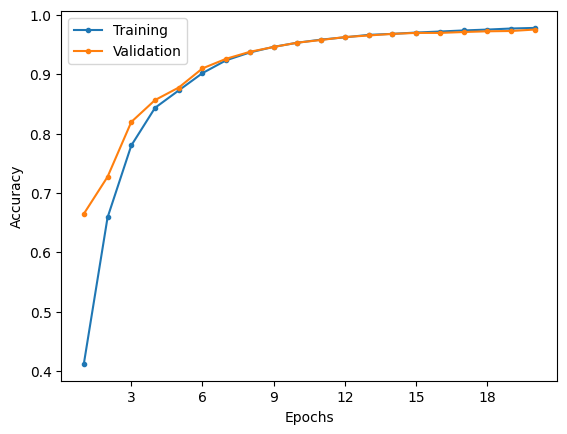

# LeNet-5

This is a replication of the LeNet-5 model being as close to as described in the research paper and a reimplementation of the architecture using modern developments.

## Original

### Model Summary

| Layer (type)                     | Output Shape     | Param # |
| -------------------------------- | ---------------- | ------- |
| 2D convolution layer (C1)        | [-1, 6, 28, 28]  | 156     |
| Tanh activation                  | [-1, 6, 28, 28]  | 0       |
| Subsampling layer (S2)           | [-1, 6, 14, 14]  | 12      |
| Tanh activation                  | [-1, 6, 14, 14]  | 0       |
| Sparse 2D convolution layer (C3) | [-1, 16, 10, 10] | 1,516   |
| Tanh activation                  | [-1, 16, 10, 10] | 0       |
| Subsampling layer (S4)           | [-1, 16, 5, 5]   | 32      |
| Tanh activation                  | [-1, 16, 5, 5]   | 0       |
| 2D convolution layer (C5)        | [-1, 120, 1, 1]  | 48,120  |
| Tanh activation                  | [-1, 120, 1, 1]  | 0       |
| Linear layer (F6)                | [-1, 84]         | 10,164  |
| RBF layer                        | [-1, 10]         | 0       |

|                      |        |
| -------------------- | ------ |
| Total params         | 60,000 |
| Trainable params     | 60,000 |
| Non-trainable params | 0      |

### Differences

The major change comes in the use of the Adam optimizer over the stochastic gradient descent optimizer. This change was necessary as training with SGD led to exploding gradients, thus causing the model to be unable to learn.

### Results

|                        Loss                         |                          Accuracy                           |
| :-------------------------------------------------: | :---------------------------------------------------------: |
|  |  |

|              | Training | Validation | Testing |
| :----------: | :------: | :--------: | :-----: |
|     Loss     |  353.03  |   352.91   | 337.71  |
| Accuracy (%) |  84.73   |   85.06    |  85.89  |

From the results, it can be seen that the model converges after training for 20 epochs with the specified learning rates and without any indications of over or under fitting.

## Modern

### Model Summary

| Layer (type)              | Output Shape     | Param # |
| ------------------------- | ---------------- | ------- |
| 2D convolution layer (C1) | [-1, 6, 28, 28]  | 156     |
| ReLU                      | [-1, 6, 28, 28]  | 0       |
| 2D max pooling layer (S2) | [-1, 6, 14, 14]  | 0       |
| ReLU                      | [-1, 6, 14, 14]  | 0       |
| 2D convolution layer (C3) | [-1, 16, 10, 10] | 2,416   |
| ReLU                      | [-1, 16, 10, 10] | 0       |
| 2D max pooling layer (S4) | [-1, 16, 5, 5]   | 0       |
| ReLU                      | [-1, 16, 5, 5]   | 0       |
| 2D convolution layer (C5) | [-1, 120, 1, 1]  | 48,120  |
| ReLU                      | [-1, 120, 1, 1]  | 0       |
| Linear (F6)               | [-1, 84]         | 10,164  |
| Linear                    | [-1, 10]         | 850     |

|                      |        |
| -------------------- | ------ |
| Total params         | 61,706 |
| Trainable params     | 61,706 |
| Non-trainable params | 0      |

### Differences to the original

Architecturally, the modern model differs by replacing the sparse convolution layer in favour for a regular 2D convolution layer, replacing the tanh functions with a ReLU function and replacing the trainable subsampling layer with a 2D max pooling layer.

In terms of the training differences, a scheduler is no longer used in favour of a constant learning rate of 1e-4 to reduce the number of hyperparameters. Additionally, manually setting learning rates is not necessary as the Adam optimizer does fairly with adapting the learning rate. The loss function was changed for cross entropy loss to allow the model to learn the structure of the digits rather than relying on ASCII representations.

### Results

|                      Loss                       |                        Accuracy                         |
| :---------------------------------------------: | :-----------------------------------------------------: |
|  |  |

|              | Training | Validation | Testing |
| :----------: | :------: | :--------: | :-----: |
|     Loss     |   0.07   |    0.08    |  0.07   |
| Accuracy (%) |  97.81   |   97.53    |  97.83  |

Similar to the original model, there does not be any signs of under or over fitting and training appears to converge within 20 epochs.

The loss values cannot be compared between the two models, due to the use of different loss functions. However, accuracy can be compared between the two. The modern model is significantly more accurate than the original model across all datasets, signifying that the changes made to the original model helped in boosting the performance of the model.

## References

Research Paper: http://vision.stanford.edu/cs598_spring07/papers/Lecun98.pdf
