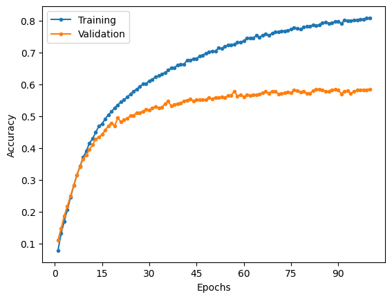

# ResNet

Implementation of ResNet as described in the paper.

For the purposes of analysis, only the ResNet-50 model would be trained, but the ResNet-101 and ResNet-152 models have been implemented.

## MNIST

### Model summary

|             Layer (type)             |    Output Shape    |  Param #  |
| :----------------------------------: | :----------------: | :-------: |
|              **conv1**               |                    |           |
|            2D convolution            | [-1, 64, 112, 112] |   9,408   |
|            2D batch norm             | [-1, 64, 112, 112] |    128    |
|                 ReLU                 | [-1, 64, 112, 112] |     0     |
|             **conv2_x**              |        ---         |    ---    |
|            2D max pooling            |  [-1, 64, 56, 56]  |     0     |
|            2D convolution            |  [-1, 64, 56, 56]  |   4,096   |
|            2D batch norm             |  [-1, 64, 56, 56]  |    128    |
|                 ReLU                 |  [-1, 64, 56, 56]  |     0     |
|            2D convolution            |  [-1, 64, 56, 56]  |  36,864   |
|            2D batch norm             |  [-1, 64, 56, 56]  |    128    |
|                 ReLU                 |  [-1, 64, 56, 56]  |     0     |
|            2D convolution            | [-1, 256, 56, 56]  |  16,384   |
|            2D batch norm             | [-1, 256, 56, 56]  |    512    |
| 2D convolution (Residual projection) | [-1, 256, 56, 56]  |  16,384   |
| 2D batch norm (Residual projection)  | [-1, 256, 56, 56]  |    512    |
|     Add (Bottleneck + residual)      | [-1, 256, 56, 56]  |     0     |
|                 ReLU                 | [-1, 256, 56, 56]  |     0     |
|            2D convolution            |  [-1, 64, 56, 56]  |  16,384   |
|            2D batch norm             |  [-1, 64, 56, 56]  |    128    |
|                 ReLU                 |  [-1, 64, 56, 56]  |     0     |
|            2D convolution            |  [-1, 64, 56, 56]  |  36,864   |
|            2D batch norm             |  [-1, 64, 56, 56]  |    128    |
|                 ReLU                 |  [-1, 64, 56, 56]  |     0     |
|            2D convolution            | [-1, 256, 56, 56]  |  16,384   |
|            2D batch norm             | [-1, 256, 56, 56]  |    512    |
|               Identity               | [-1, 256, 56, 56]  |     0     |
|     Add (Bottleneck + residual)      | [-1, 256, 56, 56]  |     0     |
|                 ReLU                 | [-1, 256, 56, 56]  |     0     |
|            2D convolution            |  [-1, 64, 56, 56]  |  16,384   |
|            2D batch norm             |  [-1, 64, 56, 56]  |    128    |
|                 ReLU                 |  [-1, 64, 56, 56]  |     0     |
|            2D convolution            |  [-1, 64, 56, 56]  |  36,864   |
|            2D batch norm             |  [-1, 64, 56, 56]  |    128    |
|                 ReLU                 |  [-1, 64, 56, 56]  |     0     |
|            2D convolution            | [-1, 256, 56, 56]  |  16,384   |
|            2D batch norm             | [-1, 256, 56, 56]  |    512    |
|               Identity               | [-1, 256, 56, 56]  |     0     |
|     Add (Bottleneck + residual)      | [-1, 256, 56, 56]  |     0     |
|                 ReLU                 | [-1, 256, 56, 56]  |     0     |
|             **conv3_x**              |        ---         |    ---    |
|            2D convolution            | [-1, 128, 28, 28]  |  32,768   |
|            2D batch norm             | [-1, 128, 28, 28]  |    256    |
|                 ReLU                 | [-1, 128, 28, 28]  |     0     |
|            2D convolution            | [-1, 128, 28, 28]  |  147,456  |
|            2D batch norm             | [-1, 128, 28, 28]  |    256    |
|                 ReLU                 | [-1, 128, 28, 28]  |     0     |
|            2D convolution            | [-1, 512, 28, 28]  |  65,536   |
|            2D batch norm             | [-1, 512, 28, 28]  |   1,024   |
| 2D convolution (Residual projection) | [-1, 512, 28, 28]  |  131,072  |
| 2D batch norm (Residual projection)  | [-1, 512, 28, 28]  |   1,024   |
|     Add (Bottleneck + residual)      | [-1, 512, 28, 28]  |     0     |
|                 ReLU                 | [-1, 512, 28, 28]  |     0     |
|            2D convolution            | [-1, 128, 28, 28]  |  65,536   |
|            2D batch norm             | [-1, 128, 28, 28]  |    256    |
|                 ReLU                 | [-1, 128, 28, 28]  |     0     |
|            2D convolution            | [-1, 128, 28, 28]  |  147,456  |
|            2D batch norm             | [-1, 128, 28, 28]  |    256    |
|                 ReLU                 | [-1, 128, 28, 28]  |     0     |
|            2D convolution            | [-1, 512, 28, 28]  |  65,536   |
|            2D batch norm             | [-1, 512, 28, 28]  |   1,024   |
|               Identity               | [-1, 512, 28, 28]  |     0     |
|                 ReLU                 | [-1, 512, 28, 28]  |     0     |
|     Add (Bottleneck + residual)      | [-1, 512, 28, 28]  |     0     |
|                 ReLU                 | [-1, 512, 28, 28]  |     0     |
|            2D convolution            | [-1, 128, 28, 28]  |  65,536   |
|            2D batch norm             | [-1, 128, 28, 28]  |    256    |
|                 ReLU                 | [-1, 128, 28, 28]  |     0     |
|            2D convolution            | [-1, 128, 28, 28]  |  147,456  |
|            2D batch norm             | [-1, 128, 28, 28]  |    256    |
|                 ReLU                 | [-1, 128, 28, 28]  |     0     |
|            2D convolution            | [-1, 512, 28, 28]  |  65,536   |
|            2D batch norm             | [-1, 512, 28, 28]  |   1,024   |
|               Identity               | [-1, 512, 28, 28]  |     0     |
|                 ReLU                 | [-1, 512, 28, 28]  |     0     |
|     Add (Bottleneck + residual)      | [-1, 512, 28, 28]  |     0     |
|                 ReLU                 | [-1, 512, 28, 28]  |     0     |
|            2D convolution            | [-1, 128, 28, 28]  |  65,536   |
|            2D batch norm             | [-1, 128, 28, 28]  |    256    |
|                 ReLU                 | [-1, 128, 28, 28]  |     0     |
|            2D convolution            | [-1, 128, 28, 28]  |  147,456  |
|            2D batch norm             | [-1, 128, 28, 28]  |    256    |
|                 ReLU                 | [-1, 128, 28, 28]  |     0     |
|            2D convolution            | [-1, 512, 28, 28]  |  65,536   |
|            2D batch norm             | [-1, 512, 28, 28]  |   1,024   |
|               Identity               | [-1, 512, 28, 28]  |     0     |
|                 ReLU                 | [-1, 512, 28, 28]  |     0     |
|     Add (Bottleneck + residual)      | [-1, 512, 28, 28]  |     0     |
|                 ReLU                 | [-1, 512, 28, 28]  |     0     |
|             **conv4_x**              |        ---         |    ---    |
|            2D convolution            | [-1, 256, 14, 14]  |  131,072  |
|            2D batch norm             | [-1, 256, 14, 14]  |    512    |
|                 ReLU                 | [-1, 256, 14, 14]  |     0     |
|            2D convolution            | [-1, 256, 14, 14]  |  589,824  |
|            2D batch norm             | [-1, 256, 14, 14]  |    512    |
|                 ReLU                 | [-1, 256, 14, 14]  |     0     |
|            2D convolution            | [-1, 1024, 14, 14] |  262,144  |
|            2D batch norm             | [-1, 1024, 14, 14] |   2,048   |
| 2D convolution (Residual projection) | [-1, 1024, 14, 14] |  524,288  |
| 2D batch norm (Residual projection)  | [-1, 1024, 14, 14] |   2,048   |
|                 ReLU                 | [-1, 1024, 14, 14] |     0     |
|     Add (Bottleneck + residual)      | [-1, 1024, 14, 14] |     0     |
|                 ReLU                 | [-1, 1024, 14, 14] |     0     |
|            2D convolution            | [-1, 256, 14, 14]  |  262,144  |
|            2D batch norm             | [-1, 256, 14, 14]  |    512    |
|                 ReLU                 | [-1, 256, 14, 14]  |     0     |
|            2D convolution            | [-1, 256, 14, 14]  |  589,824  |
|            2D batch norm             | [-1, 256, 14, 14]  |    512    |
|                 ReLU                 | [-1, 256, 14, 14]  |     0     |
|            2D convolution            | [-1, 1024, 14, 14] |  262,144  |
|            2D batch norm             | [-1, 1024, 14, 14] |   2,048   |
|               Identity               | [-1, 1024, 14, 14] |     0     |
|                 ReLU                 | [-1, 1024, 14, 14] |     0     |
|     Add (Bottleneck + residual)      | [-1, 1024, 14, 14] |     0     |
|                 ReLU                 | [-1, 1024, 14, 14] |     0     |
|            2D convolution            | [-1, 256, 14, 14]  |  262,144  |
|            2D batch norm             | [-1, 256, 14, 14]  |    512    |
|                 ReLU                 | [-1, 256, 14, 14]  |     0     |
|            2D convolution            | [-1, 256, 14, 14]  |  589,824  |
|            2D batch norm             | [-1, 256, 14, 14]  |    512    |
|                 ReLU                 | [-1, 256, 14, 14]  |     0     |
|            2D convolution            | [-1, 1024, 14, 14] |  262,144  |
|            2D batch norm             | [-1, 1024, 14, 14] |   2,048   |
|               Identity               | [-1, 1024, 14, 14] |     0     |
|                 ReLU                 | [-1, 1024, 14, 14] |     0     |
|     Add (Bottleneck + residual)      | [-1, 1024, 14, 14] |     0     |
|                 ReLU                 | [-1, 1024, 14, 14] |     0     |
|            2D convolution            | [-1, 256, 14, 14]  |  262,144  |
|            2D batch norm             | [-1, 256, 14, 14]  |    512    |
|                 ReLU                 | [-1, 256, 14, 14]  |     0     |
|            2D convolution            | [-1, 256, 14, 14]  |  589,824  |
|            2D batch norm             | [-1, 256, 14, 14]  |    512    |
|                 ReLU                 | [-1, 256, 14, 14]  |     0     |
|            2D convolution            | [-1, 1024, 14, 14] |  262,144  |
|            2D batch norm             | [-1, 1024, 14, 14] |   2,048   |
|               Identity               | [-1, 1024, 14, 14] |     0     |
|                 ReLU                 | [-1, 1024, 14, 14] |     0     |
|     Add (Bottleneck + residual)      | [-1, 1024, 14, 14] |     0     |
|                 ReLU                 | [-1, 1024, 14, 14] |     0     |
|            2D convolution            | [-1, 256, 14, 14]  |  262,144  |
|            2D batch norm             | [-1, 256, 14, 14]  |    512    |
|                 ReLU                 | [-1, 256, 14, 14]  |     0     |
|            2D convolution            | [-1, 256, 14, 14]  |  589,824  |
|            2D batch norm             | [-1, 256, 14, 14]  |    512    |
|                 ReLU                 | [-1, 256, 14, 14]  |     0     |
|            2D convolution            | [-1, 1024, 14, 14] |  262,144  |
|            2D batch norm             | [-1, 1024, 14, 14] |   2,048   |
|               Identity               | [-1, 1024, 14, 14] |     0     |
|                 ReLU                 | [-1, 1024, 14, 14] |     0     |
|     Add (Bottleneck + residual)      | [-1, 1024, 14, 14] |     0     |
|                 ReLU                 | [-1, 1024, 14, 14] |     0     |
|            2D convolution            | [-1, 256, 14, 14]  |  262,144  |
|            2D batch norm             | [-1, 256, 14, 14]  |    512    |
|                 ReLU                 | [-1, 256, 14, 14]  |     0     |
|            2D convolution            | [-1, 256, 14, 14]  |  589,824  |
|            2D batch norm             | [-1, 256, 14, 14]  |    512    |
|                 ReLU                 | [-1, 256, 14, 14]  |     0     |
|            2D convolution            | [-1, 1024, 14, 14] |  262,144  |
|            2D batch norm             | [-1, 1024, 14, 14] |   2,048   |
|               Identity               | [-1, 1024, 14, 14] |     0     |
|                 ReLU                 | [-1, 1024, 14, 14] |     0     |
|     Add (Bottleneck + residual)      | [-1, 1024, 14, 14] |     0     |
|                 ReLU                 | [-1, 1024, 14, 14] |     0     |
|             **conv5_x**              |        ---         |    ---    |
|            2D convolution            |  [-1, 512, 7, 7]   |  524,288  |
|            2D batch norm             |  [-1, 512, 7, 7]   |   1,024   |
|                 ReLU                 |  [-1, 512, 7, 7]   |     0     |
|            2D convolution            |  [-1, 512, 7, 7]   | 2,359,296 |
|            2D batch norm             |  [-1, 512, 7, 7]   |   1,024   |
|                 ReLU                 |  [-1, 512, 7, 7]   |     0     |
|            2D convolution            |  [-1, 2048, 7, 7]  | 1,048,576 |
|            2D batch norm             |  [-1, 2048, 7, 7]  |   4,096   |
| 2D convolution (Residual projection) |  [-1, 2048, 7, 7]  | 2,097,152 |
| 2D batch norm (Residual projection)  |  [-1, 2048, 7, 7]  |   4,096   |
|                 ReLU                 |  [-1, 2048, 7, 7]  |     0     |
|     Add (Bottleneck + residual)      |  [-1, 2048, 7, 7]  |     0     |
|                 ReLU                 |  [-1, 2048, 7, 7]  |     0     |
|            2D convolution            |  [-1, 512, 7, 7]   | 1,048,576 |
|            2D batch norm             |  [-1, 512, 7, 7]   |   1,024   |
|                 ReLU                 |  [-1, 512, 7, 7]   |     0     |
|            2D convolution            |  [-1, 512, 7, 7]   | 2,359,296 |
|            2D batch norm             |  [-1, 512, 7, 7]   |   1,024   |
|                 ReLU                 |  [-1, 512, 7, 7]   |     0     |
|            2D convolution            |  [-1, 2048, 7, 7]  | 1,048,576 |
|            2D batch norm             |  [-1, 2048, 7, 7]  |   4,096   |
|               Identity               |  [-1, 2048, 7, 7]  |     0     |
|                 ReLU                 |  [-1, 2048, 7, 7]  |     0     |
|     Add (Bottleneck + residual)      |  [-1, 2048, 7, 7]  |     0     |
|                 ReLU                 |  [-1, 2048, 7, 7]  |     0     |
|            2D convolution            |  [-1, 512, 7, 7]   | 1,048,576 |
|            2D batch norm             |  [-1, 512, 7, 7]   |   1,024   |
|                 ReLU                 |  [-1, 512, 7, 7]   |     0     |
|            2D convolution            |  [-1, 512, 7, 7]   | 2,359,296 |
|            2D batch norm             |  [-1, 512, 7, 7]   |   1,024   |
|                 ReLU                 |  [-1, 512, 7, 7]   |     0     |
|            2D convolution            |  [-1, 2048, 7, 7]  | 1,048,576 |
|            2D batch norm             |  [-1, 2048, 7, 7]  |   4,096   |
|               Identity               |  [-1, 2048, 7, 7]  |     0     |
|                 ReLU                 |  [-1, 2048, 7, 7]  |     0     |
|     Add (Bottleneck + residual)      |  [-1, 2048, 7, 7]  |     0     |
|                 ReLU                 |  [-1, 2048, 7, 7]  |     0     |
|          2D average pooling          |  [-1, 2048, 1, 1]  |     0     |
|               Flatten                |     [-1, 2048]     |     0     |
|                Linear                |      [-1, 10]      |  20,490   |

|                      |            |
| -------------------- | ---------- |
| Total params         | 23,528,522 |
| Trainable params     | 23,528,522 |
| Non-trainable params | 0          |

### Results

Training over 10 epochs with a learning rate of 1e-4 and batch size of 64.

|                     Loss                      |                       Accuracy                        |
| :-------------------------------------------: | :---------------------------------------------------: |
|  |  |

|              | Training | Validation | Testing |
| :----------: | :------: | :--------: | :-----: |
|     Loss     |  0.0114  |   0.0317   | 0.0268  |
| Accuracy (%) |  99.65   |   99.09    |  99.23  |

| Class | Training Precision | Validation Precision | Testing Precision | Training Recall | Validation Recall | Testing Recall | Training F1 Score | Validation F1 Score | Testing F1 Score |
| :---: | :----------------: | :------------------: | :---------------: | :-------------: | :---------------: | :------------: | :---------------: | :-----------------: | :--------------: |
|   0   |       0.9986       |        0.9949        |      0.9939       |     0.9981      |      0.9937       |     0.9980     |      0.9983       |       0.9943        |      0.9959      |
|   1   |       0.9974       |        0.9951        |      0.9947       |     0.9981      |      0.9971       |     0.9982     |      0.9978       |       0.9961        |      0.9965      |
|   2   |       0.9960       |        0.9932        |      0.9952       |     0.9952      |      0.9937       |     0.9971     |      0.9956       |       0.9934        |      0.9961      |
|   3   |       0.9977       |        0.9838        |      0.9777       |     0.9970      |      0.9984       |     0.9980     |      0.9973       |       0.9910        |      0.9878      |
|   4   |       0.9968       |        0.9837        |      0.9869       |     0.9958      |      0.9949       |     0.9939     |      0.9963       |       0.9893        |      0.9904      |
|   5   |       0.9960       |        0.9939        |      0.9966       |     0.9963      |      0.9789       |     0.9787     |      0.9961       |       0.9863        |      0.9876      |
|   6   |       0.9978       |        0.9893        |      0.9948       |     0.9976      |      0.9977       |     0.9948     |      0.9977       |       0.9935        |      0.9948      |
|   7   |       0.9952       |        0.9943        |      0.9971       |     0.9972      |      0.9876       |     0.9883     |      0.9962       |       0.9910        |      0.9927      |
|   8   |       0.9951       |        0.9947        |      0.9969       |     0.9949      |      0.9844       |     0.9908     |      0.9950       |       0.9895        |      0.9938      |
|   9   |       0.9940       |        0.9864        |      0.9900       |     0.9943      |      0.9813       |     0.9832     |      0.9941       |       0.9838        |      0.9866      |

Similar to all the preceding models, ResNet performs with close the human accuracy. It performs ever so slightly better than VGG does while containing ~18% of its parameters.

## CIFAR 100

### Model summary

|             Layer (type)             |    Output Shape    |  Param #  |
| :----------------------------------: | :----------------: | :-------: |
|              **conv1**               |                    |           |
|            2D convolution            | [-1, 64, 112, 112] |   9,408   |
|            2D batch norm             | [-1, 64, 112, 112] |    128    |
|                 ReLU                 | [-1, 64, 112, 112] |     0     |
|             **conv2_x**              |        ---         |    ---    |
|            2D max pooling            |  [-1, 64, 56, 56]  |     0     |
|            2D convolution            |  [-1, 64, 56, 56]  |   4,096   |
|            2D batch norm             |  [-1, 64, 56, 56]  |    128    |
|                 ReLU                 |  [-1, 64, 56, 56]  |     0     |
|            2D convolution            |  [-1, 64, 56, 56]  |  36,864   |
|            2D batch norm             |  [-1, 64, 56, 56]  |    128    |
|                 ReLU                 |  [-1, 64, 56, 56]  |     0     |
|            2D convolution            | [-1, 256, 56, 56]  |  16,384   |
|            2D batch norm             | [-1, 256, 56, 56]  |    512    |
| 2D convolution (Residual projection) | [-1, 256, 56, 56]  |  16,384   |
| 2D batch norm (Residual projection)  | [-1, 256, 56, 56]  |    512    |
|     Add (Bottleneck + residual)      | [-1, 256, 56, 56]  |     0     |
|                 ReLU                 | [-1, 256, 56, 56]  |     0     |
|            2D convolution            |  [-1, 64, 56, 56]  |  16,384   |
|            2D batch norm             |  [-1, 64, 56, 56]  |    128    |
|                 ReLU                 |  [-1, 64, 56, 56]  |     0     |
|            2D convolution            |  [-1, 64, 56, 56]  |  36,864   |
|            2D batch norm             |  [-1, 64, 56, 56]  |    128    |
|                 ReLU                 |  [-1, 64, 56, 56]  |     0     |
|            2D convolution            | [-1, 256, 56, 56]  |  16,384   |
|            2D batch norm             | [-1, 256, 56, 56]  |    512    |
|               Identity               | [-1, 256, 56, 56]  |     0     |
|     Add (Bottleneck + residual)      | [-1, 256, 56, 56]  |     0     |
|                 ReLU                 | [-1, 256, 56, 56]  |     0     |
|            2D convolution            |  [-1, 64, 56, 56]  |  16,384   |
|            2D batch norm             |  [-1, 64, 56, 56]  |    128    |
|                 ReLU                 |  [-1, 64, 56, 56]  |     0     |
|            2D convolution            |  [-1, 64, 56, 56]  |  36,864   |
|            2D batch norm             |  [-1, 64, 56, 56]  |    128    |
|                 ReLU                 |  [-1, 64, 56, 56]  |     0     |
|            2D convolution            | [-1, 256, 56, 56]  |  16,384   |
|            2D batch norm             | [-1, 256, 56, 56]  |    512    |
|               Identity               | [-1, 256, 56, 56]  |     0     |
|     Add (Bottleneck + residual)      | [-1, 256, 56, 56]  |     0     |
|                 ReLU                 | [-1, 256, 56, 56]  |     0     |
|             **conv3_x**              |        ---         |    ---    |
|            2D convolution            | [-1, 128, 28, 28]  |  32,768   |
|            2D batch norm             | [-1, 128, 28, 28]  |    256    |
|                 ReLU                 | [-1, 128, 28, 28]  |     0     |
|            2D convolution            | [-1, 128, 28, 28]  |  147,456  |
|            2D batch norm             | [-1, 128, 28, 28]  |    256    |
|                 ReLU                 | [-1, 128, 28, 28]  |     0     |
|            2D convolution            | [-1, 512, 28, 28]  |  65,536   |
|            2D batch norm             | [-1, 512, 28, 28]  |   1,024   |
| 2D convolution (Residual projection) | [-1, 512, 28, 28]  |  131,072  |
| 2D batch norm (Residual projection)  | [-1, 512, 28, 28]  |   1,024   |
|     Add (Bottleneck + residual)      | [-1, 512, 28, 28]  |     0     |
|                 ReLU                 | [-1, 512, 28, 28]  |     0     |
|            2D convolution            | [-1, 128, 28, 28]  |  65,536   |
|            2D batch norm             | [-1, 128, 28, 28]  |    256    |
|                 ReLU                 | [-1, 128, 28, 28]  |     0     |
|            2D convolution            | [-1, 128, 28, 28]  |  147,456  |
|            2D batch norm             | [-1, 128, 28, 28]  |    256    |
|                 ReLU                 | [-1, 128, 28, 28]  |     0     |
|            2D convolution            | [-1, 512, 28, 28]  |  65,536   |
|            2D batch norm             | [-1, 512, 28, 28]  |   1,024   |
|               Identity               | [-1, 512, 28, 28]  |     0     |
|                 ReLU                 | [-1, 512, 28, 28]  |     0     |
|     Add (Bottleneck + residual)      | [-1, 512, 28, 28]  |     0     |
|                 ReLU                 | [-1, 512, 28, 28]  |     0     |
|            2D convolution            | [-1, 128, 28, 28]  |  65,536   |
|            2D batch norm             | [-1, 128, 28, 28]  |    256    |
|                 ReLU                 | [-1, 128, 28, 28]  |     0     |
|            2D convolution            | [-1, 128, 28, 28]  |  147,456  |
|            2D batch norm             | [-1, 128, 28, 28]  |    256    |
|                 ReLU                 | [-1, 128, 28, 28]  |     0     |
|            2D convolution            | [-1, 512, 28, 28]  |  65,536   |
|            2D batch norm             | [-1, 512, 28, 28]  |   1,024   |
|               Identity               | [-1, 512, 28, 28]  |     0     |
|                 ReLU                 | [-1, 512, 28, 28]  |     0     |
|     Add (Bottleneck + residual)      | [-1, 512, 28, 28]  |     0     |
|                 ReLU                 | [-1, 512, 28, 28]  |     0     |
|            2D convolution            | [-1, 128, 28, 28]  |  65,536   |
|            2D batch norm             | [-1, 128, 28, 28]  |    256    |
|                 ReLU                 | [-1, 128, 28, 28]  |     0     |
|            2D convolution            | [-1, 128, 28, 28]  |  147,456  |
|            2D batch norm             | [-1, 128, 28, 28]  |    256    |
|                 ReLU                 | [-1, 128, 28, 28]  |     0     |
|            2D convolution            | [-1, 512, 28, 28]  |  65,536   |
|            2D batch norm             | [-1, 512, 28, 28]  |   1,024   |
|               Identity               | [-1, 512, 28, 28]  |     0     |
|                 ReLU                 | [-1, 512, 28, 28]  |     0     |
|     Add (Bottleneck + residual)      | [-1, 512, 28, 28]  |     0     |
|                 ReLU                 | [-1, 512, 28, 28]  |     0     |
|             **conv4_x**              |        ---         |    ---    |
|            2D convolution            | [-1, 256, 14, 14]  |  131,072  |
|            2D batch norm             | [-1, 256, 14, 14]  |    512    |
|                 ReLU                 | [-1, 256, 14, 14]  |     0     |
|            2D convolution            | [-1, 256, 14, 14]  |  589,824  |
|            2D batch norm             | [-1, 256, 14, 14]  |    512    |
|                 ReLU                 | [-1, 256, 14, 14]  |     0     |
|            2D convolution            | [-1, 1024, 14, 14] |  262,144  |
|            2D batch norm             | [-1, 1024, 14, 14] |   2,048   |
| 2D convolution (Residual projection) | [-1, 1024, 14, 14] |  524,288  |
| 2D batch norm (Residual projection)  | [-1, 1024, 14, 14] |   2,048   |
|                 ReLU                 | [-1, 1024, 14, 14] |     0     |
|     Add (Bottleneck + residual)      | [-1, 1024, 14, 14] |     0     |
|                 ReLU                 | [-1, 1024, 14, 14] |     0     |
|            2D convolution            | [-1, 256, 14, 14]  |  262,144  |
|            2D batch norm             | [-1, 256, 14, 14]  |    512    |
|                 ReLU                 | [-1, 256, 14, 14]  |     0     |
|            2D convolution            | [-1, 256, 14, 14]  |  589,824  |
|            2D batch norm             | [-1, 256, 14, 14]  |    512    |
|                 ReLU                 | [-1, 256, 14, 14]  |     0     |
|            2D convolution            | [-1, 1024, 14, 14] |  262,144  |
|            2D batch norm             | [-1, 1024, 14, 14] |   2,048   |
|               Identity               | [-1, 1024, 14, 14] |     0     |
|                 ReLU                 | [-1, 1024, 14, 14] |     0     |
|     Add (Bottleneck + residual)      | [-1, 1024, 14, 14] |     0     |
|                 ReLU                 | [-1, 1024, 14, 14] |     0     |
|            2D convolution            | [-1, 256, 14, 14]  |  262,144  |
|            2D batch norm             | [-1, 256, 14, 14]  |    512    |
|                 ReLU                 | [-1, 256, 14, 14]  |     0     |
|            2D convolution            | [-1, 256, 14, 14]  |  589,824  |
|            2D batch norm             | [-1, 256, 14, 14]  |    512    |
|                 ReLU                 | [-1, 256, 14, 14]  |     0     |
|            2D convolution            | [-1, 1024, 14, 14] |  262,144  |
|            2D batch norm             | [-1, 1024, 14, 14] |   2,048   |
|               Identity               | [-1, 1024, 14, 14] |     0     |
|                 ReLU                 | [-1, 1024, 14, 14] |     0     |
|     Add (Bottleneck + residual)      | [-1, 1024, 14, 14] |     0     |
|                 ReLU                 | [-1, 1024, 14, 14] |     0     |
|            2D convolution            | [-1, 256, 14, 14]  |  262,144  |
|            2D batch norm             | [-1, 256, 14, 14]  |    512    |
|                 ReLU                 | [-1, 256, 14, 14]  |     0     |
|            2D convolution            | [-1, 256, 14, 14]  |  589,824  |
|            2D batch norm             | [-1, 256, 14, 14]  |    512    |
|                 ReLU                 | [-1, 256, 14, 14]  |     0     |
|            2D convolution            | [-1, 1024, 14, 14] |  262,144  |
|            2D batch norm             | [-1, 1024, 14, 14] |   2,048   |
|               Identity               | [-1, 1024, 14, 14] |     0     |
|                 ReLU                 | [-1, 1024, 14, 14] |     0     |
|     Add (Bottleneck + residual)      | [-1, 1024, 14, 14] |     0     |
|                 ReLU                 | [-1, 1024, 14, 14] |     0     |
|            2D convolution            | [-1, 256, 14, 14]  |  262,144  |
|            2D batch norm             | [-1, 256, 14, 14]  |    512    |
|                 ReLU                 | [-1, 256, 14, 14]  |     0     |
|            2D convolution            | [-1, 256, 14, 14]  |  589,824  |
|            2D batch norm             | [-1, 256, 14, 14]  |    512    |
|                 ReLU                 | [-1, 256, 14, 14]  |     0     |
|            2D convolution            | [-1, 1024, 14, 14] |  262,144  |
|            2D batch norm             | [-1, 1024, 14, 14] |   2,048   |
|               Identity               | [-1, 1024, 14, 14] |     0     |
|                 ReLU                 | [-1, 1024, 14, 14] |     0     |
|     Add (Bottleneck + residual)      | [-1, 1024, 14, 14] |     0     |
|                 ReLU                 | [-1, 1024, 14, 14] |     0     |
|            2D convolution            | [-1, 256, 14, 14]  |  262,144  |
|            2D batch norm             | [-1, 256, 14, 14]  |    512    |
|                 ReLU                 | [-1, 256, 14, 14]  |     0     |
|            2D convolution            | [-1, 256, 14, 14]  |  589,824  |
|            2D batch norm             | [-1, 256, 14, 14]  |    512    |
|                 ReLU                 | [-1, 256, 14, 14]  |     0     |
|            2D convolution            | [-1, 1024, 14, 14] |  262,144  |
|            2D batch norm             | [-1, 1024, 14, 14] |   2,048   |
|               Identity               | [-1, 1024, 14, 14] |     0     |
|                 ReLU                 | [-1, 1024, 14, 14] |     0     |
|     Add (Bottleneck + residual)      | [-1, 1024, 14, 14] |     0     |
|                 ReLU                 | [-1, 1024, 14, 14] |     0     |
|             **conv5_x**              |        ---         |    ---    |
|            2D convolution            |  [-1, 512, 7, 7]   |  524,288  |
|            2D batch norm             |  [-1, 512, 7, 7]   |   1,024   |
|                 ReLU                 |  [-1, 512, 7, 7]   |     0     |
|            2D convolution            |  [-1, 512, 7, 7]   | 2,359,296 |
|            2D batch norm             |  [-1, 512, 7, 7]   |   1,024   |
|                 ReLU                 |  [-1, 512, 7, 7]   |     0     |
|            2D convolution            |  [-1, 2048, 7, 7]  | 1,048,576 |
|            2D batch norm             |  [-1, 2048, 7, 7]  |   4,096   |
| 2D convolution (Residual projection) |  [-1, 2048, 7, 7]  | 2,097,152 |
| 2D batch norm (Residual projection)  |  [-1, 2048, 7, 7]  |   4,096   |
|                 ReLU                 |  [-1, 2048, 7, 7]  |     0     |
|     Add (Bottleneck + residual)      |  [-1, 2048, 7, 7]  |     0     |
|                 ReLU                 |  [-1, 2048, 7, 7]  |     0     |
|            2D convolution            |  [-1, 512, 7, 7]   | 1,048,576 |
|            2D batch norm             |  [-1, 512, 7, 7]   |   1,024   |
|                 ReLU                 |  [-1, 512, 7, 7]   |     0     |
|            2D convolution            |  [-1, 512, 7, 7]   | 2,359,296 |
|            2D batch norm             |  [-1, 512, 7, 7]   |   1,024   |
|                 ReLU                 |  [-1, 512, 7, 7]   |     0     |
|            2D convolution            |  [-1, 2048, 7, 7]  | 1,048,576 |
|            2D batch norm             |  [-1, 2048, 7, 7]  |   4,096   |
|               Identity               |  [-1, 2048, 7, 7]  |     0     |
|                 ReLU                 |  [-1, 2048, 7, 7]  |     0     |
|     Add (Bottleneck + residual)      |  [-1, 2048, 7, 7]  |     0     |
|                 ReLU                 |  [-1, 2048, 7, 7]  |     0     |
|            2D convolution            |  [-1, 512, 7, 7]   | 1,048,576 |
|            2D batch norm             |  [-1, 512, 7, 7]   |   1,024   |
|                 ReLU                 |  [-1, 512, 7, 7]   |     0     |
|            2D convolution            |  [-1, 512, 7, 7]   | 2,359,296 |
|            2D batch norm             |  [-1, 512, 7, 7]   |   1,024   |
|                 ReLU                 |  [-1, 512, 7, 7]   |     0     |
|            2D convolution            |  [-1, 2048, 7, 7]  | 1,048,576 |
|            2D batch norm             |  [-1, 2048, 7, 7]  |   4,096   |
|               Identity               |  [-1, 2048, 7, 7]  |     0     |
|                 ReLU                 |  [-1, 2048, 7, 7]  |     0     |
|     Add (Bottleneck + residual)      |  [-1, 2048, 7, 7]  |     0     |
|                 ReLU                 |  [-1, 2048, 7, 7]  |     0     |
|          2D average pooling          |  [-1, 2048, 1, 1]  |     0     |
|               Flatten                |     [-1, 2048]     |     0     |
|                Linear                |     [-1, 100]      |  204,900  |

|                      |            |
| -------------------- | ---------- |
| Total params         | 23,712,932 |
| Trainable params     | 23,712,932 |
| Non-trainable params | 0          |

### Results

Training over 100 epochs with a learning rate of 1e-4, weight decay of 0.01 and batch size of 64.

|                         Loss                         |                           Accuracy                           |
| :--------------------------------------------------: | :----------------------------------------------------------: |
|  |  |

|              | Training | Validation | Testing |
| :----------: | :------: | :--------: | :-----: |
|     Loss     |  0.7017  |   1.6893   | 1.3544  |
| Accuracy (%) |  80.81   |   58.53    |  65.26  |

|     Class     | Training Precision | Validation Precision | Testing Precision | Training Recall | Validation Recall | Testing Recall | Training F1 Score | Validation F1 Score | Testing F1 Score |
| :-----------: | :----------------: | :------------------: | :---------------: | :-------------: | :---------------: | :------------: | :---------------: | :-----------------: | :--------------: |
|     apple     |       0.8644       |        0.7838        |      0.8966       |     0.8571      |      0.8112       |     0.7800     |      0.8608       |       0.7973        |      0.8342      |
| aquarium_fish |       0.8512       |        0.6867        |      0.7849       |     0.8563      |      0.6867       |     0.7300     |      0.8537       |       0.6867        |      0.7565      |
|     baby      |       0.7942       |        0.4525        |      0.5085       |     0.8035      |      0.5094       |     0.6000     |      0.7988       |       0.4793        |      0.5505      |
|     bear      |       0.7173       |        0.3372        |      0.5086       |     0.7326      |      0.4603       |     0.5900     |      0.7249       |       0.3893        |      0.5463      |
|    beaver     |       0.7657       |        0.4444        |      0.4275       |     0.7571      |      0.4658       |     0.5900     |      0.7614       |       0.4548        |      0.4958      |
|      bed      |       0.8057       |        0.5779        |      0.5781       |     0.7966      |      0.6096       |     0.7400     |      0.8011       |       0.5933        |      0.6491      |
|      bee      |       0.8627       |        0.6013        |      0.6952       |     0.8576      |      0.5644       |     0.7300     |      0.8601       |       0.5823        |      0.7122      |
|    beetle     |       0.8248       |        0.5377        |      0.8140       |     0.8117      |      0.4634       |     0.7000     |      0.8182       |       0.4978        |      0.7527      |
|    bicycle    |       0.8211       |        0.7518        |      0.8352       |     0.8309      |      0.6503       |     0.7600     |      0.8260       |       0.6974        |      0.7958      |
|    bottle     |       0.8609       |        0.6037        |      0.6909       |     0.8366      |      0.6828       |     0.7600     |      0.8486       |       0.6408        |      0.7238      |
|     bowl      |       0.7735       |        0.2402        |      0.3664       |     0.7388      |      0.3819       |     0.4800     |      0.7557       |       0.2949        |      0.4156      |
|      boy      |       0.7357       |        0.3832        |      0.4409       |     0.7000      |      0.4267       |     0.4100     |      0.7174       |       0.4038        |      0.4249      |
|    bridge     |       0.8129       |        0.5202        |      0.5865       |     0.7817      |      0.5590       |     0.7800     |      0.7970       |       0.5389        |      0.6695      |
|      bus      |       0.7965       |        0.5556        |      0.6795       |     0.7762      |      0.5102       |     0.5300     |      0.7862       |       0.5319        |      0.5955      |
|   butterfly   |       0.8382       |        0.6435        |      0.7059       |     0.8262      |      0.4966       |     0.4800     |      0.8321       |       0.5606        |      0.5714      |
|     camel     |       0.8209       |        0.6389        |      0.7297       |     0.7902      |      0.4539       |     0.5400     |      0.8053       |       0.5308        |      0.6207      |
|      can      |       0.8235       |        0.6200        |      0.6339       |     0.7865      |      0.6458       |     0.7100     |      0.8046       |       0.6327        |      0.6698      |
|    castle     |       0.8489       |        0.6705        |      0.7767       |     0.8704      |      0.8000       |     0.8000     |      0.8595       |       0.7296        |      0.7882      |
|  caterpillar  |       0.7845       |        0.6636        |      0.6528       |     0.8023      |      0.5000       |     0.4700     |      0.7933       |       0.5703        |      0.5465      |
|    cattle     |       0.8514       |        0.4891        |      0.5743       |     0.8209      |      0.5455       |     0.5800     |      0.8359       |       0.5158        |      0.5771      |
|     chair     |       0.8768       |        0.7838        |      0.8454       |     0.8895      |      0.7436       |     0.8200     |      0.8831       |       0.7632        |      0.8325      |
|  chimpanzee   |       0.8044       |        0.6909        |      0.7822       |     0.8367      |      0.7550       |     0.7900     |      0.8202       |       0.7215        |      0.7861      |
|     clock     |       0.8659       |        0.6107        |      0.6667       |     0.8319      |      0.5594       |     0.6400     |      0.8486       |       0.5839        |      0.6531      |
|     cloud     |       0.7426       |        0.6358        |      0.8182       |     0.8608      |      0.6486       |     0.7200     |      0.7974       |       0.6421        |      0.7660      |
|   cockroach   |       0.8780       |        0.8099        |      0.8037       |     0.9025      |      0.8156       |     0.8600     |      0.8901       |       0.8127        |      0.8309      |
|     couch     |       0.7683       |        0.5423        |      0.5854       |     0.7326      |      0.4936       |     0.4800     |      0.7500       |       0.5168        |      0.5275      |
|     crab      |       0.8095       |        0.4378        |      0.4485       |     0.7640      |      0.5625       |     0.6100     |      0.7861       |       0.4924        |      0.5169      |
|   crocodile   |       0.7326       |        0.4887        |      0.4904       |     0.8028      |      0.4483       |     0.5100     |      0.7661       |       0.4676        |      0.5000      |
|      cup      |       0.7914       |        0.5425        |      0.7064       |     0.7781      |      0.5764       |     0.7700     |      0.7847       |       0.5589        |      0.7368      |
|   dinosaur    |       0.7865       |        0.5143        |      0.8052       |     0.7887      |      0.4966       |     0.6200     |      0.7876       |       0.5053        |      0.7006      |
|    dolphin    |       0.7736       |        0.4774        |      0.5680       |     0.7972      |      0.6786       |     0.7100     |      0.7852       |       0.5605        |      0.6311      |
|   elephant    |       0.7692       |        0.6984        |      0.8293       |     0.8046      |      0.5789       |     0.6800     |      0.7865       |       0.6331        |      0.7473      |
|   flatfish    |       0.8017       |        0.5246        |      0.7042       |     0.7926      |      0.4324       |     0.5000     |      0.7971       |       0.4741        |      0.5848      |
|    forest     |       0.7439       |        0.5101        |      0.5340       |     0.7756      |      0.5135       |     0.5500     |      0.7594       |       0.5118        |      0.5419      |
|      fox      |       0.8718       |        0.4972        |      0.6435       |     0.8361      |      0.6567       |     0.7400     |      0.8536       |       0.5659        |      0.6884      |
|     girl      |       0.7567       |        0.4522        |      0.4557       |     0.7083      |      0.3714       |     0.3600     |      0.7317       |       0.4078        |      0.4022      |
|    hamster    |       0.8719       |        0.7279        |      0.8182       |     0.8743      |      0.6972       |     0.7200     |      0.8731       |       0.7122        |      0.7660      |
|     house     |       0.7863       |        0.6545        |      0.6889       |     0.7886      |      0.4800       |     0.6200     |      0.7874       |       0.5538        |      0.6526      |
|   kangaroo    |       0.8142       |        0.4750        |      0.5455       |     0.8070      |      0.4810       |     0.6000     |      0.8106       |       0.4780        |      0.5714      |
|   keyboard    |       0.8822       |        0.7794        |      0.8929       |     0.9122      |      0.7211       |     0.7500     |      0.8969       |       0.7491        |      0.8152      |
|     lamp      |       0.8142       |        0.4248        |      0.6100       |     0.7931      |      0.4276       |     0.6100     |      0.8035       |       0.4262        |      0.6100      |
|  lawn_mower   |       0.8457       |        0.7759        |      0.8269       |     0.8689      |      0.7849       |     0.8600     |      0.8571       |       0.7803        |      0.8431      |
|    leopard    |       0.8174       |        0.6116        |      0.6768       |     0.8011      |      0.5000       |     0.6700     |      0.8092       |       0.5502        |      0.6734      |
|     lion      |       0.8302       |        0.7059        |      0.8085       |     0.8676      |      0.6621       |     0.7600     |      0.8485       |       0.6833        |      0.7835      |
|    lizard     |       0.7969       |        0.4750        |      0.3614       |     0.7413      |      0.3654       |     0.3000     |      0.7681       |       0.4130        |      0.3279      |
|    lobster    |       0.7884       |        0.6914        |      0.7895       |     0.7884      |      0.3613       |     0.4500     |      0.7884       |       0.4746        |      0.5732      |
|      man      |       0.7587       |        0.4146        |      0.4298       |     0.7311      |      0.4755       |     0.5200     |      0.7447       |       0.4430        |      0.4706      |
|  maple_tree   |       0.7388       |        0.5635        |      0.6000       |     0.7507      |      0.5591       |     0.6000     |      0.7447       |       0.5613        |      0.6000      |
|  motorcycle   |       0.8381       |        0.6948        |      0.8544       |     0.8526      |      0.6948       |     0.8800     |      0.8453       |       0.6948        |      0.8670      |
|   mountain    |       0.8220       |        0.6066        |      0.6885       |     0.8338      |      0.7351       |     0.8400     |      0.8279       |       0.6647        |      0.7568      |
|     mouse     |       0.7395       |        0.4765        |      0.4615       |     0.6977      |      0.4863       |     0.4800     |      0.7180       |       0.4814        |      0.4706      |
|   mushroom    |       0.7919       |        0.5882        |      0.6518       |     0.8300      |      0.6122       |     0.7300     |      0.8105       |       0.6000        |      0.6887      |
|   oak_tree    |       0.7118       |        0.5181        |      0.5164       |     0.7655      |      0.6667       |     0.6300     |      0.7377       |       0.5831        |      0.5676      |
|    orange     |       0.8886       |        0.7966        |      0.8491       |     0.9355      |      0.8868       |     0.9000     |      0.9114       |       0.8393        |      0.8738      |
|    orchid     |       0.8986       |        0.6913        |      0.7959       |     0.8960      |      0.6688       |     0.7800     |      0.8973       |       0.6799        |      0.7879      |
|     otter     |       0.7147       |        0.3551        |      0.3924       |     0.6979      |      0.2390       |     0.3100     |      0.7062       |       0.2857        |      0.3464      |
|   palm_tree   |       0.8494       |        0.7162        |      0.7768       |     0.8319      |      0.6584       |     0.8700     |      0.8405       |       0.6861        |      0.8208      |
|     pear      |       0.8333       |        0.7179        |      0.7931       |     0.8475      |      0.5753       |     0.6900     |      0.8403       |       0.6388        |      0.7380      |
| pickup_truck  |       0.8713       |        0.7415        |      0.7660       |     0.8509      |      0.6899       |     0.7200     |      0.8609       |       0.7148        |      0.7423      |
|   pine_tree   |       0.7602       |        0.4590        |      0.6625       |     0.7386      |      0.5676       |     0.5300     |      0.7493       |       0.5076        |      0.5889      |
|     plain     |       0.7840       |        0.6821        |      0.8081       |     0.8099      |      0.7518       |     0.8000     |      0.7967       |       0.7153        |      0.8040      |
|     plate     |       0.8174       |        0.6644        |      0.7216       |     0.8386      |      0.6471       |     0.7000     |      0.8279       |       0.6556        |      0.7107      |
|     poppy     |       0.8436       |        0.6711        |      0.6637       |     0.8555      |      0.6939       |     0.7500     |      0.8495       |       0.6823        |      0.7042      |
|   porcupine   |       0.7535       |        0.6875        |      0.7206       |     0.8054      |      0.5964       |     0.4900     |      0.7786       |       0.6387        |      0.5833      |
|    possum     |       0.7787       |        0.6133        |      0.6180       |     0.7853      |      0.6301       |     0.5500     |      0.7820       |       0.6216        |      0.5820      |
|    rabbit     |       0.7847       |        0.5133        |      0.5275       |     0.7803      |      0.4000       |     0.4800     |      0.7825       |       0.4496        |      0.5026      |
|    raccoon    |       0.8423       |        0.8980        |      0.8289       |     0.8018      |      0.5269       |     0.6300     |      0.8215       |       0.6642        |      0.7159      |
|      ray      |       0.7607       |        0.5755        |      0.5059       |     0.7425      |      0.4819       |     0.4300     |      0.7515       |       0.5246        |      0.4649      |
|     road      |       0.8347       |        0.6829        |      0.8103       |     0.8442      |      0.7619       |     0.9400     |      0.8394       |       0.7203        |      0.8704      |
|    rocket     |       0.8405       |        0.7833        |      0.7791       |     0.8567      |      0.6861       |     0.6700     |      0.8486       |       0.7315        |      0.7204      |
|     rose      |       0.8552       |        0.7203        |      0.8068       |     0.8716      |      0.6343       |     0.7100     |      0.8633       |       0.6746        |      0.7553      |
|      sea      |       0.7702       |        0.6462        |      0.7386       |     0.8333      |      0.5753       |     0.6500     |      0.8005       |       0.6087        |      0.6915      |
|     seal      |       0.7560       |        0.2064        |      0.2391       |     0.6953      |      0.4173       |     0.4400     |      0.7244       |       0.2762        |      0.3099      |
|     shark     |       0.8040       |        0.5153        |      0.5175       |     0.8251      |      0.5350       |     0.5900     |      0.8144       |       0.5250        |      0.5514      |
|     shrew     |       0.7263       |        0.4885        |      0.5050       |     0.7471      |      0.4211       |     0.5100     |      0.7365       |       0.4523        |      0.5075      |
|     skunk     |       0.8418       |        0.8125        |      0.8687       |     0.8393      |      0.7134       |     0.8600     |      0.8405       |       0.7597        |      0.8643      |
|  skyscraper   |       0.8046       |        0.6722        |      0.7885       |     0.8358      |      0.7333       |     0.8200     |      0.8199       |       0.7014        |      0.8039      |
|     snail     |       0.8409       |        0.5307        |      0.5164       |     0.8315      |      0.6597       |     0.6300     |      0.8362       |       0.5882        |      0.5676      |
|     snake     |       0.7977       |        0.4432        |      0.4900       |     0.7839      |      0.5098       |     0.4900     |      0.7907       |       0.4742        |      0.4900      |
|    spider     |       0.7759       |        0.6508        |      0.5929       |     0.7781      |      0.5359       |     0.6700     |      0.7770       |       0.5878        |      0.6291      |
|   squirrel    |       0.7834       |        0.4833        |      0.5070       |     0.7374      |      0.4085       |     0.3600     |      0.7597       |       0.4427        |      0.4211      |
|   streetcar   |       0.8168       |        0.6389        |      0.6869       |     0.8043      |      0.5318       |     0.6800     |      0.8105       |       0.5804        |      0.6834      |
|   sunflower   |       0.9312       |        0.8968        |      0.9457       |     0.9312      |      0.7483       |     0.8700     |      0.9312       |       0.8159        |      0.9062      |
| sweet_pepper  |       0.8273       |        0.5659        |      0.6857       |     0.8204      |      0.7464       |     0.7200     |      0.8239       |       0.6438        |      0.7024      |
|     table     |       0.7936       |        0.4145        |      0.5210       |     0.7669      |      0.5556       |     0.6200     |      0.7800       |       0.4748        |      0.5662      |
|     tank      |       0.8017       |        0.5843        |      0.7453       |     0.8367      |      0.6624       |     0.7900     |      0.8188       |       0.6209        |      0.7670      |
|   telephone   |       0.8493       |        0.5823        |      0.6737       |     0.8564      |      0.6667       |     0.6400     |      0.8528       |       0.6216        |      0.6564      |
|  television   |       0.8192       |        0.6899        |      0.7549       |     0.8357      |      0.5817       |     0.7700     |      0.8274       |       0.6312        |      0.7624      |
|     tiger     |       0.8281       |        0.8071        |      0.8313       |     0.8281      |      0.6278       |     0.6900     |      0.8281       |       0.7063        |      0.7541      |
|    tractor    |       0.8227       |        0.5361        |      0.6942       |     0.8156      |      0.6797       |     0.8400     |      0.8191       |       0.5994        |      0.7602      |
|     train     |       0.7804       |        0.5538        |      0.6792       |     0.7601      |      0.4675       |     0.7200     |      0.7701       |       0.5070        |      0.6990      |
|     trout     |       0.8489       |        0.6333        |      0.7451       |     0.8284      |      0.5984       |     0.7600     |      0.8385       |       0.6154        |      0.7525      |
|     tulip     |       0.8444       |        0.5337        |      0.6667       |     0.8049      |      0.6397       |     0.6600     |      0.8242       |       0.5819        |      0.6633      |
|    turtle     |       0.7994       |        0.4961        |      0.6324       |     0.7634      |      0.4345       |     0.4300     |      0.7810       |       0.4632        |      0.5119      |
|   wardrobe    |       0.8482       |        0.7925        |      0.8980       |     0.9046      |      0.8182       |     0.8800     |      0.8755       |       0.8051        |      0.8889      |
|     whale     |       0.8265       |        0.6812        |      0.7079       |     0.8169      |      0.6026       |     0.6300     |      0.8216       |       0.6395        |      0.6667      |
|  willow_tree  |       0.7090       |        0.5119        |      0.4583       |     0.7318      |      0.5478       |     0.5500     |      0.7202       |       0.5292        |      0.5000      |
|     wolf      |       0.8097       |        0.6374        |      0.6907       |     0.8000      |      0.6606       |     0.6700     |      0.8048       |       0.6488        |      0.6802      |
|     woman     |       0.7855       |        0.5000        |      0.4811       |     0.7500      |      0.4107       |     0.5100     |      0.7673       |       0.4510        |      0.4951      |
|     worm      |       0.8105       |        0.5243        |      0.5496       |     0.8323      |      0.6506       |     0.7200     |      0.8213       |       0.5806        |      0.6234      |

The ResNet model performs significantly better than VGG across all datasets, despite the lower parameter counts. Similar to the previous models, ResNet performs better on the test set as opposed to the validation set. Furthermore, the loss graph indicates that the model has begun overfitting and measures such as weight decay may be required to reduce the generalisation gap and potentially increase performance across the validation and test sets.

## References

Research paper: https://arxiv.org/pdf/1512.03385.pdf
