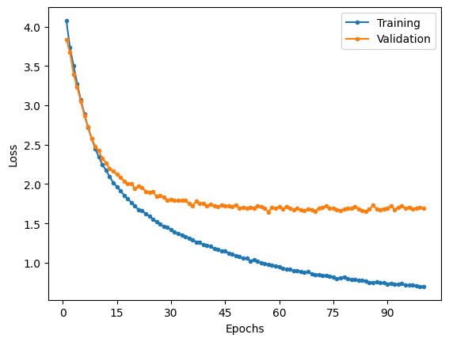

# ResNet

Implementation of ResNet as described in the paper.

For the purposes of analysis, only the ResNet-50 model would be trained, but the ResNet-101 and ResNet-152 models have been implemented.

## MNIST

### Model summary

|             Layer (type)             |    Output Shape    |  Param #  |
| :----------------------------------: | :----------------: | :-------: |
|              **conv1**               |                    |           |
|            2D convolution            | [-1, 64, 112, 112] |   9,408   |
|            2D batch norm             | [-1, 64, 112, 112] |    128    |
|                 ReLU                 | [-1, 64, 112, 112] |     0     |
|             **conv2_x**              |        ---         |    ---    |
|            2D max pooling            |  [-1, 64, 56, 56]  |     0     |
|            2D convolution            |  [-1, 64, 56, 56]  |   4,096   |
|            2D batch norm             |  [-1, 64, 56, 56]  |    128    |
|                 ReLU                 |  [-1, 64, 56, 56]  |     0     |
|            2D convolution            |  [-1, 64, 56, 56]  |  36,864   |
|            2D batch norm             |  [-1, 64, 56, 56]  |    128    |
|                 ReLU                 |  [-1, 64, 56, 56]  |     0     |
|            2D convolution            | [-1, 256, 56, 56]  |  16,384   |
|            2D batch norm             | [-1, 256, 56, 56]  |    512    |
| 2D convolution (Residual projection) | [-1, 256, 56, 56]  |  16,384   |
| 2D batch norm (Residual projection)  | [-1, 256, 56, 56]  |    512    |
|     Add (Bottleneck + residual)      | [-1, 256, 56, 56]  |     0     |
|                 ReLU                 | [-1, 256, 56, 56]  |     0     |
|            2D convolution            |  [-1, 64, 56, 56]  |  16,384   |
|            2D batch norm             |  [-1, 64, 56, 56]  |    128    |
|                 ReLU                 |  [-1, 64, 56, 56]  |     0     |
|            2D convolution            |  [-1, 64, 56, 56]  |  36,864   |
|            2D batch norm             |  [-1, 64, 56, 56]  |    128    |
|                 ReLU                 |  [-1, 64, 56, 56]  |     0     |
|            2D convolution            | [-1, 256, 56, 56]  |  16,384   |
|            2D batch norm             | [-1, 256, 56, 56]  |    512    |
|               Identity               | [-1, 256, 56, 56]  |     0     |
|     Add (Bottleneck + residual)      | [-1, 256, 56, 56]  |     0     |
|                 ReLU                 | [-1, 256, 56, 56]  |     0     |
|            2D convolution            |  [-1, 64, 56, 56]  |  16,384   |
|            2D batch norm             |  [-1, 64, 56, 56]  |    128    |
|                 ReLU                 |  [-1, 64, 56, 56]  |     0     |
|            2D convolution            |  [-1, 64, 56, 56]  |  36,864   |
|            2D batch norm             |  [-1, 64, 56, 56]  |    128    |
|                 ReLU                 |  [-1, 64, 56, 56]  |     0     |
|            2D convolution            | [-1, 256, 56, 56]  |  16,384   |
|            2D batch norm             | [-1, 256, 56, 56]  |    512    |
|               Identity               | [-1, 256, 56, 56]  |     0     |
|     Add (Bottleneck + residual)      | [-1, 256, 56, 56]  |     0     |
|                 ReLU                 | [-1, 256, 56, 56]  |     0     |
|             **conv3_x**              |        ---         |    ---    |
|            2D convolution            | [-1, 128, 28, 28]  |  32,768   |
|            2D batch norm             | [-1, 128, 28, 28]  |    256    |
|                 ReLU                 | [-1, 128, 28, 28]  |     0     |
|            2D convolution            | [-1, 128, 28, 28]  |  147,456  |
|            2D batch norm             | [-1, 128, 28, 28]  |    256    |
|                 ReLU                 | [-1, 128, 28, 28]  |     0     |
|            2D convolution            | [-1, 512, 28, 28]  |  65,536   |
|            2D batch norm             | [-1, 512, 28, 28]  |   1,024   |
| 2D convolution (Residual projection) | [-1, 512, 28, 28]  |  131,072  |
| 2D batch norm (Residual projection)  | [-1, 512, 28, 28]  |   1,024   |
|     Add (Bottleneck + residual)      | [-1, 512, 28, 28]  |     0     |
|                 ReLU                 | [-1, 512, 28, 28]  |     0     |
|            2D convolution            | [-1, 128, 28, 28]  |  65,536   |
|            2D batch norm             | [-1, 128, 28, 28]  |    256    |
|                 ReLU                 | [-1, 128, 28, 28]  |     0     |
|            2D convolution            | [-1, 128, 28, 28]  |  147,456  |
|            2D batch norm             | [-1, 128, 28, 28]  |    256    |
|                 ReLU                 | [-1, 128, 28, 28]  |     0     |
|            2D convolution            | [-1, 512, 28, 28]  |  65,536   |
|            2D batch norm             | [-1, 512, 28, 28]  |   1,024   |
|               Identity               | [-1, 512, 28, 28]  |     0     |
|                 ReLU                 | [-1, 512, 28, 28]  |     0     |
|     Add (Bottleneck + residual)      | [-1, 512, 28, 28]  |     0     |
|                 ReLU                 | [-1, 512, 28, 28]  |     0     |
|            2D convolution            | [-1, 128, 28, 28]  |  65,536   |
|            2D batch norm             | [-1, 128, 28, 28]  |    256    |
|                 ReLU                 | [-1, 128, 28, 28]  |     0     |
|            2D convolution            | [-1, 128, 28, 28]  |  147,456  |
|            2D batch norm             | [-1, 128, 28, 28]  |    256    |
|                 ReLU                 | [-1, 128, 28, 28]  |     0     |
|            2D convolution            | [-1, 512, 28, 28]  |  65,536   |
|            2D batch norm             | [-1, 512, 28, 28]  |   1,024   |
|               Identity               | [-1, 512, 28, 28]  |     0     |
|                 ReLU                 | [-1, 512, 28, 28]  |     0     |
|     Add (Bottleneck + residual)      | [-1, 512, 28, 28]  |     0     |
|                 ReLU                 | [-1, 512, 28, 28]  |     0     |
|            2D convolution            | [-1, 128, 28, 28]  |  65,536   |
|            2D batch norm             | [-1, 128, 28, 28]  |    256    |
|                 ReLU                 | [-1, 128, 28, 28]  |     0     |
|            2D convolution            | [-1, 128, 28, 28]  |  147,456  |
|            2D batch norm             | [-1, 128, 28, 28]  |    256    |
|                 ReLU                 | [-1, 128, 28, 28]  |     0     |
|            2D convolution            | [-1, 512, 28, 28]  |  65,536   |
|            2D batch norm             | [-1, 512, 28, 28]  |   1,024   |
|               Identity               | [-1, 512, 28, 28]  |     0     |
|                 ReLU                 | [-1, 512, 28, 28]  |     0     |
|     Add (Bottleneck + residual)      | [-1, 512, 28, 28]  |     0     |
|                 ReLU                 | [-1, 512, 28, 28]  |     0     |
|             **conv4_x**              |        ---         |    ---    |
|            2D convolution            | [-1, 256, 14, 14]  |  131,072  |
|            2D batch norm             | [-1, 256, 14, 14]  |    512    |
|                 ReLU                 | [-1, 256, 14, 14]  |     0     |
|            2D convolution            | [-1, 256, 14, 14]  |  589,824  |
|            2D batch norm             | [-1, 256, 14, 14]  |    512    |
|                 ReLU                 | [-1, 256, 14, 14]  |     0     |
|            2D convolution            | [-1, 1024, 14, 14] |  262,144  |
|            2D batch norm             | [-1, 1024, 14, 14] |   2,048   |
| 2D convolution (Residual projection) | [-1, 1024, 14, 14] |  524,288  |
| 2D batch norm (Residual projection)  | [-1, 1024, 14, 14] |   2,048   |
|                 ReLU                 | [-1, 1024, 14, 14] |     0     |
|     Add (Bottleneck + residual)      | [-1, 1024, 14, 14] |     0     |
|                 ReLU                 | [-1, 1024, 14, 14] |     0     |
|            2D convolution            | [-1, 256, 14, 14]  |  262,144  |
|            2D batch norm             | [-1, 256, 14, 14]  |    512    |
|                 ReLU                 | [-1, 256, 14, 14]  |     0     |
|            2D convolution            | [-1, 256, 14, 14]  |  589,824  |
|            2D batch norm             | [-1, 256, 14, 14]  |    512    |
|                 ReLU                 | [-1, 256, 14, 14]  |     0     |
|            2D convolution            | [-1, 1024, 14, 14] |  262,144  |
|            2D batch norm             | [-1, 1024, 14, 14] |   2,048   |
|               Identity               | [-1, 1024, 14, 14] |     0     |
|                 ReLU                 | [-1, 1024, 14, 14] |     0     |
|     Add (Bottleneck + residual)      | [-1, 1024, 14, 14] |     0     |
|                 ReLU                 | [-1, 1024, 14, 14] |     0     |
|            2D convolution            | [-1, 256, 14, 14]  |  262,144  |
|            2D batch norm             | [-1, 256, 14, 14]  |    512    |
|                 ReLU                 | [-1, 256, 14, 14]  |     0     |
|            2D convolution            | [-1, 256, 14, 14]  |  589,824  |
|            2D batch norm             | [-1, 256, 14, 14]  |    512    |
|                 ReLU                 | [-1, 256, 14, 14]  |     0     |
|            2D convolution            | [-1, 1024, 14, 14] |  262,144  |
|            2D batch norm             | [-1, 1024, 14, 14] |   2,048   |
|               Identity               | [-1, 1024, 14, 14] |     0     |
|                 ReLU                 | [-1, 1024, 14, 14] |     0     |
|     Add (Bottleneck + residual)      | [-1, 1024, 14, 14] |     0     |
|                 ReLU                 | [-1, 1024, 14, 14] |     0     |
|            2D convolution            | [-1, 256, 14, 14]  |  262,144  |
|            2D batch norm             | [-1, 256, 14, 14]  |    512    |
|                 ReLU                 | [-1, 256, 14, 14]  |     0     |
|            2D convolution            | [-1, 256, 14, 14]  |  589,824  |
|            2D batch norm             | [-1, 256, 14, 14]  |    512    |
|                 ReLU                 | [-1, 256, 14, 14]  |     0     |
|            2D convolution            | [-1, 1024, 14, 14] |  262,144  |
|            2D batch norm             | [-1, 1024, 14, 14] |   2,048   |
|               Identity               | [-1, 1024, 14, 14] |     0     |
|                 ReLU                 | [-1, 1024, 14, 14] |     0     |
|     Add (Bottleneck + residual)      | [-1, 1024, 14, 14] |     0     |
|                 ReLU                 | [-1, 1024, 14, 14] |     0     |
|            2D convolution            | [-1, 256, 14, 14]  |  262,144  |
|            2D batch norm             | [-1, 256, 14, 14]  |    512    |
|                 ReLU                 | [-1, 256, 14, 14]  |     0     |
|            2D convolution            | [-1, 256, 14, 14]  |  589,824  |
|            2D batch norm             | [-1, 256, 14, 14]  |    512    |
|                 ReLU                 | [-1, 256, 14, 14]  |     0     |
|            2D convolution            | [-1, 1024, 14, 14] |  262,144  |
|            2D batch norm             | [-1, 1024, 14, 14] |   2,048   |
|               Identity               | [-1, 1024, 14, 14] |     0     |
|                 ReLU                 | [-1, 1024, 14, 14] |     0     |
|     Add (Bottleneck + residual)      | [-1, 1024, 14, 14] |     0     |
|                 ReLU                 | [-1, 1024, 14, 14] |     0     |
|            2D convolution            | [-1, 256, 14, 14]  |  262,144  |
|            2D batch norm             | [-1, 256, 14, 14]  |    512    |
|                 ReLU                 | [-1, 256, 14, 14]  |     0     |
|            2D convolution            | [-1, 256, 14, 14]  |  589,824  |
|            2D batch norm             | [-1, 256, 14, 14]  |    512    |
|                 ReLU                 | [-1, 256, 14, 14]  |     0     |
|            2D convolution            | [-1, 1024, 14, 14] |  262,144  |
|            2D batch norm             | [-1, 1024, 14, 14] |   2,048   |
|               Identity               | [-1, 1024, 14, 14] |     0     |
|                 ReLU                 | [-1, 1024, 14, 14] |     0     |
|     Add (Bottleneck + residual)      | [-1, 1024, 14, 14] |     0     |
|                 ReLU                 | [-1, 1024, 14, 14] |     0     |
|             **conv5_x**              |        ---         |    ---    |
|            2D convolution            |  [-1, 512, 7, 7]   |  524,288  |
|            2D batch norm             |  [-1, 512, 7, 7]   |   1,024   |
|                 ReLU                 |  [-1, 512, 7, 7]   |     0     |
|            2D convolution            |  [-1, 512, 7, 7]   | 2,359,296 |
|            2D batch norm             |  [-1, 512, 7, 7]   |   1,024   |
|                 ReLU                 |  [-1, 512, 7, 7]   |     0     |
|            2D convolution            |  [-1, 2048, 7, 7]  | 1,048,576 |
|            2D batch norm             |  [-1, 2048, 7, 7]  |   4,096   |
| 2D convolution (Residual projection) |  [-1, 2048, 7, 7]  | 2,097,152 |
| 2D batch norm (Residual projection)  |  [-1, 2048, 7, 7]  |   4,096   |
|                 ReLU                 |  [-1, 2048, 7, 7]  |     0     |
|     Add (Bottleneck + residual)      |  [-1, 2048, 7, 7]  |     0     |
|                 ReLU                 |  [-1, 2048, 7, 7]  |     0     |
|            2D convolution            |  [-1, 512, 7, 7]   | 1,048,576 |
|            2D batch norm             |  [-1, 512, 7, 7]   |   1,024   |
|                 ReLU                 |  [-1, 512, 7, 7]   |     0     |
|            2D convolution            |  [-1, 512, 7, 7]   | 2,359,296 |
|            2D batch norm             |  [-1, 512, 7, 7]   |   1,024   |
|                 ReLU                 |  [-1, 512, 7, 7]   |     0     |
|            2D convolution            |  [-1, 2048, 7, 7]  | 1,048,576 |
|            2D batch norm             |  [-1, 2048, 7, 7]  |   4,096   |
|               Identity               |  [-1, 2048, 7, 7]  |     0     |
|                 ReLU                 |  [-1, 2048, 7, 7]  |     0     |
|     Add (Bottleneck + residual)      |  [-1, 2048, 7, 7]  |     0     |
|                 ReLU                 |  [-1, 2048, 7, 7]  |     0     |
|            2D convolution            |  [-1, 512, 7, 7]   | 1,048,576 |
|            2D batch norm             |  [-1, 512, 7, 7]   |   1,024   |
|                 ReLU                 |  [-1, 512, 7, 7]   |     0     |
|            2D convolution            |  [-1, 512, 7, 7]   | 2,359,296 |
|            2D batch norm             |  [-1, 512, 7, 7]   |   1,024   |
|                 ReLU                 |  [-1, 512, 7, 7]   |     0     |
|            2D convolution            |  [-1, 2048, 7, 7]  | 1,048,576 |
|            2D batch norm             |  [-1, 2048, 7, 7]  |   4,096   |
|               Identity               |  [-1, 2048, 7, 7]  |     0     |
|                 ReLU                 |  [-1, 2048, 7, 7]  |     0     |
|     Add (Bottleneck + residual)      |  [-1, 2048, 7, 7]  |     0     |
|                 ReLU                 |  [-1, 2048, 7, 7]  |     0     |
|          2D average pooling          |  [-1, 2048, 1, 1]  |     0     |
|               Flatten                |     [-1, 2048]     |     0     |
|                Linear                |      [-1, 10]      |  20,490   |

|                      |            |
| -------------------- | ---------- |
| Total params         | 23,528,522 |
| Trainable params     | 23,528,522 |
| Non-trainable params | 0          |

### Results

Training over 10 epochs with a learning rate of 1e-4 and batch size of 64.

|                     Loss                      |                       Accuracy                        |
| :-------------------------------------------: | :---------------------------------------------------: |
|  |  |

|              | Training | Validation | Testing |
| :----------: | :------: | :--------: | :-----: |
|     Loss     |  0.0114  |   0.0317   | 0.0268  |
| Accuracy (%) |  99.65   |   99.09    |  99.23  |

| Class | Training Precision | Validation Precision | Testing Precision | Training Recall | Validation Recall | Testing Recall | Training F1 Score | Validation F1 Score | Testing F1 Score |
| :---: | :----------------: | :------------------: | :---------------: | :-------------: | :---------------: | :------------: | :---------------: | :-----------------: | :--------------: |
|   0   |       0.9986       |        0.9949        |      0.9939       |     0.9981      |      0.9937       |     0.9980     |      0.9983       |       0.9943        |      0.9959      |
|   1   |       0.9974       |        0.9951        |      0.9947       |     0.9981      |      0.9971       |     0.9982     |      0.9978       |       0.9961        |      0.9965      |
|   2   |       0.9960       |        0.9932        |      0.9952       |     0.9952      |      0.9937       |     0.9971     |      0.9956       |       0.9934        |      0.9961      |
|   3   |       0.9977       |        0.9838        |      0.9777       |     0.9970      |      0.9984       |     0.9980     |      0.9973       |       0.9910        |      0.9878      |
|   4   |       0.9968       |        0.9837        |      0.9869       |     0.9958      |      0.9949       |     0.9939     |      0.9963       |       0.9893        |      0.9904      |
|   5   |       0.9960       |        0.9939        |      0.9966       |     0.9963      |      0.9789       |     0.9787     |      0.9961       |       0.9863        |      0.9876      |
|   6   |       0.9978       |        0.9893        |      0.9948       |     0.9976      |      0.9977       |     0.9948     |      0.9977       |       0.9935        |      0.9948      |
|   7   |       0.9952       |        0.9943        |      0.9971       |     0.9972      |      0.9876       |     0.9883     |      0.9962       |       0.9910        |      0.9927      |
|   8   |       0.9951       |        0.9947        |      0.9969       |     0.9949      |      0.9844       |     0.9908     |      0.9950       |       0.9895        |      0.9938      |
|   9   |       0.9940       |        0.9864        |      0.9900       |     0.9943      |      0.9813       |     0.9832     |      0.9941       |       0.9838        |      0.9866      |

Similar to all the preceding models, ResNet performs with close the human accuracy. It performs ever so slightly better than VGG does while containing ~18% of its parameters.

## CIFAR 100

### Model summary

|             Layer (type)             |    Output Shape    |  Param #  |
| :----------------------------------: | :----------------: | :-------: |
|              **conv1**               |                    |           |
|            2D convolution            | [-1, 64, 112, 112] |   9,408   |
|            2D batch norm             | [-1, 64, 112, 112] |    128    |
|                 ReLU                 | [-1, 64, 112, 112] |     0     |
|             **conv2_x**              |        ---         |    ---    |
|            2D max pooling            |  [-1, 64, 56, 56]  |     0     |
|            2D convolution            |  [-1, 64, 56, 56]  |   4,096   |
|            2D batch norm             |  [-1, 64, 56, 56]  |    128    |
|                 ReLU                 |  [-1, 64, 56, 56]  |     0     |
|            2D convolution            |  [-1, 64, 56, 56]  |  36,864   |
|            2D batch norm             |  [-1, 64, 56, 56]  |    128    |
|                 ReLU                 |  [-1, 64, 56, 56]  |     0     |
|            2D convolution            | [-1, 256, 56, 56]  |  16,384   |
|            2D batch norm             | [-1, 256, 56, 56]  |    512    |
| 2D convolution (Residual projection) | [-1, 256, 56, 56]  |  16,384   |
| 2D batch norm (Residual projection)  | [-1, 256, 56, 56]  |    512    |
|     Add (Bottleneck + residual)      | [-1, 256, 56, 56]  |     0     |
|                 ReLU                 | [-1, 256, 56, 56]  |     0     |
|            2D convolution            |  [-1, 64, 56, 56]  |  16,384   |
|            2D batch norm             |  [-1, 64, 56, 56]  |    128    |
|                 ReLU                 |  [-1, 64, 56, 56]  |     0     |
|            2D convolution            |  [-1, 64, 56, 56]  |  36,864   |
|            2D batch norm             |  [-1, 64, 56, 56]  |    128    |
|                 ReLU                 |  [-1, 64, 56, 56]  |     0     |
|            2D convolution            | [-1, 256, 56, 56]  |  16,384   |
|            2D batch norm             | [-1, 256, 56, 56]  |    512    |
|               Identity               | [-1, 256, 56, 56]  |     0     |
|     Add (Bottleneck + residual)      | [-1, 256, 56, 56]  |     0     |
|                 ReLU                 | [-1, 256, 56, 56]  |     0     |
|            2D convolution            |  [-1, 64, 56, 56]  |  16,384   |
|            2D batch norm             |  [-1, 64, 56, 56]  |    128    |
|                 ReLU                 |  [-1, 64, 56, 56]  |     0     |
|            2D convolution            |  [-1, 64, 56, 56]  |  36,864   |
|            2D batch norm             |  [-1, 64, 56, 56]  |    128    |
|                 ReLU                 |  [-1, 64, 56, 56]  |     0     |
|            2D convolution            | [-1, 256, 56, 56]  |  16,384   |
|            2D batch norm             | [-1, 256, 56, 56]  |    512    |
|               Identity               | [-1, 256, 56, 56]  |     0     |
|     Add (Bottleneck + residual)      | [-1, 256, 56, 56]  |     0     |
|                 ReLU                 | [-1, 256, 56, 56]  |     0     |
|             **conv3_x**              |        ---         |    ---    |
|            2D convolution            | [-1, 128, 28, 28]  |  32,768   |
|            2D batch norm             | [-1, 128, 28, 28]  |    256    |
|                 ReLU                 | [-1, 128, 28, 28]  |     0     |
|            2D convolution            | [-1, 128, 28, 28]  |  147,456  |
|            2D batch norm             | [-1, 128, 28, 28]  |    256    |
|                 ReLU                 | [-1, 128, 28, 28]  |     0     |
|            2D convolution            | [-1, 512, 28, 28]  |  65,536   |
|            2D batch norm             | [-1, 512, 28, 28]  |   1,024   |
| 2D convolution (Residual projection) | [-1, 512, 28, 28]  |  131,072  |
| 2D batch norm (Residual projection)  | [-1, 512, 28, 28]  |   1,024   |
|     Add (Bottleneck + residual)      | [-1, 512, 28, 28]  |     0     |
|                 ReLU                 | [-1, 512, 28, 28]  |     0     |
|            2D convolution            | [-1, 128, 28, 28]  |  65,536   |
|            2D batch norm             | [-1, 128, 28, 28]  |    256    |
|                 ReLU                 | [-1, 128, 28, 28]  |     0     |
|            2D convolution            | [-1, 128, 28, 28]  |  147,456  |
|            2D batch norm             | [-1, 128, 28, 28]  |    256    |
|                 ReLU                 | [-1, 128, 28, 28]  |     0     |
|            2D convolution            | [-1, 512, 28, 28]  |  65,536   |
|            2D batch norm             | [-1, 512, 28, 28]  |   1,024   |
|               Identity               | [-1, 512, 28, 28]  |     0     |
|                 ReLU                 | [-1, 512, 28, 28]  |     0     |
|     Add (Bottleneck + residual)      | [-1, 512, 28, 28]  |     0     |
|                 ReLU                 | [-1, 512, 28, 28]  |     0     |
|            2D convolution            | [-1, 128, 28, 28]  |  65,536   |
|            2D batch norm             | [-1, 128, 28, 28]  |    256    |
|                 ReLU                 | [-1, 128, 28, 28]  |     0     |
|            2D convolution            | [-1, 128, 28, 28]  |  147,456  |
|            2D batch norm             | [-1, 128, 28, 28]  |    256    |
|                 ReLU                 | [-1, 128, 28, 28]  |     0     |
|            2D convolution            | [-1, 512, 28, 28]  |  65,536   |
|            2D batch norm             | [-1, 512, 28, 28]  |   1,024   |
|               Identity               | [-1, 512, 28, 28]  |     0     |
|                 ReLU                 | [-1, 512, 28, 28]  |     0     |
|     Add (Bottleneck + residual)      | [-1, 512, 28, 28]  |     0     |
|                 ReLU                 | [-1, 512, 28, 28]  |     0     |
|            2D convolution            | [-1, 128, 28, 28]  |  65,536   |
|            2D batch norm             | [-1, 128, 28, 28]  |    256    |
|                 ReLU                 | [-1, 128, 28, 28]  |     0     |
|            2D convolution            | [-1, 128, 28, 28]  |  147,456  |
|            2D batch norm             | [-1, 128, 28, 28]  |    256    |
|                 ReLU                 | [-1, 128, 28, 28]  |     0     |
|            2D convolution            | [-1, 512, 28, 28]  |  65,536   |
|            2D batch norm             | [-1, 512, 28, 28]  |   1,024   |
|               Identity               | [-1, 512, 28, 28]  |     0     |
|                 ReLU                 | [-1, 512, 28, 28]  |     0     |
|     Add (Bottleneck + residual)      | [-1, 512, 28, 28]  |     0     |
|                 ReLU                 | [-1, 512, 28, 28]  |     0     |
|             **conv4_x**              |        ---         |    ---    |
|            2D convolution            | [-1, 256, 14, 14]  |  131,072  |
|            2D batch norm             | [-1, 256, 14, 14]  |    512    |
|                 ReLU                 | [-1, 256, 14, 14]  |     0     |
|            2D convolution            | [-1, 256, 14, 14]  |  589,824  |
|            2D batch norm             | [-1, 256, 14, 14]  |    512    |
|                 ReLU                 | [-1, 256, 14, 14]  |     0     |
|            2D convolution            | [-1, 1024, 14, 14] |  262,144  |
|            2D batch norm             | [-1, 1024, 14, 14] |   2,048   |
| 2D convolution (Residual projection) | [-1, 1024, 14, 14] |  524,288  |
| 2D batch norm (Residual projection)  | [-1, 1024, 14, 14] |   2,048   |
|                 ReLU                 | [-1, 1024, 14, 14] |     0     |
|     Add (Bottleneck + residual)      | [-1, 1024, 14, 14] |     0     |
|                 ReLU                 | [-1, 1024, 14, 14] |     0     |
|            2D convolution            | [-1, 256, 14, 14]  |  262,144  |
|            2D batch norm             | [-1, 256, 14, 14]  |    512    |
|                 ReLU                 | [-1, 256, 14, 14]  |     0     |
|            2D convolution            | [-1, 256, 14, 14]  |  589,824  |
|            2D batch norm             | [-1, 256, 14, 14]  |    512    |
|                 ReLU                 | [-1, 256, 14, 14]  |     0     |
|            2D convolution            | [-1, 1024, 14, 14] |  262,144  |
|            2D batch norm             | [-1, 1024, 14, 14] |   2,048   |
|               Identity               | [-1, 1024, 14, 14] |     0     |
|                 ReLU                 | [-1, 1024, 14, 14] |     0     |
|     Add (Bottleneck + residual)      | [-1, 1024, 14, 14] |     0     |
|                 ReLU                 | [-1, 1024, 14, 14] |     0     |
|            2D convolution            | [-1, 256, 14, 14]  |  262,144  |
|            2D batch norm             | [-1, 256, 14, 14]  |    512    |
|                 ReLU                 | [-1, 256, 14, 14]  |     0     |
|            2D convolution            | [-1, 256, 14, 14]  |  589,824  |
|            2D batch norm             | [-1, 256, 14, 14]  |    512    |
|                 ReLU                 | [-1, 256, 14, 14]  |     0     |
|            2D convolution            | [-1, 1024, 14, 14] |  262,144  |
|            2D batch norm             | [-1, 1024, 14, 14] |   2,048   |
|               Identity               | [-1, 1024, 14, 14] |     0     |
|                 ReLU                 | [-1, 1024, 14, 14] |     0     |
|     Add (Bottleneck + residual)      | [-1, 1024, 14, 14] |     0     |
|                 ReLU                 | [-1, 1024, 14, 14] |     0     |
|            2D convolution            | [-1, 256, 14, 14]  |  262,144  |
|            2D batch norm             | [-1, 256, 14, 14]  |    512    |
|                 ReLU                 | [-1, 256, 14, 14]  |     0     |
|            2D convolution            | [-1, 256, 14, 14]  |  589,824  |
|            2D batch norm             | [-1, 256, 14, 14]  |    512    |
|                 ReLU                 | [-1, 256, 14, 14]  |     0     |
|            2D convolution            | [-1, 1024, 14, 14] |  262,144  |
|            2D batch norm             | [-1, 1024, 14, 14] |   2,048   |
|               Identity               | [-1, 1024, 14, 14] |     0     |
|                 ReLU                 | [-1, 1024, 14, 14] |     0     |
|     Add (Bottleneck + residual)      | [-1, 1024, 14, 14] |     0     |
|                 ReLU                 | [-1, 1024, 14, 14] |     0     |
|            2D convolution            | [-1, 256, 14, 14]  |  262,144  |
|            2D batch norm             | [-1, 256, 14, 14]  |    512    |
|                 ReLU                 | [-1, 256, 14, 14]  |     0     |
|            2D convolution            | [-1, 256, 14, 14]  |  589,824  |
|            2D batch norm             | [-1, 256, 14, 14]  |    512    |
|                 ReLU                 | [-1, 256, 14, 14]  |     0     |
|            2D convolution            | [-1, 1024, 14, 14] |  262,144  |
|            2D batch norm             | [-1, 1024, 14, 14] |   2,048   |
|               Identity               | [-1, 1024, 14, 14] |     0     |
|                 ReLU                 | [-1, 1024, 14, 14] |     0     |
|     Add (Bottleneck + residual)      | [-1, 1024, 14, 14] |     0     |
|                 ReLU                 | [-1, 1024, 14, 14] |     0     |
|            2D convolution            | [-1, 256, 14, 14]  |  262,144  |
|            2D batch norm             | [-1, 256, 14, 14]  |    512    |
|                 ReLU                 | [-1, 256, 14, 14]  |     0     |
|            2D convolution            | [-1, 256, 14, 14]  |  589,824  |
|            2D batch norm             | [-1, 256, 14, 14]  |    512    |
|                 ReLU                 | [-1, 256, 14, 14]  |     0     |
|            2D convolution            | [-1, 1024, 14, 14] |  262,144  |
|            2D batch norm             | [-1, 1024, 14, 14] |   2,048   |
|               Identity               | [-1, 1024, 14, 14] |     0     |
|                 ReLU                 | [-1, 1024, 14, 14] |     0     |
|     Add (Bottleneck + residual)      | [-1, 1024, 14, 14] |     0     |
|                 ReLU                 | [-1, 1024, 14, 14] |     0     |
|             **conv5_x**              |        ---         |    ---    |
|            2D convolution            |  [-1, 512, 7, 7]   |  524,288  |
|            2D batch norm             |  [-1, 512, 7, 7]   |   1,024   |
|                 ReLU                 |  [-1, 512, 7, 7]   |     0     |
|            2D convolution            |  [-1, 512, 7, 7]   | 2,359,296 |
|            2D batch norm             |  [-1, 512, 7, 7]   |   1,024   |
|                 ReLU                 |  [-1, 512, 7, 7]   |     0     |
|            2D convolution            |  [-1, 2048, 7, 7]  | 1,048,576 |
|            2D batch norm             |  [-1, 2048, 7, 7]  |   4,096   |
| 2D convolution (Residual projection) |  [-1, 2048, 7, 7]  | 2,097,152 |
| 2D batch norm (Residual projection)  |  [-1, 2048, 7, 7]  |   4,096   |
|                 ReLU                 |  [-1, 2048, 7, 7]  |     0     |
|     Add (Bottleneck + residual)      |  [-1, 2048, 7, 7]  |     0     |
|                 ReLU                 |  [-1, 2048, 7, 7]  |     0     |
|            2D convolution            |  [-1, 512, 7, 7]   | 1,048,576 |
|            2D batch norm             |  [-1, 512, 7, 7]   |   1,024   |
|                 ReLU                 |  [-1, 512, 7, 7]   |     0     |
|            2D convolution            |  [-1, 512, 7, 7]   | 2,359,296 |
|            2D batch norm             |  [-1, 512, 7, 7]   |   1,024   |
|                 ReLU                 |  [-1, 512, 7, 7]   |     0     |
|            2D convolution            |  [-1, 2048, 7, 7]  | 1,048,576 |
|            2D batch norm             |  [-1, 2048, 7, 7]  |   4,096   |
|               Identity               |  [-1, 2048, 7, 7]  |     0     |
|                 ReLU                 |  [-1, 2048, 7, 7]  |     0     |
|     Add (Bottleneck + residual)      |  [-1, 2048, 7, 7]  |     0     |
|                 ReLU                 |  [-1, 2048, 7, 7]  |     0     |
|            2D convolution            |  [-1, 512, 7, 7]   | 1,048,576 |
|            2D batch norm             |  [-1, 512, 7, 7]   |   1,024   |
|                 ReLU                 |  [-1, 512, 7, 7]   |     0     |
|            2D convolution            |  [-1, 512, 7, 7]   | 2,359,296 |
|            2D batch norm             |  [-1, 512, 7, 7]   |   1,024   |
|                 ReLU                 |  [-1, 512, 7, 7]   |     0     |
|            2D convolution            |  [-1, 2048, 7, 7]  | 1,048,576 |
|            2D batch norm             |  [-1, 2048, 7, 7]  |   4,096   |
|               Identity               |  [-1, 2048, 7, 7]  |     0     |
|                 ReLU                 |  [-1, 2048, 7, 7]  |     0     |
|     Add (Bottleneck + residual)      |  [-1, 2048, 7, 7]  |     0     |
|                 ReLU                 |  [-1, 2048, 7, 7]  |     0     |
|          2D average pooling          |  [-1, 2048, 1, 1]  |     0     |
|               Flatten                |     [-1, 2048]     |     0     |
|                Linear                |     [-1, 100]      |  204,900  |

|                      |            |
| -------------------- | ---------- |
| Total params         | 23,712,932 |
| Trainable params     | 23,712,932 |
| Non-trainable params | 0          |

### Results

Training over 75 epochs with a learning rate of 1e-4 and batch size of 64.

|                         Loss                         |                           Accuracy                           |
| :--------------------------------------------------: | :----------------------------------------------------------: |
|  |  |

|              | Training | Validation | Testing |
| :----------: | :------: | :--------: | :-----: |
|     Loss     |  0.7121  |   1.7560   | 1.4217  |
| Accuracy (%) |  80.17   |   58.39    |  64.69  |

|     Class     | Training Precision | Validation Precision | Testing Precision | Training Recall | Validation Recall | Testing Recall | Training F1 Score | Validation F1 Score | Testing F1 Score |
| :-----------: | :----------------: | :------------------: | :---------------: | :-------------: | :---------------: | :------------: | :---------------: | :-----------------: | :--------------: |
|     apple     |       0.8567       |        0.8197        |      0.9697       |     0.8815      |      0.6494       |     0.6400     |      0.8689       |       0.7246        |      0.7711      |
| aquarium_fish |       0.8650       |        0.5672        |      0.6308       |     0.8698      |      0.8201       |     0.8200     |      0.8674       |       0.6706        |      0.7130      |
|     baby      |       0.7912       |        0.4367        |      0.4825       |     0.7865      |      0.6329       |     0.6900     |      0.7889       |       0.5168        |      0.5679      |
|     bear      |       0.7147       |        0.3706        |      0.5000       |     0.6847      |      0.4371       |     0.4300     |      0.6994       |       0.4011        |      0.4624      |
|    beaver     |       0.7584       |        0.3502        |      0.4222       |     0.7584      |      0.5278       |     0.5700     |      0.7584       |       0.4211        |      0.4851      |
|      bed      |       0.8018       |        0.5596        |      0.5391       |     0.8262      |      0.6279       |     0.6900     |      0.8138       |       0.5918        |      0.6053      |
|      bee      |       0.8227       |        0.7822        |      0.8281       |     0.8156      |      0.5163       |     0.5300     |      0.8191       |       0.6220        |      0.6463      |
|    beetle     |       0.8387       |        0.5892        |      0.6907       |     0.7903      |      0.6374       |     0.6700     |      0.8138       |       0.6124        |      0.6802      |
|    bicycle    |       0.8519       |        0.6822        |      0.8211       |     0.8470      |      0.5986       |     0.7800     |      0.8494       |       0.6377        |      0.8000      |
|    bottle     |       0.8311       |        0.8539        |      0.8406       |     0.8564      |      0.5507       |     0.5800     |      0.8435       |       0.6696        |      0.6864      |
|     bowl      |       0.7591       |        0.3935        |      0.4563       |     0.6970      |      0.3588       |     0.4700     |      0.7267       |       0.3754        |      0.4631      |
|      boy      |       0.7744       |        0.3871        |      0.4234       |     0.7056      |      0.4286       |     0.4700     |      0.7384       |       0.4068        |      0.4455      |
|    bridge     |       0.8480       |        0.5689        |      0.6124       |     0.8158      |      0.6013       |     0.7900     |      0.8316       |       0.5846        |      0.6900      |
|      bus      |       0.7744       |        0.6383        |      0.6579       |     0.7537      |      0.5521       |     0.5000     |      0.7639       |       0.5921        |      0.5682      |
|   butterfly   |       0.8661       |        0.6270        |      0.6304       |     0.8588      |      0.5411       |     0.5800     |      0.8624       |       0.5809        |      0.6042      |
|     camel     |       0.8163       |        0.7525        |      0.7568       |     0.7994      |      0.4720       |     0.5600     |      0.8077       |       0.5802        |      0.6437      |
|      can      |       0.8230       |        0.5864        |      0.6792       |     0.8064      |      0.6169       |     0.7200     |      0.8146       |       0.6013        |      0.6990      |
|    castle     |       0.8534       |        0.6626        |      0.8721       |     0.8366      |      0.7448       |     0.7500     |      0.8450       |       0.7013        |      0.8065      |
|  caterpillar  |       0.7738       |        0.4774        |      0.6322       |     0.7955      |      0.5175       |     0.5500     |      0.7845       |       0.4966        |      0.5882      |
|    cattle     |       0.7972       |        0.5476        |      0.6522       |     0.7949      |      0.4792       |     0.6000     |      0.7961       |       0.5111        |      0.6250      |
|     chair     |       0.8631       |        0.8073        |      0.8506       |     0.8729      |      0.6027       |     0.7400     |      0.8680       |       0.6902        |      0.7914      |
|  chimpanzee   |       0.8141       |        0.6933        |      0.8387       |     0.8353      |      0.6753       |     0.7800     |      0.8245       |       0.6842        |      0.8083      |
|     clock     |       0.8902       |        0.5850        |      0.7204       |     0.8380      |      0.6056       |     0.6700     |      0.8633       |       0.5952        |      0.6943      |
|     cloud     |       0.7619       |        0.6168        |      0.7596       |     0.8612      |      0.7007       |     0.7900     |      0.8085       |       0.6561        |      0.7745      |
|   cockroach   |       0.8610       |        0.7400        |      0.7524       |     0.8876      |      0.7708       |     0.7900     |      0.8741       |       0.7551        |      0.7707      |
|     couch     |       0.7672       |        0.4043        |      0.4745       |     0.7500      |      0.5278       |     0.6500     |      0.7585       |       0.4578        |      0.5485      |
|     crab      |       0.7393       |        0.5500        |      0.6977       |     0.7611      |      0.4783       |     0.6000     |      0.7500       |       0.5116        |      0.6452      |
|   crocodile   |       0.7597       |        0.3478        |      0.3931       |     0.7746      |      0.5517       |     0.5700     |      0.7671       |       0.4267        |      0.4653      |
|      cup      |       0.7978       |        0.6774        |      0.7419       |     0.8090      |      0.5833       |     0.6900     |      0.8033       |       0.6269        |      0.7150      |
|   dinosaur    |       0.8192       |        0.4479        |      0.6075       |     0.8016      |      0.5748       |     0.6500     |      0.8103       |       0.5034        |      0.6280      |
|    dolphin    |       0.7982       |        0.5446        |      0.5496       |     0.7910      |      0.6667       |     0.7200     |      0.7946       |       0.5995        |      0.6234      |
|   elephant    |       0.7438       |        0.5914        |      0.6961       |     0.7826      |      0.7097       |     0.7100     |      0.7627       |       0.6452        |      0.7030      |
|   flatfish    |       0.7803       |        0.6395        |      0.7429       |     0.7670      |      0.3716       |     0.5200     |      0.7736       |       0.4701        |      0.6118      |
|    forest     |       0.7310       |        0.4722        |      0.5280       |     0.7642      |      0.5743       |     0.6600     |      0.7472       |       0.5183        |      0.5867      |
|      fox      |       0.8343       |        0.7000        |      0.7579       |     0.8177      |      0.6107       |     0.7200     |      0.8259       |       0.6523        |      0.7385      |
|     girl      |       0.7319       |        0.5050        |      0.4545       |     0.6963      |      0.3377       |     0.3500     |      0.7137       |       0.4048        |      0.3955      |
|    hamster    |       0.8493       |        0.7500        |      0.8205       |     0.8592      |      0.6792       |     0.6400     |      0.8542       |       0.7129        |      0.7191      |
|     house     |       0.7826       |        0.4656        |      0.6356       |     0.7649      |      0.5986       |     0.7500     |      0.7736       |       0.5238        |      0.6881      |
|   kangaroo    |       0.7708       |        0.4313        |      0.4634       |     0.7801      |      0.5417       |     0.5700     |      0.7754       |       0.4802        |      0.5112      |
|   keyboard    |       0.8560       |        0.7426        |      0.8352       |     0.8726      |      0.7266       |     0.7600     |      0.8642       |       0.7345        |      0.7958      |
|     lamp      |       0.7556       |        0.4437        |      0.4560       |     0.7452      |      0.4820       |     0.5700     |      0.7503       |       0.4621        |      0.5067      |
|  lawn_mower   |       0.8642       |        0.7794        |      0.8764       |     0.8768      |      0.6667       |     0.7800     |      0.8705       |       0.7186        |      0.8254      |
|    leopard    |       0.8251       |        0.8000        |      0.6548       |     0.8203      |      0.4903       |     0.5500     |      0.8227       |       0.6080        |      0.5978      |
|     lion      |       0.8216       |        0.6719        |      0.7634       |     0.8363      |      0.7866       |     0.7100     |      0.8289       |       0.7247        |      0.7358      |
|    lizard     |       0.7556       |        0.3702        |      0.3913       |     0.7015      |      0.4061       |     0.4500     |      0.7276       |       0.3873        |      0.4186      |
|    lobster    |       0.7527       |        0.4011        |      0.4818       |     0.7507      |      0.5407       |     0.5300     |      0.7517       |       0.4606        |      0.5048      |
|      man      |       0.7544       |        0.5040        |      0.6000       |     0.7286      |      0.4200       |     0.4800     |      0.7413       |       0.4582        |      0.5333      |
|  maple_tree   |       0.7353       |        0.7292        |      0.5814       |     0.7246      |      0.4516       |     0.5000     |      0.7299       |       0.5578        |      0.5376      |
|  motorcycle   |       0.8576       |        0.8244        |      0.8958       |     0.8679      |      0.6467       |     0.8600     |      0.8627       |       0.7248        |      0.8776      |
|   mountain    |       0.8108       |        0.6667        |      0.8280       |     0.8197      |      0.5970       |     0.7700     |      0.8152       |       0.6299        |      0.7979      |
|     mouse     |       0.7710       |        0.3298        |      0.3761       |     0.7228      |      0.4773       |     0.4400     |      0.7461       |       0.3901        |      0.4055      |
|   mushroom    |       0.8287       |        0.4824        |      0.6765       |     0.8427      |      0.5694       |     0.6900     |      0.8357       |       0.5223        |      0.6832      |
|   oak_tree    |       0.7016       |        0.6071        |      0.5657       |     0.7394      |      0.5782       |     0.5600     |      0.7200       |       0.5923        |      0.5628      |
|    orange     |       0.9139       |        0.6957        |      0.7692       |     0.9139      |      0.9143       |     0.9000     |      0.9139       |       0.7901        |      0.8295      |
|    orchid     |       0.8710       |        0.7218        |      0.6972       |     0.8510      |      0.6358       |     0.7600     |      0.8609       |       0.6761        |      0.7273      |
|     otter     |       0.7188       |        0.3041        |      0.4144       |     0.7087      |      0.3147       |     0.4600     |      0.7137       |       0.3093        |      0.4360      |
|   palm_tree   |       0.8384       |        0.8689        |      0.9101       |     0.8674      |      0.6928       |     0.8100     |      0.8527       |       0.7709        |      0.8571      |
|     pear      |       0.8279       |        0.6243        |      0.5714       |     0.8353      |      0.6807       |     0.7200     |      0.8316       |       0.6513        |      0.6372      |
| pickup_truck  |       0.8394       |        0.7250        |      0.8427       |     0.8293      |      0.6988       |     0.7500     |      0.8343       |       0.7117        |      0.7937      |
|   pine_tree   |       0.6875       |        0.5536        |      0.7051       |     0.7008      |      0.4460       |     0.5500     |      0.6941       |       0.4940        |      0.6180      |
|     plain     |       0.7888       |        0.7167        |      0.8652       |     0.8447      |      0.6466       |     0.7700     |      0.8158       |       0.6798        |      0.8148      |
|     plate     |       0.7890       |        0.5795        |      0.6739       |     0.8248      |      0.6036       |     0.6200     |      0.8065       |       0.5913        |      0.6458      |
|     poppy     |       0.8676       |        0.6585        |      0.7447       |     0.8627      |      0.5664       |     0.7000     |      0.8652       |       0.6090        |      0.7216      |
|   porcupine   |       0.7820       |        0.7021        |      0.6707       |     0.7775      |      0.6429       |     0.5500     |      0.7797       |       0.6712        |      0.6044      |
|    possum     |       0.7872       |        0.4790        |      0.5600       |     0.7606      |      0.5517       |     0.5600     |      0.7736       |       0.5128        |      0.5600      |
|    rabbit     |       0.7695       |        0.3707        |      0.4034       |     0.7493      |      0.4841       |     0.4800     |      0.7592       |       0.4199        |      0.4384      |
|    raccoon    |       0.8410       |        0.8224        |      0.8630       |     0.8338      |      0.5828       |     0.6300     |      0.8374       |       0.6822        |      0.7283      |
|      ray      |       0.7500       |        0.4638        |      0.5165       |     0.7793      |      0.4507       |     0.4700     |      0.7644       |       0.4571        |      0.4921      |
|     road      |       0.8156       |        0.8013        |      0.8411       |     0.8513      |      0.7707       |     0.9000     |      0.8331       |       0.7857        |      0.8696      |
|    rocket     |       0.8305       |        0.6412        |      0.6981       |     0.8401      |      0.6987       |     0.7400     |      0.8353       |       0.6687        |      0.7184      |
|     rose      |       0.8300       |        0.6136        |      0.6694       |     0.8420      |      0.7105       |     0.8300     |      0.8359       |       0.6585        |      0.7411      |
|      sea      |       0.8184       |        0.7661        |      0.7907       |     0.8412      |      0.6738       |     0.6800     |      0.8297       |       0.7170        |      0.7312      |
|     seal      |       0.6936       |        0.5094        |      0.6538       |     0.6785      |      0.2030       |     0.3400     |      0.6860       |       0.2903        |      0.4474      |
|     shark     |       0.7305       |        0.5817        |      0.5833       |     0.7649      |      0.4917       |     0.4200     |      0.7473       |       0.5329        |      0.4884      |
|     shrew     |       0.7582       |        0.4067        |      0.4077       |     0.7278      |      0.4040       |     0.5300     |      0.7427       |       0.4053        |      0.4609      |
|     skunk     |       0.8299       |        0.6685        |      0.8036       |     0.8203      |      0.7677       |     0.9000     |      0.8251       |       0.7147        |      0.8491      |
|  skyscraper   |       0.8296       |        0.8130        |      0.8218       |     0.8510      |      0.6623       |     0.8300     |      0.8402       |       0.7299        |      0.8259      |
|     snail     |       0.8452       |        0.6884        |      0.5851       |     0.8077      |      0.5864       |     0.5500     |      0.8260       |       0.6333        |      0.5670      |
|     snake     |       0.7994       |        0.4066        |      0.4776       |     0.7863      |      0.5481       |     0.6400     |      0.7928       |       0.4669        |      0.5470      |
|    spider     |       0.8076       |        0.4865        |      0.5873       |     0.7926      |      0.5806       |     0.7400     |      0.8000       |       0.5294        |      0.6549      |
|   squirrel    |       0.7867       |        0.5872        |      0.5714       |     0.7889      |      0.4571       |     0.4400     |      0.7878       |       0.5141        |      0.4972      |
|   streetcar   |       0.7452       |        0.5946        |      0.5905       |     0.7535      |      0.6154       |     0.6200     |      0.7493       |       0.6048        |      0.6049      |
|   sunflower   |       0.9278       |        0.8243        |      0.9010       |     0.9252      |      0.8777       |     0.9100     |      0.9265       |       0.8502        |      0.9055      |
| sweet_pepper  |       0.8367       |        0.6420        |      0.6087       |     0.8319      |      0.6710       |     0.5600     |      0.8343       |       0.6562        |      0.5833      |
|     table     |       0.7944       |        0.4967        |      0.6026       |     0.7500      |      0.4750       |     0.4700     |      0.7716       |       0.4856        |      0.5281      |
|     tank      |       0.8217       |        0.7864        |      0.8816       |     0.8453      |      0.5364       |     0.6700     |      0.8333       |       0.6378        |      0.7614      |
|   telephone   |       0.8446       |        0.7676        |      0.8250       |     0.8496      |      0.6770       |     0.6600     |      0.8471       |       0.7195        |      0.7333      |
|  television   |       0.7845       |        0.5959        |      0.6325       |     0.8232      |      0.5613       |     0.7400     |      0.8034       |       0.5781        |      0.6820      |
|     tiger     |       0.8352       |        0.7410        |      0.7157       |     0.8375      |      0.7203       |     0.7300     |      0.8364       |       0.7305        |      0.7228      |
|    tractor    |       0.8347       |        0.5375        |      0.7757       |     0.8209      |      0.6277       |     0.8300     |      0.8278       |       0.5791        |      0.8019      |
|     train     |       0.7957       |        0.5655        |      0.5442       |     0.7861      |      0.4881       |     0.8000     |      0.7909       |       0.5240        |      0.6478      |
|     trout     |       0.8390       |        0.6870        |      0.7383       |     0.8559      |      0.5882       |     0.7900     |      0.8474       |       0.6338        |      0.7633      |
|     tulip     |       0.7935       |        0.6720        |      0.7568       |     0.7708      |      0.5563       |     0.5600     |      0.7820       |       0.6087        |      0.6437      |
|    turtle     |       0.8058       |        0.4462        |      0.6538       |     0.7473      |      0.4531       |     0.5100     |      0.7755       |       0.4496        |      0.5730      |
|   wardrobe    |       0.8740       |        0.7857        |      0.9022       |     0.9106      |      0.7746       |     0.8300     |      0.8919       |       0.7801        |      0.8646      |
|     whale     |       0.7472       |        0.6842        |      0.6742       |     0.7946      |      0.6923       |     0.6000     |      0.7701       |       0.6882        |      0.6349      |
|  willow_tree  |       0.7162       |        0.4286        |      0.4755       |     0.7486      |      0.5959       |     0.6800     |      0.7320       |       0.4986        |      0.5597      |
|     wolf      |       0.8106       |        0.5796        |      0.6161       |     0.8174      |      0.6319       |     0.6900     |      0.8140       |       0.6047        |      0.6509      |
|     woman     |       0.7479       |        0.4790        |      0.5385       |     0.7335      |      0.4191       |     0.4900     |      0.7406       |       0.4471        |      0.5131      |
|     worm      |       0.7725       |        0.5369        |      0.6036       |     0.7956      |      0.6015       |     0.6700     |      0.7839       |       0.5674        |      0.6351      |

The ResNet model performs significantly better than VGG across all datasets, despite the lower parameter counts. Similar to the previous models, ResNet performs better on the test set as opposed to the validation set. Furthermore, the loss graph indicates that the model has begun overfitting and measures such as weight decay may be required to reduce the generalisation gap and potentially increase performance across the validation and test sets.

## References

Research paper: https://arxiv.org/pdf/1512.03385.pdf
