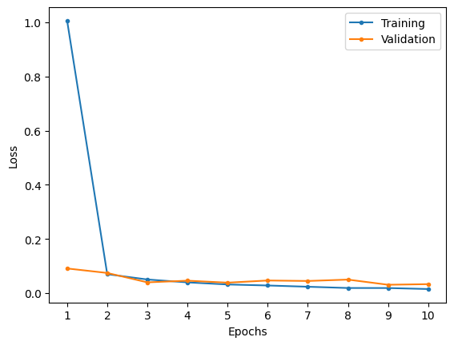
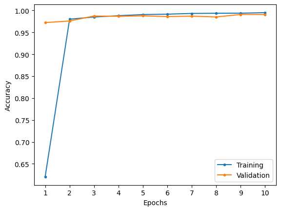
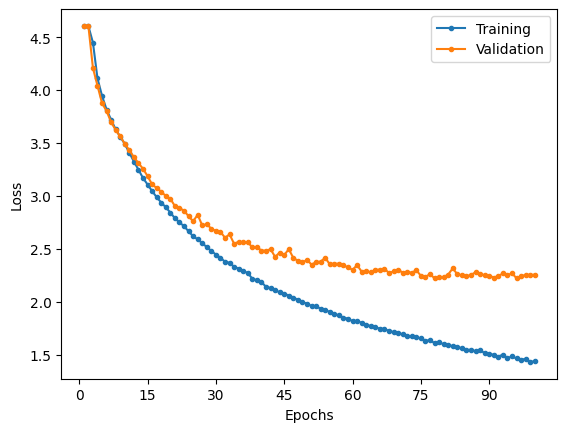
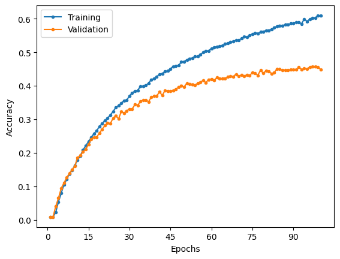

# VGG

Implementation of VGG-16 described in the research paper.

## MNIST

### Model Summary

|  Layer (type)  |    Output Shape     |   Param #   |
| :------------: | :-----------------: | :---------: |
| 2D convolution | [-1, 64, 224, 224]  |    1,792    |
|      ReLU      | [-1, 64, 224, 224]  |      0      |
| 2D convolution | [-1, 64, 224, 224]  |   36,928    |
|      ReLU      | [-1, 64, 224, 224]  |      0      |
| 2D max pooling | [-1, 64, 112, 112]  |      0      |
| 2D convolution | [-1, 128, 112, 112] |   73,856    |
|      ReLU      | [-1, 128, 112, 112] |      0      |
| 2D convolution | [-1, 128, 112, 112] |   147,584   |
|      ReLU      | [-1, 128, 112, 112] |      0      |
| 2D max pooling |  [-1, 128, 56, 56]  |      0      |
| 2D convolution |  [-1, 256, 56, 56]  |   295,168   |
|      ReLU      |  [-1, 256, 56, 56]  |      0      |
| 2D convolution |  [-1, 256, 56, 56]  |   590,080   |
|      ReLU      |  [-1, 256, 56, 56]  |      0      |
| 2D convolution |  [-1, 256, 56, 56]  |   590,080   |
|      ReLU      |  [-1, 256, 56, 56]  |      0      |
| 2D max pooling |  [-1, 256, 28, 28]  |      0      |
| 2D convolution |  [-1, 512, 28, 28]  |  1,180,160  |
|      ReLU      |  [-1, 512, 28, 28]  |      0      |
| 2D convolution |  [-1, 512, 28, 28]  |  2,359,808  |
|      ReLU      |  [-1, 512, 28, 28]  |      0      |
| 2D convolution |  [-1, 512, 28, 28]  |  2,359,808  |
|      ReLU      |  [-1, 512, 28, 28]  |      0      |
| 2D max pooling |  [-1, 512, 14, 14]  |      0      |
| 2D convolution |  [-1, 512, 14, 14]  |  2,359,808  |
|      ReLU      |  [-1, 512, 14, 14]  |      0      |
| 2D convolution |  [-1, 512, 14, 14]  |  2,359,808  |
|      ReLU      |  [-1, 512, 14, 14]  |      0      |
| 2D convolution |  [-1, 512, 14, 14]  |  2,359,808  |
|      ReLU      |  [-1, 512, 14, 14]  |      0      |
| 2D max pooling |   [-1, 512, 7, 7]   |      0      |
|    Flatten     |     [-1, 25088]     |      0      |
|    Dropout     |     [-1, 25088]     |      0      |
|     Linear     |     [-1, 4096]      | 102,764,544 |
|      ReLU      |     [-1, 4096]      |      0      |
|    Dropout     |     [-1, 4096]      |      0      |
|     Linear     |     [-1, 4096]      | 16,781,312  |
|      ReLU      |     [-1, 4096]      |      0      |
|    Dropout     |     [-1, 4096]      |      0      |
|     Linear     |      [-1, 10]       |   40,970    |

|                      |             |
| -------------------- | ----------- |
| Total params         | 134,301,514 |
| Trainable params     | 134,301,514 |
| Non-trainable params | 0           |

### Results

Training over 10 epochs with a learning rate of 1e-4 and weight decay of 1e-12.

Given the size of the model, a batch size of 32 was used.

|                     Loss                      |                       Accuracy                        |
| :-------------------------------------------: | :---------------------------------------------------: |
|  |  |

|              | Training | Validation | Testing |
| :----------: | :------: | :--------: | :-----: |
|     Loss     |  0.0153  |   0.0333   | 0.0267  |
| Accuracy (%) |  99.50   |   99.08    |  99.22  |

| Class | Training Precision | Validation Precision | Testing Precision | Training Recall | Validation Recall | Testing Recall | Training F1 Score | Validation F1 Score | Testing F1 Score |
| :---: | :----------------: | :------------------: | :---------------: | :-------------: | :---------------: | :------------: | :---------------: | :-----------------: | :--------------: |
|   0   |       0.9979       |        0.9971        |      0.9959       |     0.9983      |      0.9965       |     0.9980     |      0.9981       |       0.9968        |      0.9969      |
|   1   |       0.9970       |        0.9961        |      0.9991       |     0.9962      |      0.9912       |     0.9877     |      0.9966       |       0.9936        |      0.9934      |
|   2   |       0.9954       |        0.9838        |      0.9819       |     0.9961      |      0.9951       |     0.9971     |      0.9958       |       0.9894        |      0.9894      |
|   3   |       0.9965       |        0.9973        |      0.9950       |     0.9963      |      0.9870       |     0.9941     |      0.9964       |       0.9921        |      0.9946      |
|   4   |       0.9944       |        0.9937        |      0.9949       |     0.9936      |      0.9892       |     0.9929     |      0.9940       |       0.9915        |      0.9939      |
|   5   |       0.9945       |        0.9901        |      0.9922       |     0.9950      |      0.9876       |     0.9966     |      0.9947       |       0.9888        |      0.9944      |
|   6   |       0.9957       |        0.9851        |      0.9845       |     0.9959      |      0.9983       |     0.9948     |      0.9958       |       0.9917        |      0.9896      |
|   7   |       0.9927       |        0.9956        |      0.9961       |     0.9939      |      0.9801       |     0.9835     |      0.9933       |       0.9878        |      0.9897      |
|   8   |       0.9949       |        0.9920        |      0.9959       |     0.9937      |      0.9908       |     0.9877     |      0.9943       |       0.9914        |      0.9918      |
|   9   |       0.9913       |        0.9768        |      0.9862       |     0.9913      |      0.9923       |     0.9911     |      0.9913       |       0.9845        |      0.9886      |

Despite having more than double the parameters, VGG does not perform significantly better AlexNet on MNIST.

## CIFAR-100

### Model summary

|  Layer (type)  |    Output Shape     |   Param #   |
| :------------: | :-----------------: | :---------: |
| 2D convolution | [-1, 64, 224, 224]  |    1,792    |
|      ReLU      | [-1, 64, 224, 224]  |      0      |
| 2D convolution | [-1, 64, 224, 224]  |   36,928    |
|      ReLU      | [-1, 64, 224, 224]  |      0      |
|  2D max pool   | [-1, 64, 112, 112]  |      0      |
| 2D convolution | [-1, 128, 112, 112] |   73,856    |
|      ReLU      | [-1, 128, 112, 112] |      0      |
| 2D convolution | [-1, 128, 112, 112] |   147,584   |
|      ReLU      | [-1, 128, 112, 112] |      0      |
|  2D max pool   |  [-1, 128, 56, 56]  |      0      |
| 2D convolution |  [-1, 256, 56, 56]  |   295,168   |
|      ReLU      |  [-1, 256, 56, 56]  |      0      |
| 2D convolution |  [-1, 256, 56, 56]  |   590,080   |
|      ReLU      |  [-1, 256, 56, 56]  |      0      |
| 2D convolution |  [-1, 256, 56, 56]  |   590,080   |
|      ReLU      |  [-1, 256, 56, 56]  |      0      |
|  2D max pool   |  [-1, 256, 28, 28]  |      0      |
| 2D convolution |  [-1, 512, 28, 28]  |  1,180,160  |
|      ReLU      |  [-1, 512, 28, 28]  |      0      |
| 2D convolution |  [-1, 512, 28, 28]  |  2,359,808  |
|      ReLU      |  [-1, 512, 28, 28]  |      0      |
| 2D convolution |  [-1, 512, 28, 28]  |  2,359,808  |
|      ReLU      |  [-1, 512, 28, 28]  |      0      |
|  2D max pool   |  [-1, 512, 14, 14]  |      0      |
| 2D convolution |  [-1, 512, 14, 14]  |  2,359,808  |
|      ReLU      |  [-1, 512, 14, 14]  |      0      |
| 2D convolution |  [-1, 512, 14, 14]  |  2,359,808  |
|      ReLU      |  [-1, 512, 14, 14]  |      0      |
| 2D convolution |  [-1, 512, 14, 14]  |  2,359,808  |
|      ReLU      |  [-1, 512, 14, 14]  |      0      |
|  2D max pool   |   [-1, 512, 7, 7]   |      0      |
|    Flatten     |     [-1, 25088]     |      0      |
|    Dropout     |     [-1, 25088]     |      0      |
|     Linear     |     [-1, 4096]      | 102,764,544 |
|      ReLU      |     [-1, 4096]      |      0      |
|    Dropout     |     [-1, 4096]      |      0      |
|     Linear     |     [-1, 4096]      | 16,781,312  |
|      ReLU      |     [-1, 4096]      |      0      |
|    Dropout     |     [-1, 4096]      |      0      |
|     Linear     |      [-1, 100]      |   409,700   |

|                      |             |
| :------------------: | :---------: |
|     Total params     | 134,670,244 |
|   Trainable params   | 134,670,244 |
| Non-trainable params |      0      |

### Results

Training over 100 epochs at a learning rate of 1e-4 and a 1e-6 weight decay. Additionally, the training images were augmented with random crop of between 0.8 and 1 of the image and resize to 224x224, 50% probability of horizontal flip and gaussian noise with mean 0 and standard deviation of 0.01.

Given the size of the model, a batch of size of 32 was used.

|                         Loss                         |                           Accuracy                           |
| :--------------------------------------------------: | :----------------------------------------------------------: |
|  |  |

|              | Training | Validation | Testing |
| :----------: | :------: | :--------: | :-----: |
|     Loss     |  1.4372  |   2.2558   | 1.9198  |
| Accuracy (%) |  60.95   |   44.89    |  56.42  |

|     Class     | Training Precision | Validation Precision | Testing Precision | Training Recall | Validation Recall | Testing Recall | Training F1 Score | Validation F1 Score | Testing F1 Score |
| :-----------: | :----------------: | :------------------: | :---------------: | :-------------: | :---------------: | :------------: | :---------------: | :-----------------: | :--------------: |
|     apple     |       0.7163       |        0.6807        |      0.8764       |     0.7331      |      0.7107       |     0.7800     |      0.7246       |       0.6954        |      0.8254      |
| aquarium_fish |       0.6658       |        0.4940        |      0.6771       |     0.6986      |      0.6148       |     0.6500     |      0.6818       |       0.5479        |      0.6633      |
|     baby      |       0.5369       |        0.3835        |      0.4875       |     0.5462      |      0.3312       |     0.3900     |      0.5415       |       0.3554        |      0.4333      |
|     bear      |       0.4629       |        0.2913        |      0.4149       |     0.4496      |      0.2418       |     0.3900     |      0.4561       |       0.2643        |      0.4021      |
|    beaver     |       0.4734       |        0.2340        |      0.2483       |     0.4408      |      0.4015       |     0.3600     |      0.4565       |       0.2957        |      0.2939      |
|      bed      |       0.5718       |        0.3961        |      0.5476       |     0.6243      |      0.4692       |     0.6900     |      0.5969       |       0.4296        |      0.6106      |
|      bee      |       0.6413       |        0.3333        |      0.5630       |     0.6431      |      0.4662       |     0.6700     |      0.6422       |       0.3887        |      0.6119      |
|    beetle     |       0.6340       |        0.3506        |      0.5315       |     0.5673      |      0.3861       |     0.5900     |      0.5988       |       0.3675        |      0.5592      |
|    bicycle    |       0.6795       |        0.6700        |      0.8022       |     0.7188      |      0.4323       |     0.7300     |      0.6986       |       0.5255        |      0.7644      |
|    bottle     |       0.7217       |        0.7347        |      0.7294       |     0.7087      |      0.4311       |     0.6200     |      0.7152       |       0.5434        |      0.6703      |
|     bowl      |       0.5157       |        0.3217        |      0.4872       |     0.4568      |      0.2624       |     0.3800     |      0.4845       |       0.2891        |      0.4270      |
|      boy      |       0.5282       |        0.3551        |      0.4253       |     0.4386      |      0.2405       |     0.3700     |      0.4792       |       0.2868        |      0.3957      |
|    bridge     |       0.6271       |        0.3885        |      0.5833       |     0.6184      |      0.3830       |     0.7000     |      0.6227       |       0.3857        |      0.6364      |
|      bus      |       0.6154       |        0.4581        |      0.4737       |     0.6012      |      0.4610       |     0.4500     |      0.6082       |       0.4595        |      0.4615      |
|   butterfly   |       0.6115       |        0.4457        |      0.5873       |     0.5581      |      0.2628       |     0.3700     |      0.5836       |       0.3306        |      0.4540      |
|     camel     |       0.5836       |        0.4317        |      0.4174       |     0.5606      |      0.4138       |     0.4800     |      0.5718       |       0.4225        |      0.4465      |
|      can      |       0.6531       |        0.5069        |      0.5238       |     0.6310      |      0.5034       |     0.5500     |      0.6418       |       0.5052        |      0.5366      |
|    castle     |       0.7472       |        0.6788        |      0.7952       |     0.7758      |      0.5776       |     0.6600     |      0.7612       |       0.6242        |      0.7213      |
|  caterpillar  |       0.5710       |        0.3636        |      0.4065       |     0.5925      |      0.4416       |     0.5000     |      0.5816       |       0.3988        |      0.4484      |
|    cattle     |       0.5508       |        0.4737        |      0.5400       |     0.5114      |      0.4200       |     0.5400     |      0.5304       |       0.4452        |      0.5400      |
|     chair     |       0.7440       |        0.6296        |      0.7043       |     0.7623      |      0.6343       |     0.8100     |      0.7530       |       0.6320        |      0.7535      |
|  chimpanzee   |       0.5818       |        0.5000        |      0.7143       |     0.7014      |      0.5630       |     0.7000     |      0.6360       |       0.5296        |      0.7071      |
|     clock     |       0.6817       |        0.5413        |      0.6354       |     0.6023      |      0.3986       |     0.6100     |      0.6395       |       0.4591        |      0.6224      |
|     cloud     |       0.6177       |        0.4599        |      0.7952       |     0.7198      |      0.6770       |     0.6600     |      0.6649       |       0.5477        |      0.7213      |
|   cockroach   |       0.7411       |        0.5587        |      0.7742       |     0.7411      |      0.6098       |     0.7200     |      0.7411       |       0.5831        |      0.7461      |
|     couch     |       0.5015       |        0.3467        |      0.5063       |     0.4882      |      0.3210       |     0.4000     |      0.4948       |       0.3333        |      0.4469      |
|     crab      |       0.5652       |        0.3607        |      0.4479       |     0.5156      |      0.2993       |     0.4300     |      0.5393       |       0.3271        |      0.4388      |
|   crocodile   |       0.4523       |        0.2514        |      0.3261       |     0.5635      |      0.3261       |     0.4500     |      0.5018       |       0.2839        |      0.3782      |
|      cup      |       0.6340       |        0.6000        |      0.6923       |     0.6769      |      0.4971       |     0.7200     |      0.6548       |       0.5437        |      0.7059      |
|   dinosaur    |       0.6033       |        0.3056        |      0.3537       |     0.5303      |      0.4314       |     0.5200     |      0.5644       |       0.3577        |      0.4211      |
|    dolphin    |       0.5370       |        0.3719        |      0.4797       |     0.6098      |      0.5649       |     0.5900     |      0.5711       |       0.4485        |      0.5291      |
|   elephant    |       0.5646       |        0.4307        |      0.6618       |     0.6299      |      0.4041       |     0.4500     |      0.5955       |       0.4170        |      0.5357      |
|   flatfish    |       0.5061       |        0.3738        |      0.6267       |     0.4663      |      0.2778       |     0.4700     |      0.4854       |       0.3187        |      0.5371      |
|    forest     |       0.5884       |        0.3827        |      0.4672       |     0.5953      |      0.3899       |     0.5700     |      0.5918       |       0.3863        |      0.5135      |
|      fox      |       0.6161       |        0.5082        |      0.5914       |     0.6000      |      0.4000       |     0.5500     |      0.6079       |       0.4477        |      0.5699      |
|     girl      |       0.4970       |        0.1905        |      0.3525       |     0.4505      |      0.2059       |     0.4300     |      0.4726       |       0.1979        |      0.3874      |
|    hamster    |       0.6703       |        0.6312        |      0.8406       |     0.7135      |      0.5633       |     0.5800     |      0.6912       |       0.5953        |      0.6864      |
|     house     |       0.5743       |        0.4444        |      0.5514       |     0.5597      |      0.5135       |     0.5900     |      0.5669       |       0.4765        |      0.5700      |
|   kangaroo    |       0.4706       |        0.3900        |      0.3846       |     0.4958      |      0.2690       |     0.3500     |      0.4829       |       0.3184        |      0.3665      |
|   keyboard    |       0.7079       |        0.5426        |      0.7419       |     0.7775      |      0.6623       |     0.6900     |      0.7410       |       0.5965        |      0.7150      |
|     lamp      |       0.5976       |        0.3868        |      0.6250       |     0.5528      |      0.2929       |     0.5500     |      0.5743       |       0.3333        |      0.5851      |
|  lawn_mower   |       0.7273       |        0.7545        |      0.8889       |     0.7910      |      0.5685       |     0.7200     |      0.7578       |       0.6484        |      0.7956      |
|    leopard    |       0.5904       |        0.4672        |      0.5263       |     0.5765      |      0.3562       |     0.5000     |      0.5833       |       0.4043        |      0.5128      |
|     lion      |       0.5637       |        0.4270        |      0.6436       |     0.6676      |      0.5352       |     0.6500     |      0.6113       |       0.4750        |      0.6468      |
|    lizard     |       0.4624       |        0.2047        |      0.2500       |     0.4313      |      0.2016       |     0.2900     |      0.4463       |       0.2031        |      0.2685      |
|    lobster    |       0.5913       |        0.2258        |      0.3179       |     0.5589      |      0.4148       |     0.4800     |      0.5746       |       0.2924        |      0.3825      |
|      man      |       0.5316       |        0.2593        |      0.3596       |     0.4927      |      0.2642       |     0.4100     |      0.5114       |       0.2617        |      0.3832      |
|  maple_tree   |       0.6766       |        0.4317        |      0.6364       |     0.6012      |      0.3774       |     0.5600     |      0.6366       |       0.4027        |      0.5957      |
|  motorcycle   |       0.6676       |        0.5676        |      0.7593       |     0.7067      |      0.5283       |     0.8200     |      0.6866       |       0.5472        |      0.7885      |
|   mountain    |       0.7034       |        0.6333        |      0.7041       |     0.7238      |      0.6090       |     0.6900     |      0.7135       |       0.6209        |      0.6970      |
|     mouse     |       0.4923       |        0.3020        |      0.3933       |     0.3914      |      0.2601       |     0.3500     |      0.4361       |       0.2795        |      0.3704      |
|   mushroom    |       0.5977       |        0.5547        |      0.5349       |     0.6413      |      0.4152       |     0.4600     |      0.6188       |       0.4749        |      0.4946      |
|   oak_tree    |       0.5931       |        0.4318        |      0.5172       |     0.6817      |      0.6552       |     0.7500     |      0.6343       |       0.5205        |      0.6122      |
|    orange     |       0.7772       |        0.8320        |      0.8526       |     0.8395      |      0.6887       |     0.8100     |      0.8072       |       0.7536        |      0.8308      |
|    orchid     |       0.7198       |        0.4852        |      0.6667       |     0.7360      |      0.5694       |     0.6800     |      0.7278       |       0.5240        |      0.6733      |
|     otter     |       0.3984       |        0.1685        |      0.2432       |     0.3003      |      0.1856       |     0.2700     |      0.3425       |       0.1766        |      0.2559      |
|   palm_tree   |       0.6850       |        0.5644        |      0.7500       |     0.7230      |      0.6619       |     0.7500     |      0.7035       |       0.6093        |      0.7500      |
|     pear      |       0.6588       |        0.5029        |      0.6126       |     0.6400      |      0.5733       |     0.6800     |      0.6493       |       0.5358        |      0.6445      |
| pickup_truck  |       0.6833       |        0.6436        |      0.7945       |     0.6715      |      0.4248       |     0.5800     |      0.6773       |       0.5118        |      0.6705      |
|   pine_tree   |       0.5972       |        0.3889        |      0.5301       |     0.6178      |      0.3224       |     0.4400     |      0.6073       |       0.3525        |      0.4809      |
|     plain     |       0.7637       |        0.7153        |      0.8222       |     0.7910      |      0.6242       |     0.7400     |      0.7771       |       0.6667        |      0.7789      |
|     plate     |       0.6210       |        0.5153        |      0.6139       |     0.6086      |      0.5600       |     0.6200     |      0.6147       |       0.5367        |      0.6169      |
|     poppy     |       0.6686       |        0.5455        |      0.5586       |     0.6667      |      0.5032       |     0.6200     |      0.6676       |       0.5235        |      0.5877      |
|   porcupine   |       0.5352       |        0.4076        |      0.5556       |     0.5925      |      0.4870       |     0.4500     |      0.5624       |       0.4438        |      0.4972      |
|    possum     |       0.6000       |        0.3924        |      0.4943       |     0.5543      |      0.3899       |     0.4300     |      0.5762       |       0.3912        |      0.4599      |
|    rabbit     |       0.4966       |        0.2800        |      0.3671       |     0.4320      |      0.2160       |     0.2900     |      0.4620       |       0.2439        |      0.3240      |
|    raccoon    |       0.6433       |        0.4935        |      0.7157       |     0.6524      |      0.5101       |     0.7300     |      0.6478       |       0.5017        |      0.7228      |
|      ray      |       0.5433       |        0.3073        |      0.4500       |     0.5215      |      0.4172       |     0.3600     |      0.5322       |       0.3539        |      0.4000      |
|     road      |       0.7236       |        0.6987        |      0.8365       |     0.7341      |      0.7078       |     0.8700     |      0.7288       |       0.7032        |      0.8529      |
|    rocket     |       0.6887       |        0.6222        |      0.7053       |     0.7331      |      0.5833       |     0.6700     |      0.7102       |       0.6022        |      0.6872      |
|     rose      |       0.7092       |        0.5738        |      0.6923       |     0.7221      |      0.4142       |     0.5400     |      0.7156       |       0.4811        |      0.6067      |
|      sea      |       0.6888       |        0.5131        |      0.6583       |     0.7606      |      0.6759       |     0.7900     |      0.7229       |       0.5833        |      0.7182      |
|     seal      |       0.4128       |        0.2815        |      0.2692       |     0.3258      |      0.2639       |     0.2800     |      0.3642       |       0.2724        |      0.2745      |
|     shark     |       0.5321       |        0.4174        |      0.5455       |     0.5831      |      0.3310       |     0.4200     |      0.5565       |       0.3692        |      0.4746      |
|     shrew     |       0.4633       |        0.3630        |      0.3978       |     0.4088      |      0.3313       |     0.3700     |      0.4344       |       0.3464        |      0.3834      |
|     skunk     |       0.6721       |        0.6596        |      0.8588       |     0.7151      |      0.5962       |     0.7300     |      0.6930       |       0.6263        |      0.7892      |
|  skyscraper   |       0.7236       |        0.6748        |      0.8316       |     0.7805      |      0.6336       |     0.7900     |      0.7510       |       0.6535        |      0.8103      |
|     snail     |       0.5770       |        0.4427        |      0.5890       |     0.5852      |      0.3919       |     0.4300     |      0.5811       |       0.4158        |      0.4971      |
|     snake     |       0.5240       |        0.3511        |      0.3796       |     0.4852      |      0.2840       |     0.4100     |      0.5038       |       0.3140        |      0.3942      |
|    spider     |       0.5881       |        0.3758        |      0.5455       |     0.5358      |      0.4106       |     0.6600     |      0.5607       |       0.3924        |      0.5973      |
|   squirrel    |       0.4286       |        0.2146        |      0.3750       |     0.4622      |      0.3385       |     0.3900     |      0.4447       |       0.2627        |      0.3824      |
|   streetcar   |       0.5854       |        0.4472        |      0.5000       |     0.5789      |      0.3957       |     0.5600     |      0.5822       |       0.4198        |      0.5283      |
|   sunflower   |       0.7861       |        0.7483        |      0.8851       |     0.8282      |      0.7586       |     0.7700     |      0.8066       |       0.7534        |      0.8235      |
| sweet_pepper  |       0.6639       |        0.4098        |      0.5446       |     0.6771      |      0.5000       |     0.5500     |      0.6704       |       0.4505        |      0.5473      |
|     table     |       0.5518       |        0.4000        |      0.5281       |     0.5186      |      0.3576       |     0.4700     |      0.5347       |       0.3776        |      0.4974      |
|     tank      |       0.6174       |        0.4710        |      0.6063       |     0.6411      |      0.5407       |     0.7700     |      0.6290       |       0.5034        |      0.6784      |
|   telephone   |       0.6584       |        0.5271        |      0.6132       |     0.6512      |      0.5113       |     0.6500     |      0.6548       |       0.5191        |      0.6311      |
|  television   |       0.6436       |        0.5887        |      0.5862       |     0.6875      |      0.4932       |     0.6800     |      0.6648       |       0.5368        |      0.6296      |
|     tiger     |       0.6933       |        0.5724        |      0.7386       |     0.7365      |      0.5918       |     0.6500     |      0.7143       |       0.5819        |      0.6915      |
|    tractor    |       0.6385       |        0.5066        |      0.5000       |     0.6186      |      0.5274       |     0.6800     |      0.6284       |       0.5168        |      0.5763      |
|     train     |       0.6565       |        0.4412        |      0.6389       |     0.6136      |      0.4054       |     0.6900     |      0.6344       |       0.4225        |      0.6635      |
|     trout     |       0.6429       |        0.4892        |      0.6735       |     0.6279      |      0.4359       |     0.6600     |      0.6353       |       0.4610        |      0.6667      |
|     tulip     |       0.5932       |        0.3622        |      0.5333       |     0.5411      |      0.3129       |     0.4800     |      0.5659       |       0.3358        |      0.5053      |
|    turtle     |       0.5603       |        0.2500        |      0.2901       |     0.4606      |      0.2548       |     0.3800     |      0.5056       |       0.2524        |      0.3290      |
|   wardrobe    |       0.7096       |        0.6607        |      0.8351       |     0.7915      |      0.7655       |     0.8100     |      0.7483       |       0.7093        |      0.8223      |
|     whale     |       0.6337       |        0.5102        |      0.5631       |     0.6089      |      0.5282       |     0.5800     |      0.6211       |       0.5190        |      0.5714      |
|  willow_tree  |       0.5123       |        0.4000        |      0.4286       |     0.5714      |      0.4327       |     0.3900     |      0.5402       |       0.4157        |      0.4084      |
|     wolf      |       0.5645       |        0.3882        |      0.6404       |     0.6087      |      0.3806       |     0.5700     |      0.5858       |       0.3844        |      0.6032      |
|     woman     |       0.4761       |        0.2988        |      0.3063       |     0.4721      |      0.3451       |     0.3400     |      0.4741       |       0.3203        |      0.3223      |
|     worm      |       0.6717       |        0.4672        |      0.6875       |     0.6371      |      0.4267       |     0.5500     |      0.6540       |       0.4460        |      0.6111      |

Similar to AlexNet, VGG performs better on the test set as opposed to the validation set. Unlike the results when training on the MNIST dataset, VGG performs significantly better than AlexNet across all datasets.

As seen in the loss graph, the generalisation gap is continuing to widen. Further training may exacerbate the gap, causing the test performance to degrade. However, due to the weight decay being used during training, the model may not learn any more with further epochs.

## References

Research paper: https://arxiv.org/pdf/1409.1556.pdf
