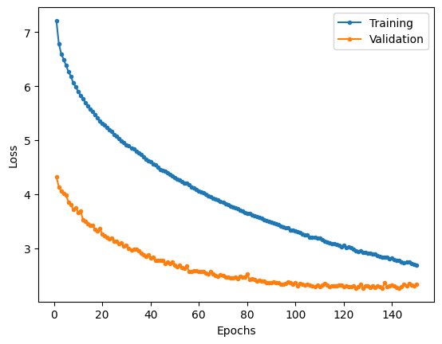
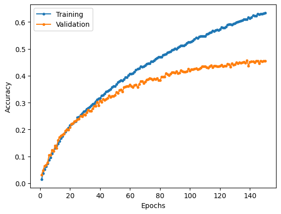

# GoogLeNet

Implementation of GoogLeNet/Inception-V1 as described in the paper.

## MNIST

### Model summary

|    Layer (type)     |    Output Shape    |  Param #  |
| :-----------------: | :----------------: | :-------: |
|   2D convolution    | [-1, 64, 112, 112] |   9,472   |
|        ReLU         | [-1, 64, 112, 112] |     0     |
|   2D max pooling    |  [-1, 64, 56, 56]  |     0     |
| Local response norm |  [-1, 64, 56, 56]  |     0     |
|   2D convolution    |  [-1, 64, 56, 56]  |   4,160   |
|        ReLU         |  [-1, 64, 56, 56]  |     0     |
|   2D convolution    | [-1, 192, 56, 56]  |  110,784  |
|        ReLU         | [-1, 192, 56, 56]  |     0     |
| Local response norm | [-1, 192, 56, 56]  |     0     |
|   2D max pooling    | [-1, 192, 28, 28]  |     0     |
|  **inception_3a**   |        ---         |    ---    |
|   2D convolution    |  [-1, 64, 28, 28]  |  12,352   |
|        ReLU         |  [-1, 64, 28, 28]  |     0     |
|   2D convolution    |  [-1, 96, 28, 28]  |  18,528   |
|        ReLU         |  [-1, 96, 28, 28]  |     0     |
|   2D convolution    | [-1, 128, 28, 28]  |  110,720  |
|        ReLU         | [-1, 128, 28, 28]  |     0     |
|   2D convolution    |  [-1, 16, 28, 28]  |   3,088   |
|        ReLU         |  [-1, 16, 28, 28]  |     0     |
|   2D convolution    |  [-1, 32, 28, 28]  |  12,832   |
|        ReLU         |  [-1, 32, 28, 28]  |     0     |
|   2D max pooling    | [-1, 192, 28, 28]  |     0     |
|   2D convolution    |  [-1, 32, 28, 28]  |   6,176   |
|        ReLU         |  [-1, 32, 28, 28]  |     0     |
|   Inception block   | [-1, 256, 28, 28]  |     0     |
|  **inception_3b**   |        ---         |    ---    |
|   2D convolution    | [-1, 128, 28, 28]  |  32,896   |
|        ReLU         | [-1, 128, 28, 28]  |     0     |
|   2D convolution    | [-1, 128, 28, 28]  |  32,896   |
|        ReLU         | [-1, 128, 28, 28]  |     0     |
|   2D convolution    | [-1, 192, 28, 28]  |  221,376  |
|        ReLU         | [-1, 192, 28, 28]  |     0     |
|   2D convolution    |  [-1, 32, 28, 28]  |   8,224   |
|        ReLU         |  [-1, 32, 28, 28]  |     0     |
|   2D convolution    |  [-1, 96, 28, 28]  |  76,896   |
|        ReLU         |  [-1, 96, 28, 28]  |     0     |
|   2D max pooling    | [-1, 256, 28, 28]  |     0     |
|   2D convolution    |  [-1, 64, 28, 28]  |  16,448   |
|        ReLU         |  [-1, 64, 28, 28]  |     0     |
|   Inception block   | [-1, 480, 28, 28]  |     0     |
|   2D max pooling    | [-1, 480, 14, 14]  |     0     |
|  **inception_4a**   |        ---         |    ---    |
|   2D convolution    | [-1, 192, 14, 14]  |  92,352   |
|        ReLU         | [-1, 192, 14, 14]  |     0     |
|   2D convolution    |  [-1, 96, 14, 14]  |  46,176   |
|        ReLU         |  [-1, 96, 14, 14]  |     0     |
|   2D convolution    | [-1, 208, 14, 14]  |  179,920  |
|        ReLU         | [-1, 208, 14, 14]  |     0     |
|   2D convolution    |  [-1, 16, 14, 14]  |   7,696   |
|        ReLU         |  [-1, 16, 14, 14]  |     0     |
|   2D convolution    |  [-1, 48, 14, 14]  |  19,248   |
|        ReLU         |  [-1, 48, 14, 14]  |     0     |
|   2D max pooling    | [-1, 480, 14, 14]  |     0     |
|   2D convolution    |  [-1, 64, 14, 14]  |  30,784   |
|        ReLU         |  [-1, 64, 14, 14]  |     0     |
|   Inception block   | [-1, 512, 14, 14]  |     0     |
|      **aux_1**      |        ---         |    ---    |
| 2D average pooling  |  [-1, 512, 4, 4]   |     0     |
|   2D convolution    |  [-1, 128, 4, 4]   |  65,664   |
|        ReLU         |  [-1, 128, 4, 4]   |     0     |
| Flatten [-1, 2048]  |         0          |
|  Linear [-1, 1024]  |     2,098,176      |
|        ReLU         |     [-1, 1024]     |     0     |
|       Dropout       |     [-1, 1024]     |     0     |
|   Linear [-1, 10]   |       10,250       |
|  **inception_4b**   |        ---         |    ---    |
|   2D convolution    | [-1, 160, 14, 14]  |  82,080   |
|        ReLU         | [-1, 160, 14, 14]  |     0     |
|   2D convolution    | [-1, 112, 14, 14]  |  57,456   |
|        ReLU         | [-1, 112, 14, 14]  |     0     |
|   2D convolution    | [-1, 224, 14, 14]  |  226,016  |
|        ReLU         | [-1, 224, 14, 14]  |     0     |
|   2D convolution    |  [-1, 24, 14, 14]  |  12,312   |
|        ReLU         |  [-1, 24, 14, 14]  |     0     |
|   2D convolution    |  [-1, 64, 14, 14]  |  38,464   |
|        ReLU         |  [-1, 64, 14, 14]  |     0     |
|   2D max pooling    | [-1, 512, 14, 14]  |     0     |
|   2D convolution    |  [-1, 64, 14, 14]  |  32,832   |
|        ReLU         |  [-1, 64, 14, 14]  |     0     |
|   Inception block   | [-1, 512, 14, 14]  |     0     |
|  **inception_4c**   |        ---         |    ---    |
|   2D convolution    | [-1, 128, 14, 14]  |  65,664   |
|        ReLU         | [-1, 128, 14, 14]  |     0     |
|   2D convolution    | [-1, 128, 14, 14]  |  65,664   |
|        ReLU         | [-1, 128, 14, 14]  |     0     |
|   2D convolution    | [-1, 256, 14, 14]  |  295,168  |
|        ReLU         | [-1, 256, 14, 14]  |     0     |
|   2D convolution    |  [-1, 24, 14, 14]  |  12,312   |
|        ReLU         |  [-1, 24, 14, 14]  |     0     |
|   2D convolution    |  [-1, 64, 14, 14]  |  38,464   |
|        ReLU         |  [-1, 64, 14, 14]  |     0     |
|   2D max pooling    | [-1, 512, 14, 14]  |     0     |
|   2D convolution    |  [-1, 64, 14, 14]  |  32,832   |
|        ReLU         |  [-1, 64, 14, 14]  |     0     |
|   Inception block   | [-1, 512, 14, 14]  |     0     |
|  **inception_4d**   |        ---         |    ---    |
|   2D convolution    | [-1, 112, 14, 14]  |  57,456   |
|        ReLU         | [-1, 112, 14, 14]  |     0     |
|   2D convolution    | [-1, 144, 14, 14]  |  73,872   |
|        ReLU         | [-1, 144, 14, 14]  |     0     |
|   2D convolution    | [-1, 288, 14, 14]  |  373,536  |
|        ReLU         | [-1, 288, 14, 14]  |     0     |
|   2D convolution    |  [-1, 32, 14, 14]  |  16,416   |
|        ReLU         |  [-1, 32, 14, 14]  |     0     |
|   2D convolution    |  [-1, 64, 14, 14]  |  51,264   |
|        ReLU         |  [-1, 64, 14, 14]  |     0     |
|   2D max pooling    | [-1, 512, 14, 14]  |     0     |
|   2D convolution    |  [-1, 64, 14, 14]  |  32,832   |
|        ReLU         |  [-1, 64, 14, 14]  |     0     |
|   Inception block   | [-1, 528, 14, 14]  |     0     |
|      **aux_2**      |        ---         |    ---    |
| 2D average pooling  |  [-1, 528, 4, 4]   |     0     |
|   2D convolution    |  [-1, 128, 4, 4]   |  67,712   |
|        ReLU         |  [-1, 128, 4, 4]   |     0     |
|       Flatten       |     [-1, 2048]     |     0     |
|       Linear        |     [-1, 1024]     | 2,098,176 |
|        ReLU         |     [-1, 1024]     |     0     |
|       Dropout       |     [-1, 1024]     |     0     |
|       Linear        |      [-1, 10]      |  10,250   |
|  **inception_4e**   |        ---         |    ---    |
|   2D convolution    | [-1, 256, 14, 14]  |  135,424  |
|        ReLU         | [-1, 256, 14, 14]  |     0     |
|   2D convolution    | [-1, 160, 14, 14]  |  84,640   |
|        ReLU         | [-1, 160, 14, 14]  |     0     |
|   2D convolution    | [-1, 320, 14, 14]  |  461,120  |
|        ReLU         | [-1, 320, 14, 14]  |     0     |
|   2D convolution    |  [-1, 32, 14, 14]  |  16,928   |
|        ReLU         |  [-1, 32, 14, 14]  |     0     |
|   2D convolution    | [-1, 128, 14, 14]  |  102,528  |
|        ReLU         | [-1, 128, 14, 14]  |     0     |
|   2D max pooling    | [-1, 528, 14, 14]  |     0     |
|   2D convolution    | [-1, 128, 14, 14]  |  67,712   |
|        ReLU         | [-1, 128, 14, 14]  |     0     |
|   Inception block   | [-1, 832, 14, 14]  |     0     |
|   2D max pooling    |  [-1, 832, 7, 7]   |     0     |
|  **inception_5a**   |        ---         |    ---    |
|   2D convolution    |  [-1, 256, 7, 7]   |  213,248  |
|        ReLU         |  [-1, 256, 7, 7]   |     0     |
|   2D convolution    |  [-1, 160, 7, 7]   |  133,280  |
|        ReLU         |  [-1, 160, 7, 7]   |     0     |
|   2D convolution    |  [-1, 320, 7, 7]   |  461,120  |
|        ReLU         |  [-1, 320, 7, 7]   |     0     |
|   2D convolution    |   [-1, 32, 7, 7]   |  26,656   |
|        ReLU         |   [-1, 32, 7, 7]   |     0     |
|   2D convolution    |  [-1, 128, 7, 7]   |  102,528  |
|        ReLU         |  [-1, 128, 7, 7]   |     0     |
|   2D max pooling    |  [-1, 832, 7, 7]   |     0     |
|   2D convolution    |  [-1, 128, 7, 7]   |  106,624  |
|        ReLU         |  [-1, 128, 7, 7]   |     0     |
|   Inception block   |  [-1, 832, 7, 7]   |     0     |
|  **inception_5b**   |        ---         |    ---    |
|   2D convolution    |  [-1, 384, 7, 7]   |  319,872  |
|        ReLU         |  [-1, 384, 7, 7]   |     0     |
|   2D convolution    |  [-1, 192, 7, 7]   |  159,936  |
|        ReLU         |  [-1, 192, 7, 7]   |     0     |
|   2D convolution    |  [-1, 384, 7, 7]   |  663,936  |
|        ReLU         |  [-1, 384, 7, 7]   |     0     |
|   2D convolution    |   [-1, 48, 7, 7]   |  39,984   |
|        ReLU         |   [-1, 48, 7, 7]   |     0     |
|   2D convolution    |  [-1, 128, 7, 7]   |  153,728  |
|        ReLU         |  [-1, 128, 7, 7]   |     0     |
|   2D max pooling    |  [-1, 832, 7, 7]   |     0     |
|   2D convolution    |  [-1, 128, 7, 7]   |  106,624  |
|        ReLU         |  [-1, 128, 7, 7]   |     0     |
|   Inception block   |  [-1, 1024, 7, 7]  |     0     |
| 2D average pooling  |  [-1, 1024, 1, 1]  |     0     |
|       Flatten       |     [-1, 1024]     |     0     |
|       Dropout       |     [-1, 1024]     |     0     |
|       Linear        |      [-1, 10]      |  10,250   |

|                                         |            |
| --------------------------------------- | ---------- |
| Total params                            | 10,334,030 |
| Trainable params                        | 10,334,030 |
| Total params excluding auxiliary params | 5,983,802  |
| Non-trainable params                    | 0          |

### Results

Trained over 20 epochs with a learning rate of 1e-4, batch size of 128 and auxiliary loss weighting of 0.3.

|                     Loss                      |                       Accuracy                        |
| :-------------------------------------------: | :---------------------------------------------------: |
|  |  |

|              | Training | Validation | Testing |
| :----------: | :------: | :--------: | :-----: |
|     Loss     |  0.0365  |   0.0337   | 0.0268  |
| Accuracy (%) |  99.32   |   98.96    |  99.14  |

| Class | Training Precision | Validation Precision | Testing Precision | Training Recall | Validation Recall | Testing Recall | Training F1 Score | Validation F1 Score | Testing F1 Score |
| :---: | :----------------: | :------------------: | :---------------: | :-------------: | :---------------: | :------------: | :---------------: | :-----------------: | :--------------: |
|   0   |       0.9949       |        0.9978        |      0.9949       |     0.9954      |      0.9939       |     0.9969     |      0.9952       |       0.9958        |      0.9959      |
|   1   |       0.9957       |        0.9883        |      0.9886       |     0.9953      |      0.9941       |     0.9974     |      0.9955       |       0.9912        |      0.9930      |
|   2   |       0.9931       |        0.9885        |      0.9885       |     0.9941      |      0.9908       |     0.9981     |      0.9936       |       0.9897        |      0.9932      |
|   3   |       0.9958       |        0.9973        |      1.0000       |     0.9934      |      0.9750       |     0.9822     |      0.9946       |       0.9860        |      0.9910      |
|   4   |       0.9929       |        0.9882        |      0.9919       |     0.9919      |      0.9932       |     0.9949     |      0.9924       |       0.9907        |      0.9934      |
|   5   |       0.9932       |        0.9762        |      0.9706       |     0.9913      |      0.9932       |     0.9989     |      0.9923       |       0.9846        |      0.9845      |
|   6   |       0.9933       |        0.9931        |      0.9968       |     0.9935      |      0.9919       |     0.9791     |      0.9934       |       0.9925        |      0.9879      |
|   7   |       0.9899       |        0.9912        |      0.9941       |     0.9928      |      0.9886       |     0.9854     |      0.9914       |       0.9899        |      0.9897      |
|   8   |       0.9937       |        0.9823        |      0.9928       |     0.9942      |      0.9908       |     0.9949     |      0.9939       |       0.9865        |      0.9938      |
|   9   |       0.9893       |        0.9914        |      0.9950       |     0.9895      |      0.9846       |     0.9861     |      0.9894       |       0.9880        |      0.9905      |

From the loss graph, it can be seen that the training and validation loss converges to similar values. Thus, the model appears to have reach its capacity when training for MNIST. That being said, the model performs well given the number of parameters used for inferencing. Note that the training loss includes the weighted loss of the auxiliary classifiers, which may cause the training loss to be larger than the validation loss while being close in other metrics.

## CIFAR 100

### Model summary

|    Layer (type)     |    Output Shape    |  Param #  |
| :-----------------: | :----------------: | :-------: |
|   2D convolution    | [-1, 64, 112, 112] |   9,472   |
|        ReLU         | [-1, 64, 112, 112] |     0     |
|   2D max pooling    |  [-1, 64, 56, 56]  |     0     |
| Local response norm |  [-1, 64, 56, 56]  |     0     |
|   2D convolution    |  [-1, 64, 56, 56]  |   4,160   |
|        ReLU         |  [-1, 64, 56, 56]  |     0     |
|   2D convolution    | [-1, 192, 56, 56]  |  110,784  |
|        ReLU         | [-1, 192, 56, 56]  |     0     |
| Local response norm | [-1, 192, 56, 56]  |     0     |
|   2D max pooling    | [-1, 192, 28, 28]  |     0     |
|  **inception_3a**   |        ---         |    ---    |
|   2D convolution    |  [-1, 64, 28, 28]  |  12,352   |
|        ReLU         |  [-1, 64, 28, 28]  |     0     |
|   2D convolution    |  [-1, 96, 28, 28]  |  18,528   |
|        ReLU         |  [-1, 96, 28, 28]  |     0     |
|   2D convolution    | [-1, 128, 28, 28]  |  110,720  |
|        ReLU         | [-1, 128, 28, 28]  |     0     |
|   2D convolution    |  [-1, 16, 28, 28]  |   3,088   |
|        ReLU         |  [-1, 16, 28, 28]  |     0     |
|   2D convolution    |  [-1, 32, 28, 28]  |  12,832   |
|        ReLU         |  [-1, 32, 28, 28]  |     0     |
|   2D max pooling    | [-1, 192, 28, 28]  |     0     |
|   2D convolution    |  [-1, 32, 28, 28]  |   6,176   |
|        ReLU         |  [-1, 32, 28, 28]  |     0     |
|   Inception block   | [-1, 256, 28, 28]  |     0     |
|  **inception_3b**   |        ---         |    ---    |
|   2D convolution    | [-1, 128, 28, 28]  |  32,896   |
|        ReLU         | [-1, 128, 28, 28]  |     0     |
|   2D convolution    | [-1, 128, 28, 28]  |  32,896   |
|        ReLU         | [-1, 128, 28, 28]  |     0     |
|   2D convolution    | [-1, 192, 28, 28]  |  221,376  |
|        ReLU         | [-1, 192, 28, 28]  |     0     |
|   2D convolution    |  [-1, 32, 28, 28]  |   8,224   |
|        ReLU         |  [-1, 32, 28, 28]  |     0     |
|   2D convolution    |  [-1, 96, 28, 28]  |  76,896   |
|        ReLU         |  [-1, 96, 28, 28]  |     0     |
|   2D max pooling    | [-1, 256, 28, 28]  |     0     |
|   2D convolution    |  [-1, 64, 28, 28]  |  16,448   |
|        ReLU         |  [-1, 64, 28, 28]  |     0     |
|   Inception block   | [-1, 480, 28, 28]  |     0     |
|   2D max pooling    | [-1, 480, 14, 14]  |     0     |
|  **inception_4a**   |        ---         |    ---    |
|   2D convolution    | [-1, 192, 14, 14]  |  92,352   |
|        ReLU         | [-1, 192, 14, 14]  |     0     |
|   2D convolution    |  [-1, 96, 14, 14]  |  46,176   |
|        ReLU         |  [-1, 96, 14, 14]  |     0     |
|   2D convolution    | [-1, 208, 14, 14]  |  179,920  |
|        ReLU         | [-1, 208, 14, 14]  |     0     |
|   2D convolution    |  [-1, 16, 14, 14]  |   7,696   |
|        ReLU         |  [-1, 16, 14, 14]  |     0     |
|   2D convolution    |  [-1, 48, 14, 14]  |  19,248   |
|        ReLU         |  [-1, 48, 14, 14]  |     0     |
|   2D max pooling    | [-1, 480, 14, 14]  |     0     |
|   2D convolution    |  [-1, 64, 14, 14]  |  30,784   |
|        ReLU         |  [-1, 64, 14, 14]  |     0     |
|   Inception block   | [-1, 512, 14, 14]  |     0     |
|      **aux_1**      |        ---         |    ---    |
| 2D average pooling  |  [-1, 512, 4, 4]   |     0     |
|   2D convolution    |  [-1, 128, 4, 4]   |  65,664   |
|        ReLU         |  [-1, 128, 4, 4]   |     0     |
| Flatten [-1, 2048]  |         0          |
|  Linear [-1, 1024]  |     2,098,176      |
|        ReLU         |     [-1, 1024]     |     0     |
|       Dropout       |     [-1, 1024]     |     0     |
|   Linear [-1, 10]   |       10,250       |
|  **inception_4b**   |        ---         |    ---    |
|   2D convolution    | [-1, 160, 14, 14]  |  82,080   |
|        ReLU         | [-1, 160, 14, 14]  |     0     |
|   2D convolution    | [-1, 112, 14, 14]  |  57,456   |
|        ReLU         | [-1, 112, 14, 14]  |     0     |
|   2D convolution    | [-1, 224, 14, 14]  |  226,016  |
|        ReLU         | [-1, 224, 14, 14]  |     0     |
|   2D convolution    |  [-1, 24, 14, 14]  |  12,312   |
|        ReLU         |  [-1, 24, 14, 14]  |     0     |
|   2D convolution    |  [-1, 64, 14, 14]  |  38,464   |
|        ReLU         |  [-1, 64, 14, 14]  |     0     |
|   2D max pooling    | [-1, 512, 14, 14]  |     0     |
|   2D convolution    |  [-1, 64, 14, 14]  |  32,832   |
|        ReLU         |  [-1, 64, 14, 14]  |     0     |
|   Inception block   | [-1, 512, 14, 14]  |     0     |
|  **inception_4c**   |        ---         |    ---    |
|   2D convolution    | [-1, 128, 14, 14]  |  65,664   |
|        ReLU         | [-1, 128, 14, 14]  |     0     |
|   2D convolution    | [-1, 128, 14, 14]  |  65,664   |
|        ReLU         | [-1, 128, 14, 14]  |     0     |
|   2D convolution    | [-1, 256, 14, 14]  |  295,168  |
|        ReLU         | [-1, 256, 14, 14]  |     0     |
|   2D convolution    |  [-1, 24, 14, 14]  |  12,312   |
|        ReLU         |  [-1, 24, 14, 14]  |     0     |
|   2D convolution    |  [-1, 64, 14, 14]  |  38,464   |
|        ReLU         |  [-1, 64, 14, 14]  |     0     |
|   2D max pooling    | [-1, 512, 14, 14]  |     0     |
|   2D convolution    |  [-1, 64, 14, 14]  |  32,832   |
|        ReLU         |  [-1, 64, 14, 14]  |     0     |
|   Inception block   | [-1, 512, 14, 14]  |     0     |
|  **inception_4d**   |        ---         |    ---    |
|   2D convolution    | [-1, 112, 14, 14]  |  57,456   |
|        ReLU         | [-1, 112, 14, 14]  |     0     |
|   2D convolution    | [-1, 144, 14, 14]  |  73,872   |
|        ReLU         | [-1, 144, 14, 14]  |     0     |
|   2D convolution    | [-1, 288, 14, 14]  |  373,536  |
|        ReLU         | [-1, 288, 14, 14]  |     0     |
|   2D convolution    |  [-1, 32, 14, 14]  |  16,416   |
|        ReLU         |  [-1, 32, 14, 14]  |     0     |
|   2D convolution    |  [-1, 64, 14, 14]  |  51,264   |
|        ReLU         |  [-1, 64, 14, 14]  |     0     |
|   2D max pooling    | [-1, 512, 14, 14]  |     0     |
|   2D convolution    |  [-1, 64, 14, 14]  |  32,832   |
|        ReLU         |  [-1, 64, 14, 14]  |     0     |
|   Inception block   | [-1, 528, 14, 14]  |     0     |
|      **aux_2**      |        ---         |    ---    |
| 2D average pooling  |  [-1, 528, 4, 4]   |     0     |
|   2D convolution    |  [-1, 128, 4, 4]   |  67,712   |
|        ReLU         |  [-1, 128, 4, 4]   |     0     |
|       Flatten       |     [-1, 2048]     |     0     |
|       Linear        |     [-1, 1024]     | 2,098,176 |
|        ReLU         |     [-1, 1024]     |     0     |
|       Dropout       |     [-1, 1024]     |     0     |
|       Linear        |      [-1, 10]      |  10,250   |
|  **inception_4e**   |        ---         |    ---    |
|   2D convolution    | [-1, 256, 14, 14]  |  135,424  |
|        ReLU         | [-1, 256, 14, 14]  |     0     |
|   2D convolution    | [-1, 160, 14, 14]  |  84,640   |
|        ReLU         | [-1, 160, 14, 14]  |     0     |
|   2D convolution    | [-1, 320, 14, 14]  |  461,120  |
|        ReLU         | [-1, 320, 14, 14]  |     0     |
|   2D convolution    |  [-1, 32, 14, 14]  |  16,928   |
|        ReLU         |  [-1, 32, 14, 14]  |     0     |
|   2D convolution    | [-1, 128, 14, 14]  |  102,528  |
|        ReLU         | [-1, 128, 14, 14]  |     0     |
|   2D max pooling    | [-1, 528, 14, 14]  |     0     |
|   2D convolution    | [-1, 128, 14, 14]  |  67,712   |
|        ReLU         | [-1, 128, 14, 14]  |     0     |
|   Inception block   | [-1, 832, 14, 14]  |     0     |
|   2D max pooling    |  [-1, 832, 7, 7]   |     0     |
|  **inception_5a**   |        ---         |    ---    |
|   2D convolution    |  [-1, 256, 7, 7]   |  213,248  |
|        ReLU         |  [-1, 256, 7, 7]   |     0     |
|   2D convolution    |  [-1, 160, 7, 7]   |  133,280  |
|        ReLU         |  [-1, 160, 7, 7]   |     0     |
|   2D convolution    |  [-1, 320, 7, 7]   |  461,120  |
|        ReLU         |  [-1, 320, 7, 7]   |     0     |
|   2D convolution    |   [-1, 32, 7, 7]   |  26,656   |
|        ReLU         |   [-1, 32, 7, 7]   |     0     |
|   2D convolution    |  [-1, 128, 7, 7]   |  102,528  |
|        ReLU         |  [-1, 128, 7, 7]   |     0     |
|   2D max pooling    |  [-1, 832, 7, 7]   |     0     |
|   2D convolution    |  [-1, 128, 7, 7]   |  106,624  |
|        ReLU         |  [-1, 128, 7, 7]   |     0     |
|   Inception block   |  [-1, 832, 7, 7]   |     0     |
|  **inception_5b**   |        ---         |    ---    |
|   2D convolution    |  [-1, 384, 7, 7]   |  319,872  |
|        ReLU         |  [-1, 384, 7, 7]   |     0     |
|   2D convolution    |  [-1, 192, 7, 7]   |  159,936  |
|        ReLU         |  [-1, 192, 7, 7]   |     0     |
|   2D convolution    |  [-1, 384, 7, 7]   |  663,936  |
|        ReLU         |  [-1, 384, 7, 7]   |     0     |
|   2D convolution    |   [-1, 48, 7, 7]   |  39,984   |
|        ReLU         |   [-1, 48, 7, 7]   |     0     |
|   2D convolution    |  [-1, 128, 7, 7]   |  153,728  |
|        ReLU         |  [-1, 128, 7, 7]   |     0     |
|   2D max pooling    |  [-1, 832, 7, 7]   |     0     |
|   2D convolution    |  [-1, 128, 7, 7]   |  106,624  |
|        ReLU         |  [-1, 128, 7, 7]   |     0     |
|   Inception block   |  [-1, 1024, 7, 7]  |     0     |
| 2D average pooling  |  [-1, 1024, 1, 1]  |     0     |
|       Flatten       |     [-1, 1024]     |     0     |
|       Dropout       |     [-1, 1024]     |     0     |
|       Linear        |     [-1, 100]      |  102,500  |

|                                         |            |
| --------------------------------------- | ---------- |
| Total params                            | 10,610,780 |
| Trainable params                        | 10,610,780 |
| Total params excluding auxiliary params | 6,076,052  |
| Non-trainable params                    | 0          |

### Results

Training over 150 epochs with a learning rate of 1e-4, batch size of 128 and auxiliary loss weighting of 0.3.

|                         Loss                         |                           Accuracy                           |
| :--------------------------------------------------: | :----------------------------------------------------------: |
|  |  |

|              | Training | Validation | Testing |
| :----------: | :------: | :--------: | :-----: |
|     Loss     |  2.6885  |   2.3316   | 2.2178  |
| Accuracy (%) |  63.39   |   45.46    |  53.44  |

|     Class     | Training Precision | Validation Precision | Testing Precision | Training Recall | Validation Recall | Testing Recall | Training F1 Score | Validation F1 Score | Testing F1 Score |
| :-----------: | :----------------: | :------------------: | :---------------: | :-------------: | :---------------: | :------------: | :---------------: | :-----------------: | :--------------: |
|     apple     |       0.8042       |        0.6932        |      0.8261       |     0.7878      |      0.7821       |     0.7600     |      0.7959       |       0.7349        |      0.7917      |
| aquarium_fish |       0.6936       |        0.4066        |      0.4551       |     0.6936      |      0.6364       |     0.7100     |      0.6936       |       0.4962        |      0.5547      |
|     baby      |       0.5936       |        0.4622        |      0.5253       |     0.6254      |      0.3793       |     0.5200     |      0.6091       |       0.4167        |      0.5226      |
|     bear      |       0.4826       |        0.2097        |      0.4167       |     0.5014      |      0.1844       |     0.3000     |      0.4918       |       0.1962        |      0.3488      |
|    beaver     |       0.4798       |        0.3165        |      0.3750       |     0.5061      |      0.2907       |     0.3900     |      0.4926       |       0.3030        |      0.3824      |
|      bed      |       0.6239       |        0.3448        |      0.4872       |     0.6149      |      0.3947       |     0.5700     |      0.6194       |       0.3681        |      0.5253      |
|      bee      |       0.7028       |        0.5329        |      0.5130       |     0.6618      |      0.5159       |     0.5900     |      0.6817       |       0.5243        |      0.5488      |
|    beetle     |       0.6858       |        0.4143        |      0.5755       |     0.6394      |      0.4000       |     0.6100     |      0.6618       |       0.4070        |      0.5922      |
|    bicycle    |       0.6813       |        0.4216        |      0.4605       |     0.6889      |      0.5571       |     0.7000     |      0.6851       |       0.4800        |      0.5556      |
|    bottle     |       0.6733       |        0.5758        |      0.6556       |     0.6771      |      0.5067       |     0.5900     |      0.6752       |       0.5390        |      0.6211      |
|     bowl      |       0.5228       |        0.1549        |      0.2795       |     0.4778      |      0.2500       |     0.4500     |      0.4993       |       0.1913        |      0.3448      |
|      boy      |       0.5651       |        0.4536        |      0.5278       |     0.5042      |      0.2993       |     0.3800     |      0.5329       |       0.3607        |      0.4419      |
|    bridge     |       0.6458       |        0.4959        |      0.5620       |     0.5954      |      0.3961       |     0.6800     |      0.6195       |       0.4404        |      0.6154      |
|      bus      |       0.6697       |        0.4538        |      0.3950       |     0.6257      |      0.3933       |     0.4700     |      0.6470       |       0.4214        |      0.4292      |
|   butterfly   |       0.6455       |        0.3547        |      0.3684       |     0.6000      |      0.4207       |     0.4200     |      0.6219       |       0.3849        |      0.3925      |
|     camel     |       0.6145       |        0.3542        |      0.4711       |     0.5698      |      0.3592       |     0.5700     |      0.5913       |       0.3566        |      0.5158      |
|      can      |       0.6507       |        0.4891        |      0.5586       |     0.6337      |      0.4295       |     0.6200     |      0.6421       |       0.4573        |      0.5877      |
|    castle     |       0.7733       |        0.6139        |      0.6900       |     0.7710      |      0.6258       |     0.6900     |      0.7721       |       0.6198        |      0.6900      |
|  caterpillar  |       0.5984       |        0.3380        |      0.4400       |     0.6271      |      0.5000       |     0.5500     |      0.6124       |       0.4033        |      0.4889      |
|    cattle     |       0.6030       |        0.5192        |      0.5455       |     0.5870      |      0.3354       |     0.4200     |      0.5949       |       0.4075        |      0.4746      |
|     chair     |       0.7784       |        0.7167        |      0.8315       |     0.7458      |      0.6056       |     0.7400     |      0.7618       |       0.6565        |      0.7831      |
|  chimpanzee   |       0.5949       |        0.5153        |      0.7303       |     0.6629      |      0.5600       |     0.6500     |      0.6270       |       0.5367        |      0.6878      |
|     clock     |       0.6490       |        0.3906        |      0.3623       |     0.5698      |      0.4808       |     0.5000     |      0.6068       |       0.4310        |      0.4202      |
|     cloud     |       0.6565       |        0.4480        |      0.6827       |     0.7665      |      0.7279       |     0.7100     |      0.7072       |       0.5546        |      0.6961      |
|   cockroach   |       0.7289       |        0.7478        |      0.6701       |     0.8006      |      0.5972       |     0.6500     |      0.7631       |       0.6641        |      0.6599      |
|     couch     |       0.5341       |        0.2923        |      0.2705       |     0.5310      |      0.3540       |     0.3300     |      0.5325       |       0.3202        |      0.2973      |
|     crab      |       0.6092       |        0.3465        |      0.4082       |     0.5470      |      0.2536       |     0.4000     |      0.5764       |       0.2929        |      0.4040      |
|   crocodile   |       0.4860       |        0.2816        |      0.3750       |     0.5634      |      0.3602       |     0.3900     |      0.5219       |       0.3161        |      0.3824      |
|      cup      |       0.6017       |        0.4375        |      0.6333       |     0.6372      |      0.3478       |     0.5700     |      0.6189       |       0.3875        |      0.6000      |
|   dinosaur    |       0.6382       |        0.4114        |      0.3929       |     0.5511      |      0.4392       |     0.4400     |      0.5915       |       0.4248        |      0.4151      |
|    dolphin    |       0.6027       |        0.4792        |      0.5921       |     0.6331      |      0.4825       |     0.4500     |      0.6175       |       0.4808        |      0.5114      |
|   elephant    |       0.6175       |        0.3519        |      0.5200       |     0.6640      |      0.6406       |     0.5200     |      0.6399       |       0.4543        |      0.5200      |
|   flatfish    |       0.5693       |        0.4731        |      0.6875       |     0.5514      |      0.2933       |     0.4400     |      0.5602       |       0.3621        |      0.5366      |
|    forest     |       0.5784       |        0.3899        |      0.4667       |     0.6215      |      0.4493       |     0.4900     |      0.5992       |       0.4175        |      0.4780      |
|      fox      |       0.6254       |        0.4961        |      0.5490       |     0.5847      |      0.4384       |     0.5600     |      0.6044       |       0.4655        |      0.5545      |
|     girl      |       0.5211       |        0.3939        |      0.4500       |     0.4753      |      0.2868       |     0.3600     |      0.4971       |       0.3319        |      0.4000      |
|    hamster    |       0.6863       |        0.5417        |      0.7671       |     0.7252      |      0.6190       |     0.5600     |      0.7052       |       0.5778        |      0.6474      |
|     house     |       0.6072       |        0.3967        |      0.5567       |     0.5924      |      0.3636       |     0.5400     |      0.5997       |       0.3794        |      0.5482      |
|   kangaroo    |       0.4886       |        0.3525        |      0.3483       |     0.4900      |      0.2848       |     0.3100     |      0.4893       |       0.3150        |      0.3280      |
|   keyboard    |       0.7658       |        0.6867        |      0.7640       |     0.7751      |      0.6023       |     0.6800     |      0.7704       |       0.6417        |      0.7196      |
|     lamp      |       0.5802       |        0.4024        |      0.5616       |     0.5512      |      0.2374       |     0.4100     |      0.5653       |       0.2986        |      0.4740      |
|  lawn_mower   |       0.7564       |        0.7155        |      0.8025       |     0.7586      |      0.5461       |     0.6500     |      0.7575       |       0.6194        |      0.7182      |
|    leopard    |       0.6332       |        0.5205        |      0.4623       |     0.6424      |      0.4872       |     0.4900     |      0.6378       |       0.5033        |      0.4757      |
|     lion      |       0.6029       |        0.4897        |      0.5859       |     0.7176      |      0.6209       |     0.5800     |      0.6553       |       0.5476        |      0.5829      |
|    lizard     |       0.5467       |        0.2566        |      0.3297       |     0.4553      |      0.1895       |     0.3000     |      0.4969       |       0.2180        |      0.3141      |
|    lobster    |       0.5815       |        0.3282        |      0.4938       |     0.5914      |      0.2867       |     0.4000     |      0.5864       |       0.3060        |      0.4420      |
|      man      |       0.5765       |        0.4118        |      0.4868       |     0.5552      |      0.3333       |     0.3700     |      0.5657       |       0.3684        |      0.4205      |
|  maple_tree   |       0.6869       |        0.5810        |      0.6234       |     0.6092      |      0.4729       |     0.4800     |      0.6457       |       0.5214        |      0.5424      |
|  motorcycle   |       0.7117       |        0.6963        |      0.6810       |     0.6884      |      0.5767       |     0.7900     |      0.6998       |       0.6309        |      0.7315      |
|   mountain    |       0.7292       |        0.5724        |      0.6742       |     0.7292      |      0.5061       |     0.6000     |      0.7292       |       0.5372        |      0.6349      |
|     mouse     |       0.4853       |        0.2024        |      0.3276       |     0.4613      |      0.1921       |     0.3800     |      0.4730       |       0.1971        |      0.3519      |
|   mushroom    |       0.5833       |        0.3676        |      0.5529       |     0.5932      |      0.3425       |     0.4700     |      0.5882       |       0.3546        |      0.5081      |
|   oak_tree    |       0.6606       |        0.5032        |      0.5333       |     0.7005      |      0.5735       |     0.6400     |      0.6800       |       0.5361        |      0.5818      |
|    orange     |       0.7911       |        0.7770        |      0.8916       |     0.8707      |      0.7105       |     0.7400     |      0.8290       |       0.7423        |      0.8087      |
|    orchid     |       0.7994       |        0.5940        |      0.7030       |     0.7815      |      0.5524       |     0.7100     |      0.7904       |       0.5725        |      0.7065      |
|     otter     |       0.4458       |        0.2405        |      0.3929       |     0.4138      |      0.1250       |     0.2200     |      0.4292       |       0.1645        |      0.2821      |
|   palm_tree   |       0.7486       |        0.5287        |      0.6458       |     0.7221      |      0.6241       |     0.6200     |      0.7351       |       0.5724        |      0.6327      |
|     pear      |       0.6877       |        0.5000        |      0.5161       |     0.6897      |      0.5395       |     0.6400     |      0.6887       |       0.5190        |      0.5714      |
| pickup_truck  |       0.6949       |        0.7447        |      0.7385       |     0.7172      |      0.4459       |     0.4800     |      0.7059       |       0.5578        |      0.5818      |
|   pine_tree   |       0.6092       |        0.4024        |      0.4492       |     0.6092      |      0.4342       |     0.5300     |      0.6092       |       0.4177        |      0.4862      |
|     plain     |       0.7989       |        0.6776        |      0.8367       |     0.8324      |      0.7254       |     0.8200     |      0.8153       |       0.7007        |      0.8283      |
|     plate     |       0.6250       |        0.4348        |      0.5821       |     0.6953      |      0.3704       |     0.3900     |      0.6583       |       0.4000        |      0.4671      |
|     poppy     |       0.7311       |        0.5205        |      0.5614       |     0.7500      |      0.5855       |     0.6400     |      0.7404       |       0.5511        |      0.5981      |
|   porcupine   |       0.5758       |        0.4161        |      0.5488       |     0.6328      |      0.4589       |     0.4500     |      0.6030       |       0.4365        |      0.4945      |
|    possum     |       0.6353       |        0.3926        |      0.5571       |     0.5822      |      0.3759       |     0.3900     |      0.6076       |       0.3841        |      0.4588      |
|    rabbit     |       0.4779       |        0.3462        |      0.4048       |     0.5134      |      0.2761       |     0.3400     |      0.4950       |       0.3072        |      0.3696      |
|    raccoon    |       0.6657       |        0.5794        |      0.6354       |     0.6267      |      0.5177       |     0.6100     |      0.6456       |       0.5468        |      0.6224      |
|      ray      |       0.5426       |        0.2973        |      0.4118       |     0.5983      |      0.4430       |     0.4900     |      0.5691       |       0.3558        |      0.4475      |
|     road      |       0.7449       |        0.5942        |      0.8095       |     0.7867      |      0.6560       |     0.8500     |      0.7652       |       0.6236        |      0.8293      |
|    rocket     |       0.7143       |        0.6136        |      0.7529       |     0.7310      |      0.5127       |     0.6400     |      0.7225       |       0.5586        |      0.6919      |
|     rose      |       0.7500       |        0.5432        |      0.5556       |     0.7731      |      0.6154       |     0.6000     |      0.7614       |       0.5770        |      0.5769      |
|      sea      |       0.7099       |        0.5152        |      0.6875       |     0.7537      |      0.7484       |     0.7700     |      0.7312       |       0.6103        |      0.7264      |
|     seal      |       0.4252       |        0.2057        |      0.3902       |     0.3776      |      0.1801       |     0.3200     |      0.4000       |       0.1921        |      0.3516      |
|     shark     |       0.5497       |        0.3968        |      0.3630       |     0.5923      |      0.4573       |     0.4900     |      0.5702       |       0.4249        |      0.4170      |
|     shrew     |       0.4868       |        0.2265        |      0.3038       |     0.5041      |      0.3985       |     0.4800     |      0.4953       |       0.2888        |      0.3721      |
|     skunk     |       0.7105       |        0.7946        |      0.8434       |     0.7593      |      0.5894       |     0.7000     |      0.7341       |       0.6768        |      0.7650      |
|  skyscraper   |       0.7583       |        0.6646        |      0.8193       |     0.7652      |      0.6337       |     0.6800     |      0.7618       |       0.6488        |      0.7432      |
|     snail     |       0.6030       |        0.3430        |      0.3540       |     0.5838      |      0.3831       |     0.4000     |      0.5932       |       0.3620        |      0.3756      |
|     snake     |       0.5569       |        0.2660        |      0.3152       |     0.5320      |      0.3546       |     0.5200     |      0.5442       |       0.3040        |      0.3925      |
|    spider     |       0.5740       |        0.4876        |      0.3699       |     0.5706      |      0.3688       |     0.5400     |      0.5723       |       0.4199        |      0.4390      |
|   squirrel    |       0.5043       |        0.2138        |      0.3154       |     0.4860      |      0.4366       |     0.4100     |      0.4950       |       0.2870        |      0.3565      |
|   streetcar   |       0.6105       |        0.3987        |      0.4828       |     0.5899      |      0.4375       |     0.5600     |      0.6000       |       0.4172        |      0.5185      |
|   sunflower   |       0.8418       |        0.6875        |      0.7876       |     0.8674      |      0.8768       |     0.8900     |      0.8544       |       0.7707        |      0.8357      |
| sweet_pepper  |       0.6898       |        0.4733        |      0.6145       |     0.6580      |      0.4671       |     0.5100     |      0.6735       |       0.4702        |      0.5574      |
|     table     |       0.6025       |        0.4188        |      0.4815       |     0.5575      |      0.3224       |     0.3900     |      0.5791       |       0.3643        |      0.4309      |
|     tank      |       0.6264       |        0.5092        |      0.6421       |     0.6393      |      0.5220       |     0.6100     |      0.6328       |       0.5155        |      0.6256      |
|   telephone   |       0.6295       |        0.4634        |      0.5889       |     0.6603      |      0.4318       |     0.5300     |      0.6446       |       0.4471        |      0.5579      |
|  television   |       0.6042       |        0.4967        |      0.5478       |     0.5935      |      0.4601       |     0.6300     |      0.5988       |       0.4777        |      0.5860      |
|     tiger     |       0.7079       |        0.6299        |      0.6373       |     0.7179      |      0.6510       |     0.6500     |      0.7129       |       0.6403        |      0.6436      |
|    tractor    |       0.7045       |        0.4406        |      0.4688       |     0.6908      |      0.4468       |     0.6000     |      0.6976       |       0.4437        |      0.5263      |
|     train     |       0.5976       |        0.4366        |      0.5000       |     0.5702      |      0.4106       |     0.5800     |      0.5836       |       0.4232        |      0.5370      |
|     trout     |       0.6830       |        0.6091        |      0.7470       |     0.6733      |      0.4527       |     0.6200     |      0.6781       |       0.5194        |      0.6776      |
|     tulip     |       0.6717       |        0.3988        |      0.4112       |     0.6427      |      0.4510       |     0.4400     |      0.6568       |       0.4233        |      0.4251      |
|    turtle     |       0.5655       |        0.3853        |      0.2907       |     0.5000      |      0.2442       |     0.2500     |      0.5307       |       0.2989        |      0.2688      |
|   wardrobe    |       0.7325       |        0.5818        |      0.8421       |     0.8049      |      0.7059       |     0.8000     |      0.7670       |       0.6379        |      0.8205      |
|     whale     |       0.6239       |        0.5970        |      0.6883       |     0.6407      |      0.4819       |     0.5300     |      0.6322       |       0.5333        |      0.5989      |
|  willow_tree  |       0.5500       |        0.4444        |      0.4909       |     0.6111      |      0.3544       |     0.2700     |      0.5789       |       0.3944        |      0.3484      |
|     wolf      |       0.5806       |        0.4765        |      0.6163       |     0.6058      |      0.4581       |     0.5300     |      0.5929       |       0.4671        |      0.5699      |
|     woman     |       0.5367       |        0.4915        |      0.3448       |     0.4941      |      0.3625       |     0.2000     |      0.5145       |       0.4173        |      0.2532      |
|     worm      |       0.6361       |        0.4692        |      0.6429       |     0.6510      |      0.3836       |     0.5400     |      0.6435       |       0.4221        |      0.5870      |

Compared to VGG, GoogLeNet performs slightly worse while taking longer to train. However, it does have the benefit of containing significantly less parameters.

Similar to the results when training on MNIST, the training loss is higher than the validation loss due to the additional auxiliary classifiers. However, it is evident that the model has begun overfitting and further training would have negligible improvements or possibly degrade performance on the test set.

## References

Research paper: https://arxiv.org/pdf/1409.4842.pdf
